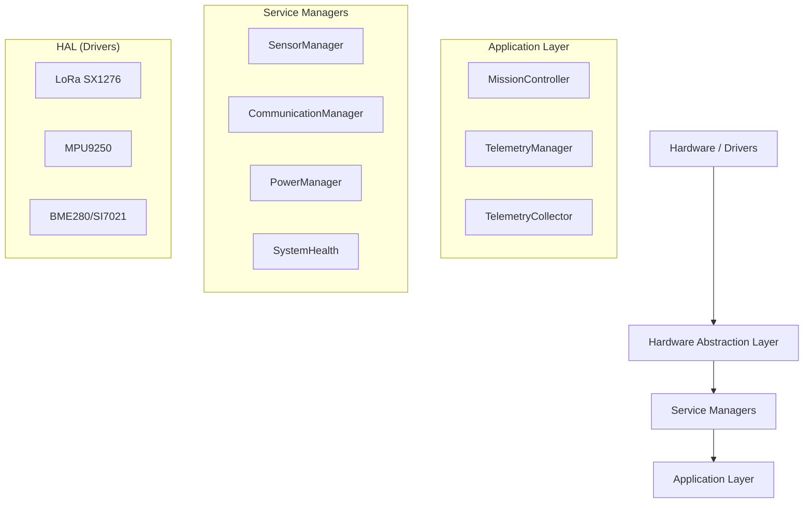
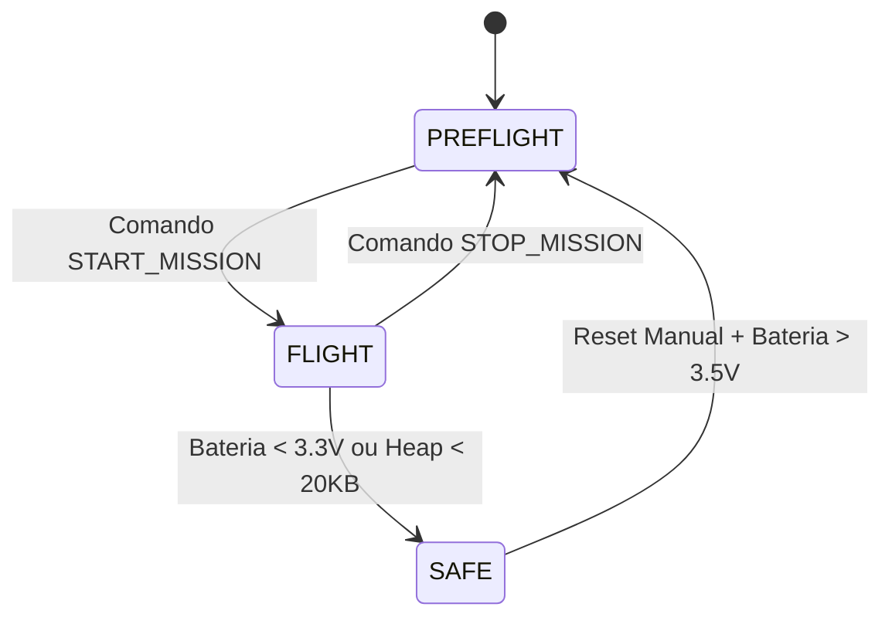

# AgroSat-IoT: CubeSat 1U Store-and-Forward


Sistema de telemetria orbital para monitoramento remoto de cultivos em áreas sem conectividade terrestre. Desenvolvido pela equipe Orbitalis (UFG) para a 3ª Olimpíada Brasileira de Satélites (OBSAT MCTI).

---

## Sumário
1. [Visão Geral](#visão-geral)
2. [Arquitetura de Software](#arquitetura-de-software)
3. [Máquina de Estados](#máquina-de-estados)
4. [Especificações de Hardware](#especificações-de-hardware)
5. [Instalação e Build](#instalação-e-build)
6. [Interface de Comandos](#interface-de-comandos)
7. [Protocolos de Comunicação](#protocolos-de-comunicação)

---

## Visão Geral

O AgroSat-IoT é um sistema embarcado para CubeSat 1U que implementa um relay orbital operando no modelo **Store-and-Forward**. O satélite coleta dados de sensores agrícolas terrestres via LoRa (915 MHz) durante passagens orbitais e retransmite as informações para estações base.

### Capacidades Técnicas
* **Store-and-Forward Orbital:** Recepção, bufferização e retransmissão de dados de múltiplos nós.
* **Telemetria Multi-Sensor:** IMU 9-DOF, Barômetro, Higrômetro e Qualidade do Ar (eCO2/TVOC).
* **Gestão de Energia:** Dynamic Frequency Scaling (DFS) com ajuste de clock (80/240 MHz).
* **Robustez:** Watchdog Timer adaptativo, monitoramento de Heap e persistência NVS.
* **Segurança:** Criptografia AES-128 nos links de dados críticos.

---

## Arquitetura de Software

O sistema utiliza uma arquitetura modular orientada a serviços sobre FreeRTOS.



### Estrutura de Diretórios

* **src/app/**: Lógica de missão, regras de negócio e orquestração.
* **src/comm/**: Drivers de comunicação (LoRa, WiFi, HTTP, Criptografia).
* **src/core/**: Serviços vitais (RTC, Energia, Watchdog, Sistema de Arquivos).
* **src/sensors/**: Gerenciadores de sensores com lógica de recuperação I2C.
* **src/storage/**: Persistência de dados em cartão SD (CSV).

---

## Máquina de Estados

O sistema opera baseado em modos distintos para garantir a segurança da missão e economia de energia.



| Modo | Serial Logs | LoRa TX | CPU Freq | WDT Timeout | Descrição |
| --- | --- | --- | --- | --- | --- |
| **PREFLIGHT** | Sim | Ativo | 240 MHz | 60s | Modo de depuração e testes em solo. |
| **FLIGHT** | Não | Ativo | 240 MHz | 90s | Modo operacional nominal. Logs desativados. |
| **SAFE** | Sim | Beacon (180s) | 80 MHz | 180s | Modo de recuperação. Consumo mínimo. |

> [!WARNING]
> O modo SAFE é ativado automaticamente em condições críticas de hardware. A saída deste modo requer intervenção ou recuperação dos níveis de tensão.

---

## Especificações de Hardware

**Plataforma:** ESP32 (TTGO LoRa32 V2.1)

### Pinagem Crítica

| Periférico | Interface | Pinos (ESP32) |
| --- | --- | --- |
| **LoRa SX1276** | SPI | SCK: 5, MISO: 19, MOSI: 27, CS: 18, RST: 23, DIO0: 26 |
| **SD Card** | SPI | SCK: 14, MISO: 2, MOSI: 15, CS: 13 |
| **Sensores** | I2C | SDA: 21, SCL: 22 (100 kHz) |
| **Bateria** | ADC | GPIO 35 (Divisor 1/2) |
| **GPS UART** | Serial | TX: 12, RX: 34 |

---

## Instalação e Build

### Pré-requisitos

* VS Code com PlatformIO
* Driver CP2104

### Compilação e Upload

```bash
# 1. Clonar repositório
git clone [https://github.com/mathasilv/AgroSat-IoT.git](https://github.com/mathasilv/AgroSat-IoT.git)

# 2. Compilar
pio run -e ttgo-lora32-v21

# 3. Upload e Monitor
pio run -e ttgo-lora32-v21 -t upload
pio device monitor

```

---

## Interface de Comandos

Disponível via Serial (115200 baud) nos modos PREFLIGHT e SAFE.

| Comando | Descrição |
| --- | --- |
| `STATUS` | Exibe telemetria instantânea e status online/offline dos sensores. |
| `CALIB_MAG` | Inicia rotina de calibração do magnetômetro (requer rotação física). |
| `SAVE_BASELINE` | Salva a linha de base do sensor de qualidade do ar (CCS811). |
| `START_MISSION` | Transição manual para modo FLIGHT. |
| `STOP_MISSION` | Retorna ao modo PREFLIGHT. |
| `LINK_BUDGET` | Exibe análise teórica do link de rádio LoRa. |

---

## Protocolos de Comunicação

### LoRa (Uplink/Downlink)

* **Frequência:** 915 MHz
* **Largura de Banda:** 125 kHz
* **Spreading Factor:** SF7 a SF12 (Adaptativo)
* **Coding Rate:** 4/5
* **Potência:** 20 dBm

**Estrutura do Pacote Binário:**
`[Header: 2B] [Team ID: 2B] [Timestamp: 4B] [Payload: N bytes] [CRC: 2B]`

### Armazenamento (SD Card)

Os dados são persistidos em formato CSV com rotação de arquivos.

**Exemplo de Log de Telemetria:**

```csv
timestamp,mission_time,battery_v,temp_mpu,pressure,lat,lon,satellites,system_status
1703450000,1200,3.85,25.4,980.5,-16.68,-49.26,8,0x00

```

---

**Desenvolvido por Equipe Orbitalis - UFG**