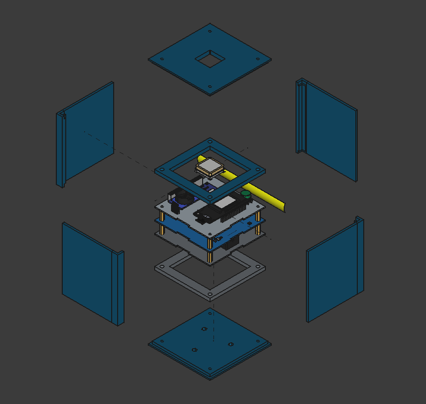
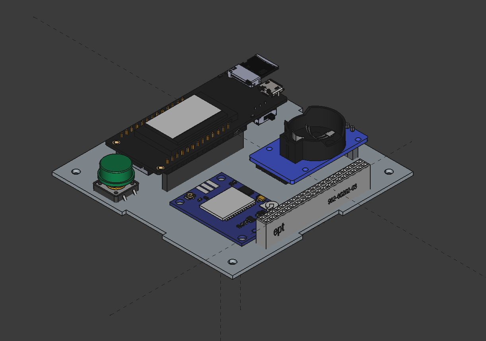
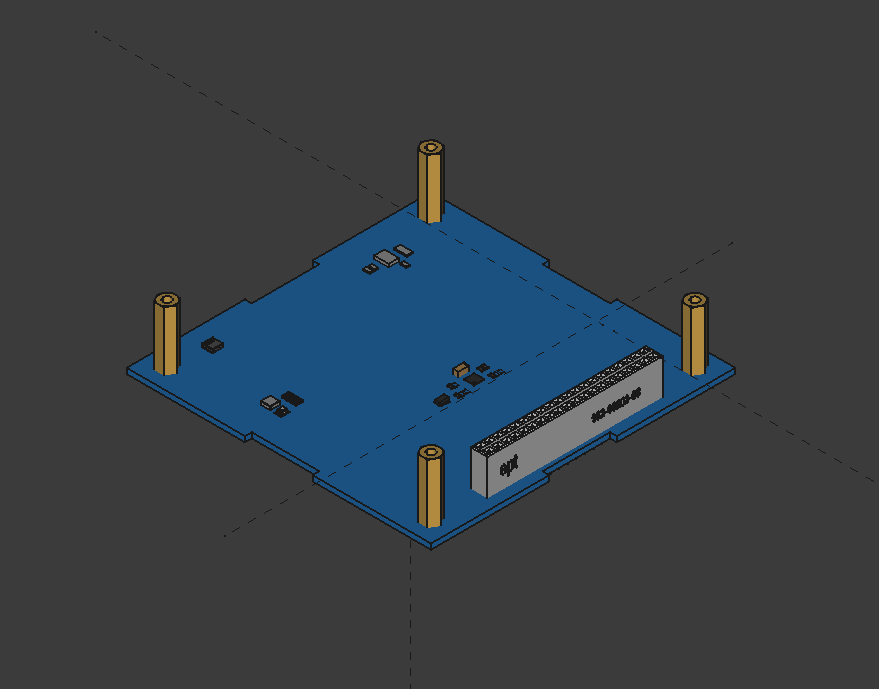
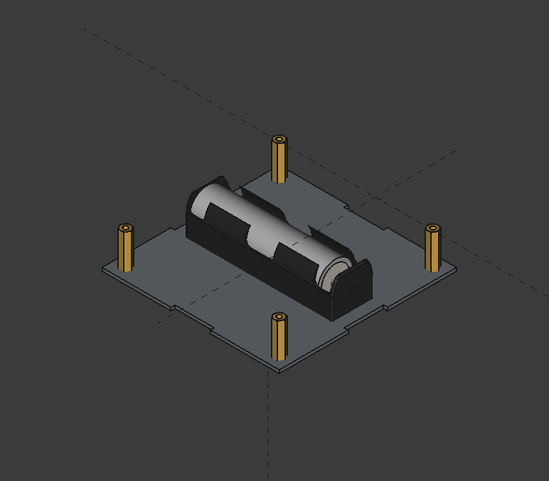

# AgroSat-IoT

Sistema embarcado para CubeSat 1U desenvolvido para monitoramento remoto de cultivos agrícolas em regiões sem cobertura de internet ou telefonia celular.

---

## Sumário

1. [Sobre o Projeto](#sobre-o-projeto)
2. [Problema e Solução](#problema-e-solução)
3. [Como Funciona](#como-funciona)
4. [Arquitetura do Sistema](#arquitetura-do-sistema)
5. [Funcionalidades Principais](#funcionalidades-principais)
6. [Sensores e Medições](#sensores-e-medições)
7. [Modos de Operação](#modos-de-operação)
8. [Comunicação](#comunicação)
9. [Segurança e Confiabilidade](#segurança-e-confiabilidade)
10. [Hardware Utilizado](#hardware-utilizado)
11. [Modelo 3D do Satélite](#modelo-3d-do-satélite)
12. [Instalação](#instalação)
13. [Comandos Disponíveis](#comandos-disponíveis)
14. [Equipe](#equipe)

---

## Sobre o Projeto

O AgroSat-IoT e um sistema de telemetria orbital projetado para operar em um CubeSat no formato 1U (cubo de 10x10x10 cm). Seu objetivo principal e servir como um ponto de retransmissao (relay) entre sensores instalados em propriedades rurais e estacoes de controle em terra.

O projeto foi desenvolvido para participar de competicoes de CubeSats educacionais e demonstrar a viabilidade de solucoes de baixo custo para agricultura de precisao em areas remotas.

---

## Problema e Solucao

### O Problema

Grandes areas agricolas no Brasil, especialmente em regioes do Centro-Oeste e Norte, nao possuem cobertura de internet ou sinal de celular. Isso impede que produtores rurais utilizem tecnologias modernas de monitoramento de suas lavouras, como sensores de umidade do solo, temperatura e sistemas de irrigacao inteligente.

### A Solucao

O AgroSat-IoT resolve esse problema utilizando comunicacao via radio LoRa, que possui longo alcance e baixo consumo de energia. O sistema funciona da seguinte forma:

1. Sensores instalados nas propriedades rurais (nos terrestres) coletam dados sobre as condicoes do solo e ambiente
2. Esses dados sao transmitidos via radio para o satelite quando ele passa sobre a regiao
3. O satelite armazena os dados recebidos (modelo Store-and-Forward)
4. Quando o satelite passa sobre uma estacao base com internet, os dados sao retransmitidos
5. Os dados ficam disponiveis para consulta pelo produtor rural

---

## Como Funciona

O sistema opera em um ciclo continuo de coleta, armazenamento e retransmissao de dados:

### Coleta de Dados Proprios

O satelite possui sensores embarcados que monitoram constantemente:
- Sua propria posicao via GPS
- Condicoes internas (temperatura, pressao, umidade)
- Orientacao espacial (acelerometro, giroscopio, magnetometro)
- Qualidade do ar interno
- Nivel de bateria e saude do sistema

### Recepcao de Dados Terrestres

Quando o satelite passa sobre uma area monitorada, ele recebe automaticamente os dados transmitidos pelos sensores terrestres. Cada pacote recebido contem:
- Identificacao do sensor de origem
- Umidade do solo
- Temperatura ambiente
- Status do sistema de irrigacao

### Armazenamento Seguro

Todos os dados sao armazenados em cartao SD com verificacao de integridade (CRC-16 CCITT). O sistema gera os seguintes arquivos:

| Arquivo          | Conteúdo                    | Formato |
|------------------|-----------------------------|---------|
| telemetry.csv    | Dados de sensores           | CSV+CRC |
| mission.csv      | Dados de ground nodes       | CSV+CRC |
| system.log       | Logs do sistema             | TXT+CRC |

### Retransmissao

Os dados coletados sao retransmitidos de duas formas:
- Via radio LoRa para estacoes terrestres
- Via WiFi/HTTP quando disponivel (em testes de solo)

---

## Arquitetura do Sistema

### Estrutura de Código

O projeto segue uma arquitetura modular organizada em camadas:

```
AgroSat-IoT/
├── include/
│   ├── config.h              # Agregador de configurações
│   ├── config/
│   │   ├── pins.h            # Definições de pinos GPIO
│   │   ├── constants.h       # Constantes e limites do sistema
│   │   ├── modes.h           # Configurações de modos de operação
│   │   └── debug.h           # Macros de debug e logging
│   ├── types/
│   │   └── TelemetryTypes.h  # Estruturas de dados
│   └── Globals.h             # Recursos globais (mutexes, filas)
├── src/
│   ├── app/                  # Lógica de aplicação
│   │   ├── TelemetryManager/ # Gerenciador central
│   │   ├── MissionController/# Controle de missão
│   │   ├── GroundNodeManager/# Gerenciamento de nós terrestres
│   │   └── TelemetryCollector/# Coleta de telemetria
│   ├── comm/                 # Comunicação
│   │   ├── LoRaService/      # Rádio LoRa + DutyCycleTracker
│   │   ├── WiFiService/      # Conexão WiFi
│   │   ├── HttpService/      # Requisições HTTP
│   │   ├── PayloadManager/   # Formatação de payloads
│   │   └── CommunicationManager/ # Orquestrador
│   ├── core/                 # Núcleo do sistema
│   │   ├── SystemHealth/     # Monitoramento de saúde
│   │   ├── PowerManager/     # Gerenciamento de energia
│   │   ├── RTCManager/       # Relógio de tempo real
│   │   ├── CommandHandler/   # Processador de comandos
│   │   └── ButtonHandler/    # Tratamento de botão
│   ├── sensors/              # Drivers de sensores
│   │   ├── SensorManager/    # Orquestrador de sensores
│   │   ├── MPU9250Manager/   # IMU 9-DOF
│   │   ├── BMP280Manager/    # Pressão/Temperatura
│   │   ├── SI7021Manager/    # Umidade/Temperatura
│   │   ├── CCS811Manager/    # Qualidade do ar
│   │   └── GPSManager/       # GPS NEO-M8N
│   └── storage/              # Armazenamento
│       └── StorageManager/   # SD Card com CRC
└── platformio.ini            # Configuração do projeto
```

### Tasks FreeRTOS

O sistema utiliza FreeRTOS com múltiplas tasks para operação em tempo real:

| Task         | Core | Prioridade | Stack | Função                    |
|--------------|------|------------|-------|---------------------------|
| SensorsTask  | 1    | 2          | 4KB   | Leitura de sensores 10Hz  |
| HttpTask     | 0    | 1          | 8KB   | Processamento HTTP        |
| StorageTask  | 0    | 1          | 8KB   | Persistência em SD Card   |
| Loop (main)  | 0    | 1          | -     | Comandos e LoRa           |

### Bibliotecas Utilizadas

| Biblioteca      | Versão  | Função                    |
|-----------------|---------|---------------------------|
| RTClib          | ^2.1.4  | Relógio de tempo real     |
| LoRa            | ^0.8.0  | Comunicação rádio LoRa    |
| ArduinoJson     | ^6.21.3 | Serialização JSON         |
| TinyGPSPlus     | ^1.0.0  | Parsing de dados GPS      |

---

## Funcionalidades Principais

### Relay Store-and-Forward

O satelite atua como um intermediario entre sensores remotos e estacoes base. Ele armazena os dados recebidos e os retransmite quando possivel, permitindo comunicacao assincrona mesmo quando nao ha linha de visada direta.

### Gerenciamento de Multiplos Nos

O sistema pode gerenciar simultaneamente ate 3 nos terrestres ativos, priorizando automaticamente os dados mais criticos para retransmissao. A priorizacao considera:
- Criticidade dos dados (alertas de irrigacao tem prioridade)
- Tempo desde a ultima transmissao bem-sucedida
- Qualidade do sinal de cada no

### Controle Automatico de Energia

O sistema monitora constantemente o nivel da bateria e ajusta automaticamente seu comportamento:
- Em condicoes normais: todas as funcoes ativas
- Bateria baixa (< 3.7V): reduz frequencia de transmissoes
- Bateria critica (< 3.3V): entra em modo de sobrevivencia, mantendo apenas funcoes essenciais

### Monitoramento de Saude

O sistema realiza autodiagnostico continuo, verificando:
- Funcionamento de todos os sensores
- Espaco disponivel no armazenamento
- Memoria disponivel (heap)
- Temperatura interna
- Erros de comunicacao
- Timeouts de mutex

### Sincronizacao de Tempo

O relogio interno e sincronizado via NTP quando ha conexao WiFi disponivel, garantindo que todos os dados tenham registro temporal preciso. Um relogio de tempo real (RTC DS3231) com bateria propria mantem a hora mesmo durante reinicializacoes.

---

## Sensores e Medicoes

### Sensores de Navegacao e Orientacao

**GPS (NEO-M8N)**
- Latitude e longitude
- Altitude
- Numero de satelites visiveis
- Status de posicionamento

**Unidade de Medicao Inercial - IMU (MPU9250)**
- Acelerometro 3 eixos: mede aceleracao linear
- Giroscopio 3 eixos: mede velocidade de rotacao
- Magnetometro 3 eixos: funciona como bussola digital

### Sensores Ambientais

**Pressao e Temperatura (BMP280)**
- Pressao atmosferica
- Temperatura
- Altitude barometrica calculada

**Umidade e Temperatura (SI7021)**
- Umidade relativa do ar
- Temperatura (redundancia)

**Qualidade do Ar (CCS811)**
- Concentracao de CO2 equivalente (eCO2)
- Compostos Organicos Volateis Totais (TVOC)

### Monitoramento de Energia

- Tensao da bateria
- Percentual de carga estimado
- Deteccao de niveis criticos

---

## Modos de Operacao

O sistema possui diferentes modos de operacao que se adaptam as condicoes da missao:

### Modo Pre-Voo (PREFLIGHT)

Utilizado durante testes em solo antes do lancamento:
- Todas as funcionalidades ativas
- Comunicacao WiFi habilitada para testes
- Logs detalhados para depuracao
- Display ativo (quando disponivel)
- Intervalo de telemetria: 20 segundos
- Intervalo de storage: 1 segundo

### Modo Voo (FLIGHT)

Modo principal de operacao orbital:
- Foco em coleta e retransmissao de dados
- Logs seriais desabilitados para economia de energia
- Comunicacao LoRa e HTTP ativas
- Intervalo de telemetria: 60 segundos
- Intervalo de storage: 10 segundos

### Modo Seguro (SAFE)

Ativado automaticamente em situacoes criticas:
- Bateria abaixo do nivel critico
- Temperatura fora dos limites seguros
- Falhas graves de sistema
- Memoria heap critica

Neste modo:
- Apenas funcoes essenciais permanecem ativas
- Transmite beacon periodico para localizacao (a cada 3 minutos)
- HTTP desabilitado para economia
- Intervalo de telemetria: 120 segundos
- Intervalo de storage: 300 segundos

### Comparacao de Modos

| Parâmetro          | PREFLIGHT | FLIGHT  | SAFE     |
|--------------------|-----------|---------|----------|
| Serial Logs        | ✓         | ✗       | ✓        |
| SD Verbose         | ✓         | ✗       | ✓        |
| LoRa               | ✓         | ✓       | ✓        |
| HTTP               | ✓         | ✓       | ✗        |
| Telemetry Interval | 20s       | 60s     | 120s     |
| Storage Interval   | 1s        | 10s     | 300s     |
| Beacon             | -         | -       | 180s     |

---

## Comunicacao

### Radio LoRa

Principal meio de comunicacao do satelite:
- Frequencia: 915 MHz (banda ISM Brasil)
- Spreading Factor: 7 (modo normal)
- Largura de banda: 125 kHz
- Potencia TX: 20 dBm
- Alcance: dezenas de quilometros em linha de visada
- Baixo consumo de energia
- Resistente a interferencias

O sistema implementa controle de ciclo de trabalho (duty cycle) de 10% para cumprir regulamentacoes ANATEL e evitar sobrecarga do canal de radio.

### WiFi e HTTP

Utilizado principalmente em testes de solo:
- Conexao com redes WiFi convencionais
- Envio de dados para servidor via HTTPS (porta 443)
- Sincronizacao de relogio via NTP
- Timeout de conexao: 10 segundos

### Protocolo de Dados

Os dados sao transmitidos em formato binario compacto para maximizar a eficiencia do canal de radio. O sistema suporta:
- Pacotes de telemetria do satelite
- Pacotes de dados dos nos terrestres
- Pacotes de relay (dados combinados)
- Beacons de localizacao (modo SAFE)

---

## Seguranca e Confiabilidade

### Integridade de Dados

- Verificacao CRC-16 CCITT em todas as transmissoes e arquivos
- Deteccao e recuperacao automatica de erros
- Rotacao automatica de arquivos por tamanho (max 5MB)
- Redundância tripla para dados críticos com votação por maioria

### Watchdog

Um temporizador de seguranca (watchdog) reinicia automaticamente o sistema caso ele trave, garantindo operacao continua mesmo em caso de falhas de software.

| Modo       | Timeout WDT |
|------------|-------------|
| PREFLIGHT  | 60 segundos |
| FLIGHT     | 90 segundos |
| SAFE       | 180 segundos|

### Protecao de Recursos

O sistema utiliza mecanismos de sincronizacao (mutexes) para garantir que multiplas tarefas nao corrompam dados ao acessar recursos compartilhados simultaneamente:

- **xSerialMutex**: Protege acesso à porta serial
- **xI2CMutex**: Protege barramento I2C (sensores)
- **xSPIMutex**: Protege barramento SPI (SD Card, LoRa)
- **xDataMutex**: Protege estruturas de dados compartilhadas

### Monitoramento de Memória

O sistema monitora continuamente o heap disponível:

| Status       | Heap Livre  | Ação                        |
|--------------|-------------|-----------------------------| 
| Normal       | > 50KB      | Operação normal             |
| Warning      | 30-50KB     | Log de aviso                |
| Critical     | 15-30KB     | Entra em SAFE MODE          |
| Fatal        | < 15KB      | Reinicialização automática  |

---

## Hardware Utilizado

### Placa Principal

**TTGO LoRa32 V2.1 (LilyGo T3 V1.6.1)**
- Microcontrolador ESP32 dual-core
- Radio LoRa SX1276 integrado
- Display OLED (opcional)
- Conector para bateria Li-ion

### Sensores

| Componente | Funcao |
|------------|--------|
| NEO-M8N | GPS |
| MPU9250 | Acelerometro, Giroscopio, Magnetometro |
| BMP280 | Pressao e Temperatura |
| SI7021 | Umidade e Temperatura |
| CCS811 | Qualidade do Ar (CO2, TVOC) |
| DS3231 | Relogio de Tempo Real |

### Armazenamento

- Cartao microSD para registro de dados (HSPI)

### Alimentacao

- Bateria Li-ion 18650
- Monitoramento de tensao integrado

---

## Modelo 3D do Satélite

O modelo 3D do AgroSat-IoT foi desenvolvido no FreeCAD, permitindo visualizar a estrutura completa do CubeSat 1U e seus componentes internos.

### Vista Explodida



*Vista explodida mostrando todos os componentes e sua disposição interna no CubeSat 1U.*

### Placa Principal



*Placa principal com o microcontrolador, rádio LoRa, RTC, GPS e Botão.*

### Placa de Sensores



*Placa dedicada aos sensores ambientais e de navegação.*

### PCB da Bateria



*PCB com o compartimento da bateria Li-ion 18650.*

---

## Instalacao

### Requisitos

- Visual Studio Code
- Extensao PlatformIO
- Cabo USB para programacao

### Compilacao e Upload

```bash
# Clonar o repositorio
git clone https://github.com/mathasilv/AgroSat-IoT.git

# Entrar no diretorio
cd AgroSat-IoT

# Compilar o projeto
pio run

# Enviar para a placa
pio run -t upload

# Abrir monitor serial
pio device monitor
```

---

## Comandos Disponiveis

O sistema aceita comandos via porta serial (115200 baud):

### Comandos de Missão

| Comando | Descricao |
|---------|-----------|
| START_MISSION | Inicia modo de voo (FLIGHT) |
| STOP_MISSION | Retorna ao modo pre-voo (PREFLIGHT) |
| SAFE_MODE | Forca entrada no modo seguro |

### Comandos de Diagnóstico

| Comando | Descricao |
|---------|-----------|
| STATUS | Exibe estado detalhado dos sensores |
| DUTY_CYCLE | Exibe estatisticas de duty cycle LoRa |
| MUTEX_STATS | Exibe estatisticas de uso de mutexes |
| HELP | Lista comandos disponiveis |

### Comandos de Calibração

| Comando | Descricao |
|---------|-----------|
| CALIB_MAG | Inicia calibracao do magnetometro (gire o dispositivo em formato de 8) |
| CLEAR_MAG | Apaga calibracao do magnetometro da NVS |
| SAVE_BASELINE | Salva baseline do sensor CCS811 |

### Interação via Botão

Além dos comandos serial, o sistema responde ao botão físico:

| Ação | Resultado |
|------|-----------|
| Pressão curta | Alterna entre PREFLIGHT e FLIGHT |
| Pressão longa (>2s) | Ativa SAFE MODE |

---

## Equipe

**Equipe Orbitalis - Universidade Federal de Goias (UFG)**

---

## Licenca

Este projeto esta licenciado sob a licenca MIT.
