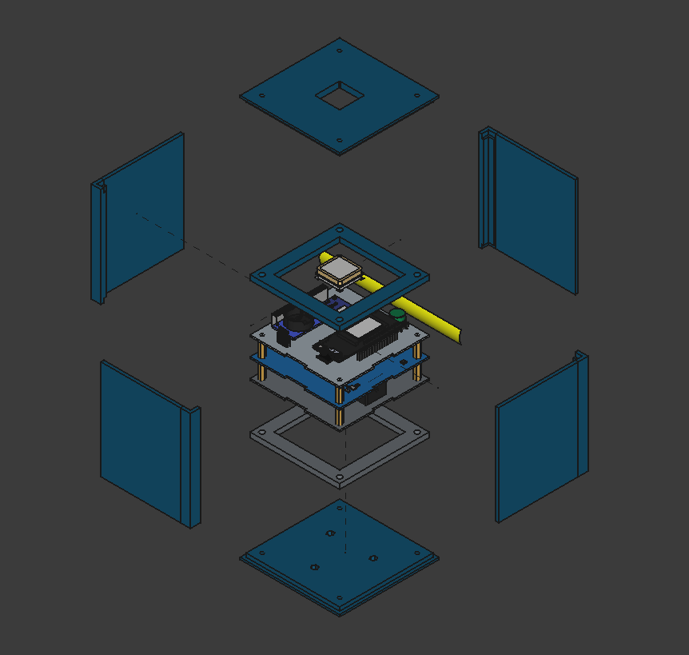
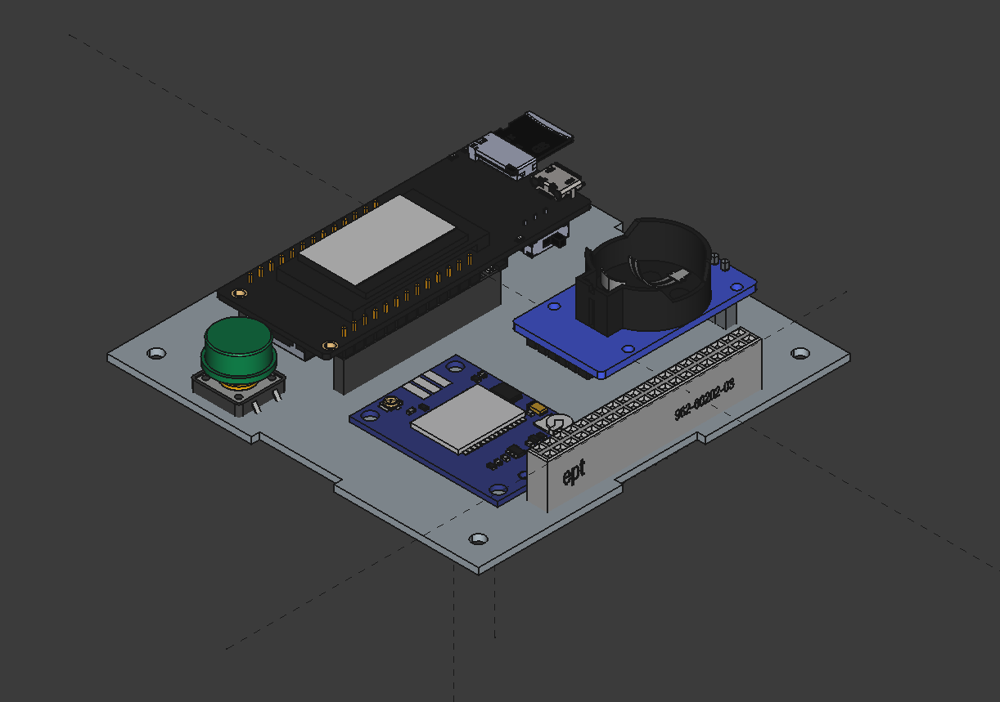
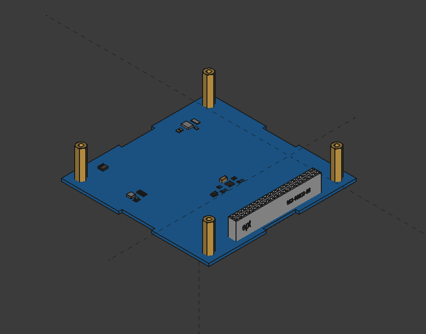
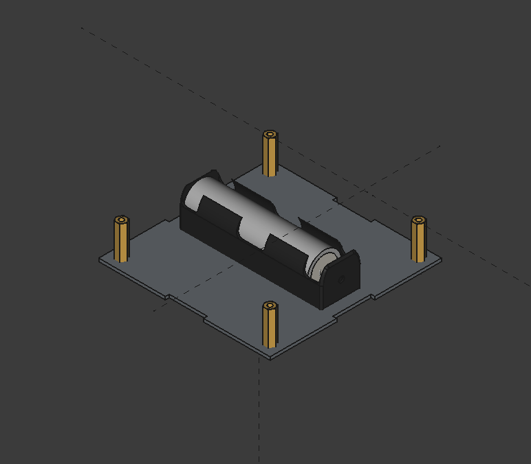

# AgroSat-IoT

Sistema embarcado para CubeSat 1U desenvolvido para monitoramento remoto de cultivos agrícolas em regiões sem cobertura de internet ou telefonia celular.

---

## Sumário

1. [Sobre o Projeto](#sobre-o-projeto)
2. [Problema e Solução](#problema-e-solução)
3. [Como Funciona](#como-funciona)
4. [Arquitetura do Sistema](#arquitetura-do-sistema)
5. [Funcionalidades Principais](#funcionalidades-principais)
6. [Sensores e Medições](#sensores-e-medições)
7. [Modos de Operação](#modos-de-operação)
8. [Comunicação](#comunicação)
9. [Segurança e Confiabilidade](#segurança-e-confiabilidade)
10. [Hardware Utilizado](#hardware-utilizado)
11. [Modelo 3D do Satélite](#modelo-3d-do-satélite)
12. [Instalação](#instalação)
13. [Comandos Disponíveis](#comandos-disponíveis)
14. [Equipe](#equipe)

---

## Sobre o Projeto

O AgroSat-IoT é um sistema de telemetria orbital projetado para operar em um CubeSat no formato 1U (cubo de 10x10x10 cm). Seu objetivo principal é servir como um ponto de retransmissão (relay) entre sensores instalados em propriedades rurais e estações de controle em terra.

O projeto foi desenvolvido para participar de competições de CubeSats educacionais e demonstrar a viabilidade de soluções de baixo custo para agricultura de precisão em áreas remotas.

---

## Problema e Solução

### O Problema

Grandes áreas agrícolas no Brasil, especialmente em regiões do Centro-Oeste e Norte, não possuem cobertura de internet ou sinal de celular. Isso impede que produtores rurais utilizem tecnologias modernas de monitoramento de suas lavouras, como sensores de umidade do solo, temperatura e sistemas de irrigação inteligente.

### A Solução

O AgroSat-IoT resolve esse problema utilizando comunicação via rádio LoRa, que possui longo alcance e baixo consumo de energia. O sistema funciona da seguinte forma:

1. Sensores instalados nas propriedades rurais (nós terrestres) coletam dados sobre as condições do solo e ambiente
2. Esses dados são transmitidos via rádio para o satélite quando ele passa sobre a região
3. O satélite armazena os dados recebidos (modelo Store-and-Forward)
4. Quando o satélite passa sobre uma estação base com internet, os dados são retransmitidos
5. Os dados ficam disponíveis para consulta pelo produtor rural

---

## Como Funciona

O sistema opera em um ciclo contínuo de coleta, armazenamento e retransmissão de dados:

### Coleta de Dados Próprios

O satélite possui sensores embarcados que monitoram constantemente:
- Sua própria posição via GPS
- Condições internas (temperatura, pressão, umidade)
- Orientação espacial (acelerômetro, giroscópio, magnetômetro)
- Qualidade do ar interno
- Nível de bateria e saúde do sistema

### Recepção de Dados Terrestres

Quando o satélite passa sobre uma área monitorada, ele recebe automaticamente os dados transmitidos pelos sensores terrestres. Cada pacote recebido contém:
- Identificação do sensor de origem
- Umidade do solo
- Temperatura ambiente
- Status do sistema de irrigação

### Armazenamento Seguro

Todos os dados são armazenados em cartão SD com verificação de integridade (CRC-16 CCITT). O sistema gera os seguintes arquivos:

| Arquivo          | Conteúdo                    | Formato |
|------------------|-----------------------------|---------|
| telemetry.csv    | Dados de sensores           | CSV+CRC |
| mission.csv      | Dados de ground nodes       | CSV+CRC |
| system.log       | Logs do sistema             | TXT+CRC |

### Retransmissão

Os dados coletados são retransmitidos de duas formas:
- Via rádio LoRa para estações terrestres
- Via WiFi/HTTP quando disponível (em testes de solo)

---

## Arquitetura do Sistema

### Estrutura de Código

O projeto segue uma arquitetura modular organizada em camadas:

```
AgroSat-IoT/
├── include/
│   ├── config.h              # Agregador de configurações
│   ├── config/
│   │   ├── pins.h            # Definições de pinos GPIO
│   │   ├── constants.h       # Constantes e limites do sistema
│   │   ├── modes.h           # Configurações de modos de operação
│   │   └── debug.h           # Macros de debug e logging
│   ├── types/
│   │   └── TelemetryTypes.h  # Estruturas de dados
│   └── Globals.h             # Recursos globais (mutexes, filas)
├── src/
│   ├── app/                  # Lógica de aplicação
│   │   ├── TelemetryManager/ # Gerenciador central
│   │   ├── MissionController/# Controle de missão
│   │   ├── GroundNodeManager/# Gerenciamento de nós terrestres
│   │   └── TelemetryCollector/# Coleta de telemetria
│   ├── comm/                 # Comunicação
│   │   ├── LoRaService/      # Rádio LoRa + DutyCycleTracker
│   │   ├── WiFiService/      # Conexão WiFi
│   │   ├── HttpService/      # Requisições HTTP
│   │   ├── PayloadManager/   # Formatação de payloads
│   │   └── CommunicationManager/ # Orquestrador
│   ├── core/                 # Núcleo do sistema
│   │   ├── SystemHealth/     # Monitoramento de saúde
│   │   ├── PowerManager/     # Gerenciamento de energia
│   │   ├── RTCManager/       # Relógio de tempo real
│   │   ├── CommandHandler/   # Processador de comandos
│   │   └── ButtonHandler/    # Tratamento de botão
│   ├── sensors/              # Drivers de sensores
│   │   ├── SensorManager/    # Orquestrador de sensores
│   │   ├── MPU9250Manager/   # IMU 9-DOF
│   │   ├── BMP280Manager/    # Pressão/Temperatura
│   │   ├── SI7021Manager/    # Umidade/Temperatura
│   │   ├── CCS811Manager/    # Qualidade do ar
│   │   └── GPSManager/       # GPS NEO-M8N
│   └── storage/              # Armazenamento
│       └── StorageManager/   # SD Card com CRC
└── platformio.ini            # Configuração do projeto
```

### Tasks FreeRTOS

O sistema utiliza FreeRTOS com múltiplas tasks para operação em tempo real:

| Task         | Core | Prioridade | Stack | Função                    |
|--------------|------|------------|-------|---------------------------|
| SensorsTask  | 1    | 2          | 4KB   | Leitura de sensores 10Hz  |
| HttpTask     | 0    | 1          | 8KB   | Processamento HTTP        |
| StorageTask  | 0    | 1          | 8KB   | Persistência em SD Card   |
| Loop (main)  | 0    | 1          | -     | Comandos e LoRa           |

### Bibliotecas Utilizadas

| Biblioteca      | Versão  | Função                    |
|-----------------|---------|---------------------------|
| RTClib          | ^2.1.4  | Relógio de tempo real     |
| LoRa            | ^0.8.0  | Comunicação rádio LoRa    |
| ArduinoJson     | ^6.21.3 | Serialização JSON         |
| TinyGPSPlus     | ^1.0.0  | Parsing de dados GPS      |

---

## Funcionalidades Principais

### Relay Store-and-Forward

O satélite atua como um intermediário entre sensores remotos e estações base. Ele armazena os dados recebidos e os retransmite quando possível, permitindo comunicação assíncrona mesmo quando não há linha de visada direta.

### Gerenciamento de Múltiplos Nós

O sistema pode gerenciar simultaneamente até 3 nós terrestres ativos, priorizando automaticamente os dados mais críticos para retransmissão. A priorização considera:
- Criticidade dos dados (alertas de irrigação têm prioridade)
- Tempo desde a última transmissão bem-sucedida
- Qualidade do sinal de cada nó

### Controle Automático de Energia

O sistema monitora constantemente o nível da bateria e ajusta automaticamente seu comportamento:
- Em condições normais: todas as funções ativas
- Bateria baixa (< 3.7V): reduz frequência de transmissões
- Bateria crítica (< 3.3V): entra em modo de sobrevivência, mantendo apenas funções essenciais

### Monitoramento de Saúde

O sistema realiza autodiagnóstico contínuo, verificando:
- Funcionamento de todos os sensores
- Espaço disponível no armazenamento
- Memória disponível (heap)
- Temperatura interna
- Erros de comunicação
- Timeouts de mutex

### Sincronização de Tempo

O relógio interno é sincronizado via NTP quando há conexão WiFi disponível, garantindo que todos os dados tenham registro temporal preciso. Um relógio de tempo real (RTC DS3231) com bateria própria mantém a hora mesmo durante reinicializações.

---

## Sensores e Medições

### Sensores de Navegação e Orientação

**GPS (NEO-M8N)**
- Latitude e longitude
- Altitude
- Número de satélites visíveis
- Status de posicionamento

**Unidade de Medição Inercial - IMU (MPU9250)**
- Acelerômetro 3 eixos: mede aceleração linear
- Giroscópio 3 eixos: mede velocidade de rotação
- Magnetômetro 3 eixos: funciona como bússola digital

### Sensores Ambientais

**Pressão e Temperatura (BMP280)**
- Pressão atmosférica
- Temperatura
- Altitude barométrica calculada

**Umidade e Temperatura (SI7021)**
- Umidade relativa do ar
- Temperatura (redundância)

**Qualidade do Ar (CCS811)**
- Concentração de CO2 equivalente (eCO2)
- Compostos Orgânicos Voláteis Totais (TVOC)

### Monitoramento de Energia

- Tensão da bateria
- Percentual de carga estimado
- Detecção de níveis críticos

---

## Modos de Operação

O sistema possui diferentes modos de operação que se adaptam às condições da missão:

### Modo Pré-Voo (PREFLIGHT)

Utilizado durante testes em solo antes do lançamento:
- Todas as funcionalidades ativas
- Comunicação WiFi habilitada para testes
- Logs detalhados para depuração
- Display ativo (quando disponível)
- Intervalo de telemetria: 20 segundos
- Intervalo de storage: 1 segundo

### Modo Voo (FLIGHT)

Modo principal de operação orbital:
- Foco em coleta e retransmissão de dados
- Logs seriais desabilitados para economia de energia
- Comunicação LoRa e HTTP ativas
- Intervalo de telemetria: 60 segundos
- Intervalo de storage: 10 segundos

### Modo Seguro (SAFE)

Ativado automaticamente em situações críticas:
- Bateria abaixo do nível crítico
- Temperatura fora dos limites seguros
- Falhas graves de sistema
- Memória heap crítica

Neste modo:
- Apenas funções essenciais permanecem ativas
- Transmite beacon periódico para localização (a cada 3 minutos)
- HTTP desabilitado para economia
- Intervalo de telemetria: 120 segundos
- Intervalo de storage: 300 segundos

### Comparação de Modos

| Parâmetro          | PREFLIGHT | FLIGHT  | SAFE     |
|--------------------|-----------|---------|----------|
| Serial Logs        | ✓         | ✗       | ✓        |
| SD Verbose         | ✓         | ✗       | ✓        |
| LoRa               | ✓         | ✓       | ✓        |
| HTTP               | ✓         | ✓       | ✗        |
| Telemetry Interval | 20s       | 60s     | 120s     |
| Storage Interval   | 1s        | 10s     | 300s     |
| Beacon             | -         | -       | 180s     |

---

## Comunicação

### Rádio LoRa

Principal meio de comunicação do satélite:
- Frequência: 915 MHz (banda ISM Brasil)
- Spreading Factor: 7 (modo normal)
- Largura de banda: 125 kHz
- Potência TX: 20 dBm
- Alcance: dezenas de quilômetros em linha de visada
- Baixo consumo de energia
- Resistente a interferências

O sistema implementa controle de ciclo de trabalho (duty cycle) de 10% para cumprir regulamentações ANATEL e evitar sobrecarga do canal de rádio.

### WiFi e HTTP

Utilizado principalmente em testes de solo:
- Conexão com redes WiFi convencionais
- Envio de dados para servidor via HTTPS (porta 443)
- Sincronização de relógio via NTP
- Timeout de conexão: 10 segundos

### Protocolo de Dados

Os dados são transmitidos em formato binário compacto para maximizar a eficiência do canal de rádio. O sistema suporta:
- Pacotes de telemetria do satélite
- Pacotes de dados dos nós terrestres
- Pacotes de relay (dados combinados)
- Beacons de localização (modo SAFE)

---

## Segurança e Confiabilidade

### Integridade de Dados

- Verificação CRC-16 CCITT em todas as transmissões e arquivos
- Detecção e recuperação automática de erros
- Rotação automática de arquivos por tamanho (max 5MB)
- Redundância tripla para dados críticos com votação por maioria

### Watchdog

Um temporizador de segurança (watchdog) reinicia automaticamente o sistema caso ele trave, garantindo operação contínua mesmo em caso de falhas de software.

| Modo       | Timeout WDT |
|------------|-------------|
| PREFLIGHT  | 60 segundos |
| FLIGHT     | 90 segundos |
| SAFE       | 180 segundos|

### Proteção de Recursos

O sistema utiliza mecanismos de sincronização (mutexes) para garantir que múltiplas tarefas não corrompam dados ao acessar recursos compartilhados simultaneamente:

- **xSerialMutex**: Protege acesso à porta serial
- **xI2CMutex**: Protege barramento I2C (sensores)
- **xDataMutex**: Protege estruturas de dados compartilhadas

### Monitoramento de Memória

O sistema monitora continuamente o heap disponível:

| Status       | Heap Livre  | Ação                        |
|--------------|-------------|-----------------------------| 
| Normal       | > 50KB      | Operação normal             |
| Warning      | 30-50KB     | Log de aviso                |
| Critical     | 15-30KB     | Entra em SAFE MODE          |
| Fatal        | < 15KB      | Reinicialização automática  |

---

## Hardware Utilizado

### Placa Principal

**TTGO LoRa32 V2.1 (LilyGo T3 V1.6.1)**
- Microcontrolador ESP32 dual-core
- Rádio LoRa SX1276 integrado
- Display OLED (opcional)
- Conector para bateria Li-ion

### Sensores

| Componente | Função |
|------------|--------|
| NEO-M8N | GPS |
| MPU9250 | Acelerômetro, Giroscópio, Magnetômetro |
| BMP280 | Pressão e Temperatura |
| SI7021 | Umidade e Temperatura |
| CCS811 | Qualidade do Ar (CO2, TVOC) |
| DS3231 | Relógio de Tempo Real |

### Armazenamento

- Cartão microSD para registro de dados (HSPI)

### Alimentação

- Bateria Li-ion 18650
- Monitoramento de tensão integrado

---

## Modelo 3D do Satélite

O modelo 3D do AgroSat-IoT foi desenvolvido no FreeCAD, permitindo visualizar a estrutura completa do CubeSat 1U e seus componentes internos.

### Vista Explodida



*Vista explodida mostrando todos os componentes e sua disposição interna no CubeSat 1U.*

### Placa Principal



*Placa principal com o microcontrolador, rádio LoRa, RTC, GPS e Botão.*

### Placa de Sensores



*Placa dedicada aos sensores ambientais e de navegação.*

### PCB da Bateria



*PCB com o compartimento da bateria Li-ion 18650.*

---

## Instalação

### Requisitos

- Visual Studio Code
- Extensão PlatformIO
- Cabo USB para programação

### Compilação e Upload

```bash
# Clonar o repositório
git clone https://github.com/mathasilv/AgroSat-IoT.git

# Entrar no diretório
cd AgroSat-IoT

# Compilar o projeto
pio run

# Enviar para a placa
pio run -t upload

# Abrir monitor serial
pio device monitor
```

---

## Comandos Disponíveis

O sistema aceita comandos via porta serial (115200 baud):

### Comandos de Missão

| Comando | Descrição |
|---------|-----------|
| START_MISSION | Inicia modo de voo (FLIGHT) |
| STOP_MISSION | Retorna ao modo pré-voo (PREFLIGHT) |
| SAFE_MODE | Força entrada no modo seguro |

### Comandos de Diagnóstico

| Comando | Descrição |
|---------|-----------|
| STATUS | Exibe estado detalhado dos sensores |
| DUTY_CYCLE | Exibe estatísticas de duty cycle LoRa |
| MUTEX_STATS | Exibe estatísticas de uso de mutexes |
| HELP | Lista comandos disponíveis |

### Comandos de Calibração

| Comando | Descrição |
|---------|-----------|
| CALIB_MAG | Inicia calibração do magnetômetro (gire o dispositivo em formato de 8) |
| CLEAR_MAG | Apaga calibração do magnetômetro da NVS |
| SAVE_BASELINE | Salva baseline do sensor CCS811 |

### Interação via Botão

Além dos comandos serial, o sistema responde ao botão físico:

| Ação | Resultado |
|------|-----------|
| Pressão curta | Alterna entre PREFLIGHT e FLIGHT |
| Pressão longa (>2s) | Ativa SAFE MODE |

---

## Equipe

**Equipe Orbitalis - Universidade Federal de Goiás (UFG)**

---

## Licença

Este projeto está licenciado sob a licença MIT.
