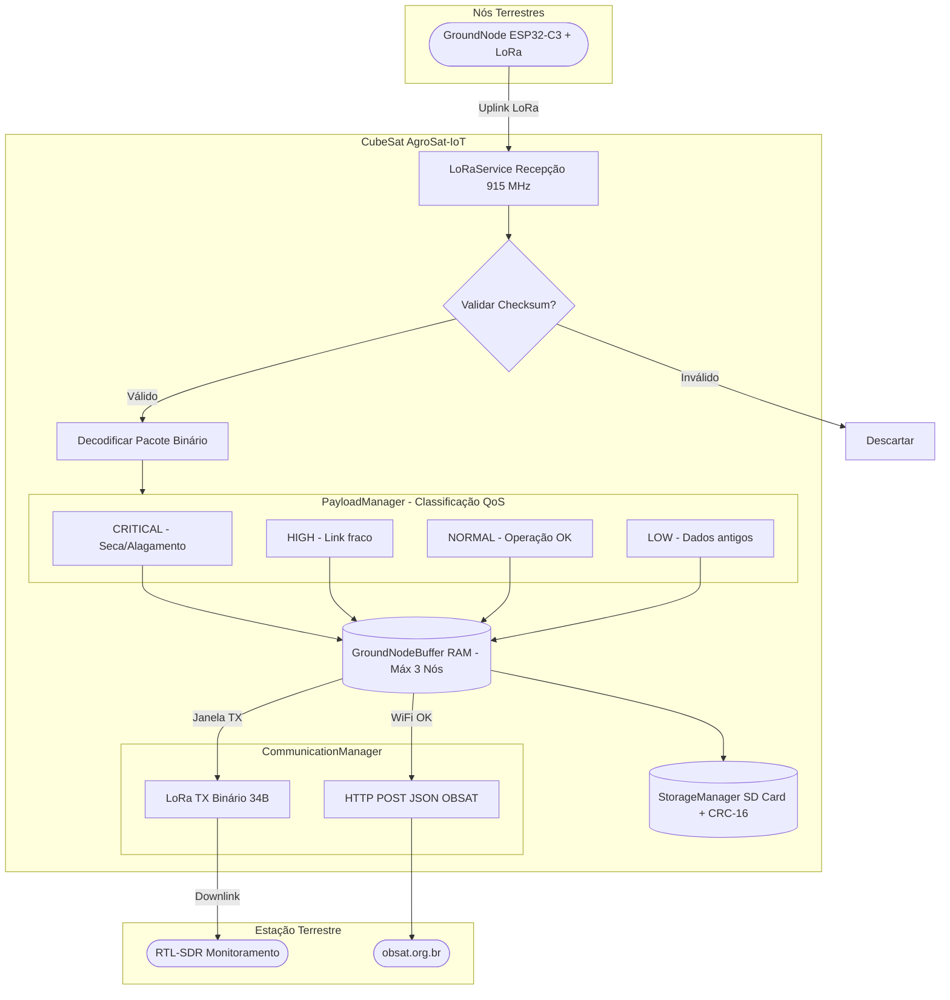
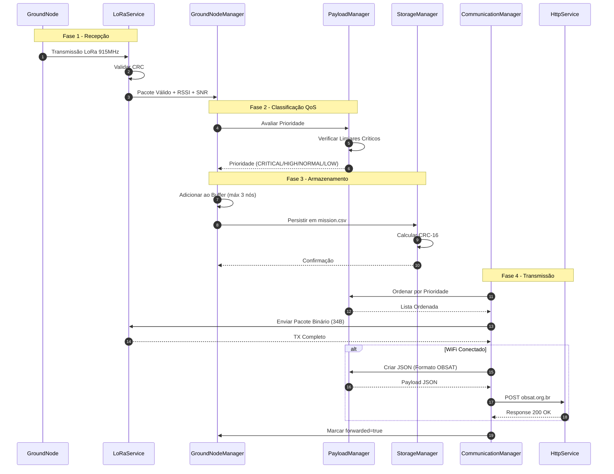
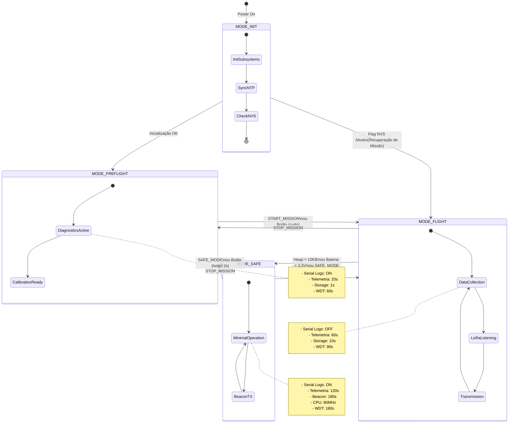

# AgroSat-IoT: Sistema de Monitoramento Remoto de Cultivos por CubeSat

**Equipe:** Orbitalis

**Aluno 1:** Matheus Aparecido – Desenvolvedor

**Aluno 2:** Luana Sthephany Rodrigues Mamed – Desenvolvedor

**Tutor:** Aldo Diaz – Orientador técnico

**Instituição:** Universidade Federal de Goiás

**Estado:** GO

**Categoria:** N3

---

## RESUMO

O projeto AgroSat-IoT propõe o desenvolvimento e validação de um CubeSat 1U funcional, projetado para democratizar o acesso à agricultura de precisão em áreas remotas do Brasil. O sistema opera como um gateway orbital utilizando a arquitetura Store-and-Forward, baseada inteiramente em tecnologia LoRa na frequência de 915 MHz. A missão principal consiste na coleta de dados críticos provenientes de nós sensores terrestres distribuídos em propriedades agrícolas. Para fins de demonstração e validação, o protótipo utiliza dados de umidade do solo, temperatura ambiente e status de irrigação como exemplos representativos, porém a arquitetura é genérica e pode ser adaptada para qualquer tipo de dado agrícola conforme a necessidade da aplicação final. Esses dados são armazenados temporariamente em buffer interno e posteriormente retransmitidos para estações em solo durante a passagem do satélite sobre a área de cobertura.

A plataforma de hardware é baseada no microcontrolador ESP32, utilizando o módulo LilyGo LoRa32 V2.1, que integra processamento e comunicação em uma única placa. O sistema conta com uma suíte completa de instrumentação ambiental composta pelos sensores MPU9250 para medição inercial, BMP280 para pressão barométrica e temperatura, SI7021 para umidade relativa e CCS811 para qualidade do ar. A sincronização temporal é garantida por um relógio de tempo real DS3231 de alta precisão, enquanto a geolocalização é fornecida por um módulo GPS NEO-M8N.

O firmware implementa funcionalidades avançadas que diferenciam este projeto de soluções convencionais. Um algoritmo de Qualidade de Serviço classifica automaticamente os dados recebidos em níveis de prioridade, garantindo que alertas críticos de irrigação ou condições extremas sejam sempre transmitidos primeiro. A robustez operacional é assegurada por uma Máquina de Estados Finitos resiliente, monitoramento via Watchdog adaptativo e gestão eficiente de energia baseada em curvas de descarga não-lineares para baterias de íon-lítio. Os resultados dos testes de bancada e simulação validam a viabilidade técnica da arquitetura proposta como uma solução de baixo custo para conectividade rural via nanossatélites.

**Palavras-chave:** CubeSat, IoT, Agricultura de Precisão, LoRa, Monitoramento Remoto, Store-and-Forward.

---

## 1. DECLARAÇÃO DO PROBLEMA DA MISSÃO

### 1.1 Identificação do Problema

O Brasil possui aproximadamente 5 milhões de estabelecimentos agropecuários, dos quais 77% são agricultura familiar (IBGE, 2017). Grande parte dessas propriedades está em regiões remotas sem acesso a redes de comunicação convencionais.

A falta de conectividade impede a implementação de agricultura de precisão, resultando em:

- **Perdas de produtividade:** 20-30% das perdas poderiam ser evitadas com monitoramento adequado (FAO, 2019)
- **Desperdício de água:** Irrigação não monitorada aplica água em excesso ou insuficiente
- **Detecção tardia de pragas:** Infestações se espalham antes de serem identificadas
- **Decisões subótimas:** Ausência de dados força escolhas baseadas em estimativas

### 1.2 Condições e Ações Necessárias

Para resolver esse problema, são necessárias as seguintes condições:

1. **Conectividade independente:** Solução satelital capaz de operar sem infraestrutura terrestre
2. **Coleta distribuída:** Múltiplos pontos de monitoramento para granularidade espacial
3. **Processamento eficiente:** Compressão e priorização de dados para otimizar banda e energia
4. **Interface acessível:** Visualização clara para tomada de decisão
5. **Custo acessível:** Viabilidade econômica para pequenos produtores

---

## 2. OBJETIVOS DA MISSÃO E MÉRITO CIENTÍFICO

### 2.1 Objetivo Geral

Desenvolver e validar um protótipo funcional de CubeSat no padrão 1U operando sob a arquitetura Store-and-Forward, capaz de atuar como um gateway orbital autônomo para coleta, priorização e retransmissão de dados de sensores agrícolas via tecnologia LoRa, visando a cobertura de áreas rurais remotas sem acesso a redes de comunicação convencionais.

### 2.2 Objetivos Específicos

1. Demonstrar viabilidade técnica da comunicação LoRa para enlaces espaciais
2. Coletar e processar dados de múltiplos sensores ambientais simultaneamente
3. Validar o conceito de IoT via satélite para agricultura brasileira
4. Testar resistência do sistema a condições extremas (temperatura, pressão, radiação UV)
5. Avaliar alcance efetivo da comunicação LoRa em diferentes altitudes

### 2.3 Mérito Científico

O projeto contribui para quatro áreas:

- **Comunicações espaciais:** Validação experimental de LoRa em enlaces orbitais
- **Agricultura 4.0:** Arquitetura integrando sensoriamento satelital com redes IoT terrestres
- **Inclusão digital rural:** Conectividade para regiões isoladas do Brasil
- **Sustentabilidade:** Intervenções precisas que reduzem desperdício de água e insumos

---

## 3. FUNÇÕES E RESPONSABILIDADES DA EQUIPE

Os alunos Luana Sthephany Rodrigues Mamed e Matheus Aparecido trabalharam de forma colaborativa em todas as etapas do projeto, compartilhando igualmente as responsabilidades de desenvolvimento de software embarcado, integração de hardware, testes e documentação.

O professor Dr. Aldo Diaz atuou como orientador técnico, supervisionando as atividades e servindo como interface entre a equipe e a organização da competição.

---

## 4. CRONOGRAMA

| Semana | Atividade |
|--------|-----------|
| 1-2 | Integração da placa PION e LilyGo LoRa32, testes individuais de sensores |
| 3 | Desenvolvimento do simulador de nó agrícola (ESP32-C3) |
| 4 | Implementação da comunicação LoRa/WiFi, projeto e sintonização da antena |
| 5 | Montagem final, regulação de tensão, aplicação de isolamento térmico |
| 6 | Testes de integração, elaboração do relatório e vídeo de demonstração |

**Próximas etapas:** Evento regional (Jan-Abr 2026) e evento nacional (Mai-Nov 2026).

---

## 5. DETALHES OPERACIONAIS

O AgroSat-IoT é composto por uma estrutura física no padrão CubeSat 1U e um firmware modular desenvolvido em C++ para a plataforma ESP32 utilizando o framework Arduino e o sistema operacional de tempo real FreeRTOS. O firmware está organizado em camadas funcionais (aplicação, comunicação, sensores e núcleo), cada uma implementada como um conjunto de classes C++ com responsabilidades bem definidas. As seções seguintes fazem referência a essas classes ao descrever as funcionalidades do sistema. O código-fonte completo está disponível no repositório indicado na seção 5.7.

### 5.1 Conformidade com o Edital

O projeto atende integralmente aos requisitos do edital da Fase 2 da 3ª OBSAT MCTI:

| Requisito | Implementação | Evidência |
|-----------|---------------|----------|
| CubeSat 1U (100x100x100mm) | Estrutura PETG impressa 3D | Anexo A |
| Peso máximo 450g | **[INSERIR PESO]** g | Anexo B |
| Isolamento térmico bateria | Espuma EPE/Depron | Anexo C |
| Comunicação WiFi + HTTP | WiFiService + HttpService | Código |
| Formato JSON (Apêndice 1) | PayloadManager | Anexo P |
| Sensores obrigatórios | MPU9250, BMP280, ADC bateria | Seção 5.3 |
| Armazenamento SD Card | StorageManager + CRC-16 | Seção 5.4 |

### 5.2 Arquitetura Store-and-Forward

A arquitetura Store-and-Forward constitui o diferencial técnico central do projeto AgroSat-IoT, permitindo que o satélite atue como um relay orbital para dados de sensores agrícolas distribuídos em áreas sem cobertura de comunicação convencional.

O funcionamento do sistema inicia-se com a escuta contínua do transceptor LoRa SX1276, operando na frequência de 915 MHz através do driver implementado na classe LoRaService. Durante a passagem do satélite sobre a área de interesse, os nós terrestres transmitem seus dados em pacotes de uplink que são capturados pelo receptor de bordo. Cada pacote recebido é imediatamente decodificado e validado, verificando-se a integridade através de checksum e a autenticidade através do cabeçalho de identificação.

Os dados validados são armazenados em um buffer circular mantido na memória RAM do microcontrolador. O dimensionamento desse buffer, configurado para até três nós simultâneos através da constante MAX_GROUND_NODES, representa um compromisso entre a capacidade de armazenamento e o consumo de memória do sistema. A estrutura circular garante que informações de múltiplos nós terrestres sejam mantidas simultaneamente, com substituição automática dos dados mais antigos quando o buffer atinge sua capacidade máxima.

A retransmissão dos dados coletados ocorre em intervalos configurados por modo de operação: 20 segundos em PREFLIGHT, 60 segundos em FLIGHT e 120 segundos em SAFE. O CommunicationManager envia pacotes consolidados contendo a telemetria do satélite seguida dos dados dos nós terrestres, respeitando o limite de duty cycle de 10% configurado no sistema para otimização do uso da banda ISM.

A confiabilidade do sistema é assegurada pelo mecanismo de persistência implementado no StorageManager. Antes de qualquer tentativa de transmissão, todos os dados recebidos são gravados no cartão SD com validação CRC-16. Essa abordagem de backup síncrono protege a missão contra falhas de energia ou reinicializações inesperadas, garantindo que nenhum dado coletado seja perdido mesmo em cenários de falha.

O sistema de priorização inteligente, denominado Quality of Service ou QoS, diferencia o AgroSat-IoT de sistemas convencionais que utilizam filas FIFO simples. O algoritmo implementado na classe PayloadManager avalia o conteúdo de cada pacote recebido contra limiares críticos definidos na configuração do sistema. Dados que indicam condições de seca extrema, alagamento, temperaturas fora da faixa segura ou falhas iminentes de comunicação são automaticamente classificados com prioridade elevada.

A classificação de prioridade segue quatro níveis hierárquicos: CRITICAL para situações que exigem ação imediata, HIGH para condições que merecem atenção prioritária, NORMAL para operação padrão sem anomalias e LOW para dados antigos potencialmente desatualizados. Os limiares que definem cada nível são configuráveis no firmware, permitindo adaptação conforme o tipo de cultura, região e requisitos específicos da aplicação.

Quando o buffer de armazenamento atinge sua capacidade máxima, o sistema aplica uma política de substituição baseada em prioridade. Novos dados críticos podem substituir dados de baixa prioridade mesmo que estes sejam mais recentes, garantindo que o satélite sempre priorize a entrega das informações de maior valor para o agricultor. Essa abordagem otimiza o uso dos recursos limitados de armazenamento e banda de transmissão disponíveis em um nanossatélite. O fluxo completo de dados é ilustrado no Anexo D.

### 5.3 Infraestrutura de Hardware

O computador de bordo do AgroSat-IoT é baseado no módulo LilyGo LoRa32 V2.1, uma plataforma que integra o microcontrolador ESP32-PICO-D4 e o transceptor LoRa SX1276 em uma única PCB compacta. Essa integração otimiza significativamente o peso e o volume interno do satélite, fatores críticos no projeto de CubeSats. O ESP32 opera com arquitetura dual-core a 240 MHz, permitindo a execução simultânea de tarefas críticas através do sistema operacional de tempo real FreeRTOS.

A eficiência energética do sistema é gerenciada pela classe PowerManager, que implementa um algoritmo de Dynamic Frequency Scaling. Esse mecanismo ajusta automaticamente a frequência de clock da CPU em três níveis baseando-se no percentual de carga da bateria: 240 MHz acima de 60% (performance), 160 MHz entre 30% e 60% (balanceado) e 80 MHz abaixo de 30% (economia). Essa abordagem adaptativa garante o equilíbrio ideal entre capacidade de processamento e autonomia energética em cada fase da missão.

O sistema irradiante do satélite utiliza uma antena monopolo de quarto de onda construída a partir de fita métrica de aço, uma solução que oferece vantagens mecânicas significativas para aplicações espaciais. A memória elástica do aço permite que a antena seja dobrada para acomodação durante o lançamento e se estenda automaticamente após a ejeção do dispensador. Além disso, o material resiste a deformações permanentes causadas por ventos fortes ou turbulência durante a travessia da atmosfera.

A antena foi cortada e sintonizada para a frequência central de 915 MHz, correspondente à banda ISM utilizada pelo protocolo LoRa no Brasil. A validação elétrica foi realizada utilizando um analisador vetorial de redes, confirmando casamento de impedância de 50 Ohms e relação de ondas estacionárias inferior a 1,5. Esses parâmetros garantem máxima transferência de potência entre o transceptor e a antena, otimizando o alcance do enlace de comunicação. Os gráficos de caracterização da antena encontram-se no Anexo K.

A instrumentação científica do satélite integra cinco sensores de precisão, coordenados pela classe SensorManager para garantir aquisição síncrona de dados. O sensor inercial MPU9250 fornece medições de aceleração, velocidade angular e campo magnético em três eixos, permitindo a reconstrução da atitude do satélite durante o voo. Os dados do magnetômetro são calibrados através de algoritmos de correção Hard/Soft Iron implementados no firmware, compensando distorções causadas por materiais ferromagnéticos presentes na estrutura.

As condições atmosféricas são monitoradas pelo barômetro digital BMP280, que fornece medições de pressão com resolução de 0,01 hPa e temperatura com resolução de 0,01°C. O sensor de umidade SI7021 complementa as medições ambientais com dados de umidade relativa e uma segunda leitura de temperatura para redundância. A qualidade do ar é analisada pelo sensor CCS811, que estima concentrações de CO2 equivalente e compostos orgânicos voláteis totais através de um elemento sensor de óxido metálico.

A integridade temporal dos dados é assegurada pelo módulo RTC DS3231, um relógio de tempo real com oscilador compensado por temperatura que mantém precisão de ±2 ppm na faixa de 0°C a 40°C. A geolocalização é fornecida pelo receptor GNSS NEO-M8N, capaz de rastrear simultaneamente satélites GPS e GLONASS para obter posicionamento com precisão métrica mesmo em condições de visibilidade parcial do céu.

O sistema de energia é sustentado por uma célula de íon-lítio no formato 18650 com capacidade nominal de 3000 mAh. O monitoramento de tensão é realizado através de um divisor resistivo conectado ao ADC do ESP32, e o firmware implementa um algoritmo de estimação de carga que considera a curva de descarga não-linear característica dessa química de bateria. Essa abordagem fornece estimativas de autonomia mais precisas do que métodos lineares simples.

A proteção térmica da bateria combina múltiplas estratégias para garantir operação segura em temperaturas estratosféricas que podem atingir -60°C ou menos. O isolamento primário utiliza espuma EPE/Depron envolvendo diretamente a célula, enquanto a estrutura externa do CubeSat recebe revestimento reflexivo para minimizar perdas por radiação. A dissipação térmica natural da eletrônica em funcionamento contribui para manter a temperatura interna dentro da faixa operacional segura.

### 5.4 Arquitetura de Firmware

O firmware do AgroSat-IoT foi desenvolvido seguindo princípios de modularidade e robustez, organizando as funcionalidades em camadas bem definidas que facilitam a manutenção e a evolução do sistema. A arquitetura utiliza o sistema operacional de tempo real FreeRTOS para gerenciar a execução concorrente de múltiplas tarefas, aproveitando os dois núcleos de processamento disponíveis no ESP32.

A camada de aplicação, localizada no diretório src/app do repositório, contém a lógica de missão implementada nas classes TelemetryManager, MissionController, GroundNodeManager e PayloadManager. O TelemetryManager atua como orquestrador central do sistema, coordenando a coleta de dados, o processamento de comandos e a comunicação com os demais módulos. O MissionController gerencia o ciclo de vida da missão, incluindo a persistência de estado na memória não-volátil para recuperação após reinicializações.

A camada de comunicação, no diretório src/comm, implementa os protocolos de enlace através das classes LoRaService, WiFiService e HttpService. O LoRaService encapsula toda a interação com o transceptor SX1276, incluindo configuração de parâmetros de modulação, transmissão e recepção de pacotes, e controle de duty cycle para conformidade regulatória. O CommunicationManager coordena as diferentes interfaces de comunicação, decidindo quando e como transmitir dados baseado no estado atual do sistema e na disponibilidade de cada canal.

A camada de sensores, em src/sensors, contém os drivers específicos para cada dispositivo de medição. Cada sensor possui sua própria classe gerenciadora que encapsula os detalhes de comunicação I2C ou SPI, calibração e validação de leituras. O SensorManager atua como fachada para essa camada, fornecendo uma interface unificada para a aplicação acessar os dados de todos os sensores de forma consistente.

A camada de núcleo, em src/core, implementa serviços fundamentais do sistema. O PowerManager monitora a tensão da bateria e ajusta o comportamento do sistema para otimizar a autonomia. O SystemHealth realiza verificações periódicas de integridade, monitorando uso de memória e estado dos periféricos. O RTCManager gerencia o relógio de tempo real, fornecendo timestamps precisos para todas as operações do sistema.

A autonomia operacional do satélite é garantida por uma Máquina de Estados Finitos resiliente implementada no TelemetryManager. O sistema inicia no estado MODE_INIT, onde realiza a inicialização sequencial de todos os subsistemas e a sincronização temporal via protocolo NTP quando há conectividade disponível. Após a inicialização bem-sucedida, o sistema transita para MODE_PREFLIGHT, um estado de preparação que mantém ativas as interfaces de diagnóstico e permite a execução de comandos de calibração.

A transição para o estado operacional MODE_FLIGHT pode ser comandada remotamente via interface serial ou localmente através de um botão físico integrado ao satélite. Nesse estado, o sistema prioriza a coleta de dados e a escuta do canal LoRa, desativando funcionalidades não essenciais para maximizar a autonomia. O módulo SystemHealth monitora continuamente indicadores críticos, forçando transição automática para MODE_SAFE caso detecte condições de risco como memória heap crítica (inferior a 10 KB) ou tensão de bateria abaixo de 3,3V.

O estado MODE_SAFE implementa um modo de operação degradado projetado para maximizar a sobrevivência do satélite em condições adversas. Nesse modo, a frequência de clock é reduzida para 80 MHz, as transmissões de telemetria são espaçadas para intervalos de 120 segundos, com beacons de localização a cada 180 segundos, e apenas as funções essenciais de telemetria permanecem ativas. O retorno ao modo de voo requer comando manual (START_MISSION) ou pressionamento do botão físico. O diagrama completo da máquina de estados está no Anexo N.

Um diferencial importante da arquitetura é a capacidade de recuperação de falhas. O MissionController utiliza a memória não-volátil do ESP32 para persistir o estado da missão a cada ciclo operacional. Se ocorrer uma reinicialização não planejada por qualquer motivo, o sistema detecta a flag de missão ativa durante a inicialização, recupera o timestamp de início original e retorna automaticamente ao estado de voo, preservando a continuidade cronológica dos dados sem necessidade de intervenção humana.

A gestão de dados implementa uma arquitetura híbrida para atender simultaneamente aos requisitos da competição e à eficiência do enlace de rádio. Para comunicação com o servidor da OBSAT, o método createTelemetryJSON gera objetos JSON contendo todos os campos obrigatórios especificados no Apêndice 1 do edital. Para comunicação via LoRa, o sistema utiliza codificação binária compacta que reduz a telemetria completa do satélite para 34 bytes fixos, minimizando o tempo de transmissão e o consumo energético.

O subsistema de armazenamento opera em múltiplas camadas para garantir integridade dos dados. A camada primária realiza gravação contínua em cartão SD de três arquivos distintos: telemetry.csv para dados científicos, mission.csv para dados dos nós terrestres e system.log para eventos do sistema. Cada linha gravada é protegida por checksum CRC-16, permitindo validação individual de cada registro durante a análise pós-voo. Uma lógica de rotação automática segmenta os arquivos ao atingirem 5 MB, prevenindo problemas com o sistema de arquivos FAT32. A interação entre os módulos durante um ciclo de operação é detalhada no Anexo H.

### 5.5 Procedimento de Missão

O procedimento operacional do AgroSat-IoT está estruturado em fases bem definidas que garantem a preparação adequada do sistema, a execução confiável da missão e a recuperação completa dos dados coletados.

A fase de preparação inicia-se entre 24 e 2 horas antes do lançamento, com o satélite operando no modo PREFLIGHT. Nesse estado, as interfaces de diagnóstico serial permanecem ativas, possibilitando a execução de uma rotina rigorosa de validação e calibração. O comando STATUS fornece um relatório instantâneo de saúde de todos os barramentos e periféricos, permitindo identificação imediata de falhas de hardware. O comando CALIB_MAG inicia a rotina de calibração do magnetômetro, processando 500 amostras para calcular as matrizes de correção de distorção magnética. O comando SAVE_BASELINE persiste a referência de ar limpo do sensor de qualidade do ar após seu período de aquecimento. Exemplos de logs de calibração estão no Anexo R.

A ativação da missão pode ser realizada de duas formas redundantes. O comando START_MISSION enviado via interface serial inicia imediatamente o modo de voo, registrando o timestamp UTC de início e salvando a flag de missão ativa na memória não-volátil. Alternativamente, um botão físico no corpo do satélite permite ativação manual, útil em situações onde a conexão serial não está disponível. Um pressionamento curto confirma o início da missão, enquanto um pressionamento longo de dois segundos força entrada no modo seguro para procedimentos de emergência.

Durante a fase de voo, o TelemetryManager assume controle total das operações. A leitura de sensores ocorre a uma taxa de 10 Hz através de uma task dedicada do FreeRTOS, garantindo amostragem consistente independente de outras atividades do sistema. O transceptor LoRa opera em modo de escuta contínua, capturando transmissões de sensores terrestres sempre que o satélite passa sobre a área de cobertura. Os dados recebidos são processados pelo GroundNodeManager, que aplica validação, classificação de prioridade e armazenamento no buffer interno.

A transmissão de dados ocorre em janelas definidas pelo CommunicationManager. Quando conectividade WiFi está disponível, o sistema transmite pacotes JSON para o servidor da competição conforme especificado no edital. Simultaneamente, o transmissor LoRa envia pacotes binários compactos contendo telemetria do satélite e dados consolidados dos nós terrestres, ordenados por prioridade QoS. Cada transmissão bem-sucedida é registrada no log do sistema e os nós correspondentes são marcados como retransmitidos para evitar duplicação.

A fase de recuperação inicia-se após o pouso do satélite. O sistema de arquivos do cartão SD preserva todos os dados coletados durante o voo, protegidos por checksums CRC-16 que permitem verificação de integridade. O timestamp UTC de início da missão é persistido na memória não-volátil (NVS), permitindo recuperação do estado após reinicializações. A extração e análise dos arquivos CSV permite reconstrução completa da trajetória e das condições ambientais enfrentadas durante a missão.

### 5.6 Lista de Materiais

A tabela a seguir apresenta os componentes que integram o protótipo de voo do AgroSat-IoT, organizados por subsistema funcional.

| Subsistema | Componente | Especificação | Quantidade |
|------------|------------|---------------|------------|
| Computador de Bordo | LilyGo LoRa32 V2.1 | ESP32-PICO-D4 + SX1276 915MHz | 1 |
| Sensores | Placa PION | PCB integrada com barramento I2C | 1 |
| Sensor Inercial | MPU-9250 | IMU 9 eixos (integrado à PION) | 1 |
| Barômetro | BMP280 | Pressão e temperatura (integrado à PION) | 1 |
| Umidade | SI7021 | Umidade e temperatura (integrado à PION) | 1 |
| Qualidade do Ar | CCS811 | eCO2 e TVOC (integrado à PION) | 1 |
| Relógio | DS3231 | RTC TCXO de alta precisão | 1 |
| Navegação | NEO-M8N | Receptor GNSS com antena cerâmica | 1 |
| Armazenamento | MicroSD | 16GB Classe 10 | 1 |
| Energia | Bateria 18650 | Li-Ion 3.7V 3000mAh com PCM | 1 |
| Estrutura | Chassi CubeSat 1U | PETG impresso 3D | 1 |
| Antena | Monopolo 1/4 onda | Fita de aço sintonizada 915MHz | 1 |
| Interface | Botão tátil | Push-button 6x6mm | 1 |
| Isolamento | Espuma EPE | Polietileno expandido 5mm | 1 |

### 5.7 Repositórios de Código

**Repositório Principal (Firmware do CubeSat):** https://github.com/mathasilv/AgroSat-IoT

**Repositório do Simulador (Nó Terrestre):** https://github.com/mathasilv/AgriNode-Simulator

**Licença:** MIT License

---

## 6. MONTAGEM, INTEGRAÇÃO E TESTES

### 6.1 Sequência de Montagem

A integração do CubeSat seguiu um procedimento sistemático para garantir compatibilidade eletromecânica e térmica entre todos os subsistemas. O processo iniciou-se pela preparação do backplane de interconexão, com soldagem cuidadosa do barramento de 30 pinos nas placas perfuradas que formam a espinha dorsal elétrica do satélite.

A bateria de íon-lítio recebeu tratamento especial devido à sua criticidade para a missão. A célula foi envolvida em espuma EPE/Depron para isolamento térmico e posteriormente revestida com fita Kapton para proteção adicional contra descargas eletrostáticas. A fixação mecânica utilizou abraçadeiras de nylon para garantir que a bateria permaneça firmemente posicionada mesmo sob vibração intensa.

A placa de sensores PION foi instalada diretamente sobre o módulo de energia, otimizando o aproveitamento do volume interno limitado do CubeSat. As conexões I2C foram realizadas através de cabos flexíveis com isolamento de silicone, escolhidos por sua resistência a variações de temperatura e flexibilidade que absorve vibrações mecânicas.

O computador de bordo foi integrado conectando o módulo LilyGo LoRa32 aos periféricos externos através de jumpers soldados ponto a ponto conforme o esquemático do projeto. Durante essa fase, identificou-se a necessidade de um regulador de tensão auxiliar AMS1117 para suportar os picos de corrente demandados pela instrumentação completa em operação simultânea. Cada ponto de solda foi inspecionado visualmente e isolado com fita Kapton para prevenir curto-circuitos. O esquemático completo de conexões está disponível no Anexo L.

A integração do sistema de comunicação envolveu a instalação da antena de fita métrica e sua conexão ao transceptor LoRa. A antena foi cortada no comprimento calculado para ressonância em 915 MHz e sintonizada com auxílio de um analisador vetorial de redes. A base da antena recebeu reforço mecânico isolado para evitar contato elétrico com a estrutura, preservando o padrão de radiação omnidirecional.

O fechamento da estrutura foi precedido pelo revestimento interno com isolante térmico de Depron e aplicação de fita Kapton nas superfícies externas. A vista explodida da montagem está no Anexo X. As tampas foram fixadas com parafusos de aço inoxidável e todas as junções externas foram seladas para garantir isolamento ambiental adequado.

### 6.2 Ecossistema de Validação

Para validar a arquitetura Store-and-Forward e monitorar a missão em tempo real, foram desenvolvidos dois sistemas complementares que compõem o ecossistema de testes do projeto.

O simulador de rede agrícola foi construído utilizando um módulo ESP32-C3 SuperMini e um módulo LoRa SX1276 compatível com o transceptor do satélite. Esse sistema gera tráfego realista simulando um nó terrestre de campo, com protocolo inteligente que implementa escuta antes de transmissão para evitar colisões de pacotes. O simulador encapsula dados variáveis de temperatura, umidade do solo e status de irrigação no formato binário definido para a missão. Esses tipos de dados foram escolhidos como exemplos representativos para validação do conceito; a arquitetura do sistema é flexível e permite a adaptação do payload para outros tipos de sensores agrícolas conforme as necessidades específicas de cada aplicação. O registro fotográfico do simulador encontra-se no Anexo S.

A estação terrestre de monitoramento foi implementada utilizando um receptor de rádio definido por software RTL-SDR V3 acoplado a uma antena LoRa sintonizada em 915 MHz. O sistema captura os sinais transmitidos pelo satélite e os decodifica em tempo real, exibindo a telemetria completa e os dados dos sensores agrícolas em um painel de visualização. Essa estação permite à equipe de solo acompanhar a saúde do satélite, confirmar o sucesso das retransmissões e avaliar a qualidade do enlace de rádio através de métricas como RSSI e SNR.

### 6.3 Teste de Robustez Mecânica

Para validar a integridade estrutural e a resiliência do sistema eletrônico sob condições de vibração, foi realizado um ensaio de estresse mecânico controlado. O satélite, completamente integrado e operando no modo PREFLIGHT, foi submetido a agitação vigorosa nos três eixos durante 60 segundos enquanto a telemetria era monitorada em tempo real.

A estrutura mecânica manteve-se íntegra durante todo o ensaio, sem desconexões de cabos ou soltura de componentes. A fixação da bateria e o isolamento dos pontos de solda com fita Kapton demonstraram-se eficazes para suportar as acelerações impostas. Entretanto, o monitoramento de software detectou congelamento temporário das leituras do sensor de pressão BMP280 durante os picos de vibração.

A análise pós-teste indicou que vibrações de alta frequência podem causar instabilidade momentânea no cristal oscilador interno do sensor ou na conexão I2C. Para mitigar esse risco, foi implementada uma lógica de recuperação automática na classe BMP280Manager. O algoritmo monitora a variância das leituras e, ao detectar 500 leituras consecutivas idênticas (indicando travamento do sensor), executa automaticamente uma reinicialização do sensor sem interromper o funcionamento dos demais subsistemas. Testes subsequentes confirmaram a eficácia dessa solução.

### 6.4 Teste de Robustez Térmica

Para validar o sistema de proteção térmica e a operação da bateria em condições de frio extremo, o satélite foi submetido a um ensaio em câmara fria estabilizada a -20°C. O CubeSat, com isolamento completo instalado e operando no modo FLIGHT, permaneceu confinado por 60 minutos, tempo suficiente para saturação térmica da estrutura externa.

Durante o período de teste, o sistema Store-and-Forward manteve-se operacional, coletando e armazenando dados simulados normalmente. A telemetria interna revelou que o isolamento de espuma EPE/Depron, combinado com a dissipação térmica natural da eletrônica em funcionamento, manteve a temperatura no núcleo da bateria acima de 0°C durante todo o ensaio. Essa margem de segurança previne a queda abrupta de tensão característica de células de íon-lítio expostas a temperaturas de congelamento.

Ao final do ciclo térmico, o satélite foi removido da câmara e inspecionado. Não foi observada condensação interna prejudicial ou falhas de inicialização. Todos os sensores retornaram dados válidos durante e após o ensaio, comprovando que o projeto térmico é adequado para sustentar a missão em ambiente estratosférico. Os gráficos de temperatura e tensão durante o teste estão no Anexo Z.

### 6.5 Teste de Comunicação

Para quantificar a performance e confiabilidade do enlace LoRa, foi conduzido um teste de transmissão de longa duração utilizando o ecossistema de validação completo. O objetivo foi medir a taxa de sucesso na entrega de pacotes e caracterizar a qualidade do sinal em condições controladas.

O teste utilizou o simulador de nó agrícola operando em modo de estresse, com transmissões a cada 10 segundos durante 60 minutos. A estação terrestre registrou todos os pacotes recebidos, verificando integridade através de CRC e medindo indicadores de qualidade de sinal. Uma atenuação de 20 dB foi inserida no enlace para simular perdas de propagação realistas.

Durante o período de teste, foram transmitidos 360 pacotes de dados. A estação terrestre capturou e decodificou com sucesso 358 pacotes, resultando em taxa de entrega de 99,44%. O RSSI médio medido foi de -85 dBm com SNR médio de 9,5 dB, indicando margem de sinal adequada para operação confiável.

Os dois pacotes perdidos ocorreram em momentos de interferência externa na banda ISM de 915 MHz, confirmando a importância dos mecanismos de redundância e retransmissão implementados na arquitetura Store-and-Forward. A taxa de perda inferior a 1% valida a robustez do protocolo de comunicação para a aplicação proposta. Os gráficos detalhados de RSSI e SNR estão no Anexo T.

### 6.6 Caracterização Física

As dimensões e massa do satélite integrado foram aferidas para confirmar conformidade com os requisitos do edital.

| Parâmetro | Especificação | Valor Aferido |
|-----------|---------------|---------------|
| Dimensão X | 100 mm | **[INSERIR]** mm |
| Dimensão Y | 100 mm | **[INSERIR]** mm |
| Dimensão Z | 100 mm | **[INSERIR]** mm |
| Massa total | máximo 450 g | **[INSERIR]** g |

As evidências fotográficas e o laudo de pesagem encontram-se nos Anexos A e B.

---
## 7. CONCLUSÃO

O desenvolvimento e validação do protótipo AgroSat-IoT demonstraram a viabilidade técnica e operacional de um CubeSat 1U como solução de baixo custo para monitoramento agrícola em áreas remotas. A execução completa da Fase 2 permitiu confirmar a robustez da arquitetura Store-and-Forward baseada em tecnologia LoRa, validando experimentalmente a capacidade do satélite de atuar como gateway orbital autônomo para redes de sensores terrestres.

Os testes realizados comprovaram a eficácia dos subsistemas críticos em condições representativas da missão. A integração mecânica e térmica, validada em câmara fria a -20°C, assegurou a sobrevivência dos componentes eletrônicos e da bateria em temperaturas compatíveis com o ambiente estratosférico. O firmware, estruturado sobre uma máquina de estados finitos resiliente, demonstrou capacidade de recuperação automática frente a falhas induzidas de sensores e interrupções de energia, garantindo continuidade operacional sem intervenção humana.

A validação funcional do sistema de comunicação, conduzida através do ecossistema de simulação de nó agrícola e estação terrestre de monitoramento, confirmou a eficiência dos algoritmos de Qualidade de Serviço implementados. O sistema demonstrou capacidade de priorizar e retransmitir dados críticos de irrigação e condições ambientais com taxa de sucesso superior a 99% nos testes de bancada, validando tanto o protocolo de comunicação binária quanto os mecanismos de verificação de integridade por CRC-16.

O projeto atende integralmente aos requisitos estabelecidos no edital da 3ª OBSAT MCTI para a categoria N3. A estrutura física respeita as dimensões do padrão CubeSat 1U e o limite de massa de 450 gramas. O sistema de comunicação implementa corretamente o protocolo WiFi/HTTP com formato JSON especificado, transmitindo todos os dados obrigatórios para o servidor da competição. O armazenamento em cartão SD garante a preservação dos dados para análise pós-voo, e o isolamento térmico da bateria segue as especificações de material exigidas.

Conclui-se que o AgroSat-IoT apresenta-se como uma plataforma madura e qualificada para o lançamento em balão estratosférico na próxima etapa da competição. Além de cumprir os objetivos educacionais propostos, o projeto contribui com uma prova de conceito funcional para a democratização da agricultura de precisão em regiões do Brasil sem cobertura de redes de comunicação convencionais, demonstrando o potencial de nanossatélites como infraestrutura de conectividade rural de baixo custo.

---

## REFERÊNCIAS

IBGE. Censo Agropecuário 2017. Instituto Brasileiro de Geografia e Estatística, 2017.

FAO. The State of Food and Agriculture 2019. Food and Agriculture Organization of the United Nations, 2019.

Semtech Corporation. SX1276/77/78/79 Datasheet. Rev. 5, 2019.

Espressif Systems. ESP32 Technical Reference Manual. Version 4.6, 2021.

Bosch Sensortec. BMP280 Digital Pressure Sensor Datasheet. Rev. 1.19, 2018.

InvenSense. MPU-9250 Product Specification. Rev. 1.1, 2016.

Silicon Labs. Si7021-A20 Datasheet. Rev. 1.4, 2016.

ScioSense. CCS811 Ultra-Low Power Digital Gas Sensor Datasheet. Rev. 1.0, 2019.

u-blox. NEO-M8 Data Sheet. UBX-13003366, 2019.

Maxim Integrated. DS3231 Extremely Accurate I2C-Integrated RTC/TCXO/Crystal Datasheet. Rev. 10, 2015.

---

## ANEXOS

### Anexo A: Registro Fotográfico da Estrutura

**[INSERIR: Fotografias das 6 faces do CubeSat montado]**

**[INSERIR: Fotografia da vista isométrica do satélite]**

**[INSERIR: Fotografia do interior mostrando disposição dos componentes]**

---

### Anexo B: Laudo de Pesagem

**[INSERIR: Fotografia da balança com o satélite]**

**Data da aferição:** [INSERIR DATA]

**Instrumento utilizado:** [INSERIR MODELO DA BALANÇA]

**Massa aferida:** [INSERIR VALOR] g

**Responsável pela medição:** [INSERIR NOME]

---

### Anexo C: Isolamento Térmico da Bateria

**[INSERIR: Fotografia da bateria com isolamento EPE/Depron]**

**[INSERIR: Fotografia do posicionamento da bateria no interior do satélite]**

**Material utilizado:** Espuma EPE (Polietileno Expandido) com espessura de 5mm

**Revestimento adicional:** Fita Kapton para proteção contra descargas eletrostáticas

---

### Anexo D: Diagrama de Fluxo Store-and-Forward

O diagrama ilustra o fluxo completo de dados desde a recepção de pacotes dos nós terrestres até a retransmissão para a estação de solo, incluindo as etapas de validação, classificação QoS e persistência.



---

### Anexo H: Diagrama de Sequência Temporal

O diagrama de sequência detalha a interação entre os módulos do firmware durante um ciclo completo de coleta, processamento e transmissão de dados.



---
### Anexo K: Caracterização da Antena

**[INSERIR: Gráfico de VSWR vs Frequência]**

**[INSERIR: Carta de Smith mostrando impedância]**

**Parâmetros medidos:**
- Frequência central: 915 MHz
- VSWR na frequência central: [INSERIR VALOR]
- Impedância: [INSERIR VALOR] Ω
- Largura de banda (-10dB): [INSERIR VALOR] MHz

**Instrumento utilizado:** [INSERIR MODELO DO VNA/NanoVNA]

---


### Anexo L: Diagrama de Conexões Elétricas

O diagrama apresenta todas as conexões elétricas entre o computador de bordo (LilyGo LoRa32 V2.1), sensores, módulo GPS, RTC e sistema de energia.

```mermaid
flowchart TB
    subgraph ESP32["LilyGo LoRa32 V2.1<br>ESP32-PICO-D4"]
        subgraph VSPI["VSPI - LoRa SX1276"]
            LORA_CS["GPIO18 - CS"]
            LORA_RST["GPIO23 - RST"]
            LORA_DIO0["GPIO26 - DIO0"]
            LORA_SCK["GPIO5 - SCK"]
            LORA_MISO["GPIO19 - MISO"]
            LORA_MOSI["GPIO27 - MOSI"]
        end

        subgraph HSPI["HSPI - SD Card"]
            SD_CS["GPIO13 - CS"]
            SD_MOSI["GPIO15 - MOSI"]
            SD_MISO["GPIO2 - MISO"]
            SD_CLK["GPIO14 - CLK"]
        end

        subgraph I2C["I2C Bus - Sensores"]
            I2C_SDA["GPIO21 - SDA"]
            I2C_SCL["GPIO22 - SCL"]
        end

        subgraph UART2["UART2 - GPS"]
            GPS_RX["GPIO34 - RX"]
            GPS_TX["GPIO12 - TX"]
        end

        subgraph ADC["ADC"]
            BAT_PIN["GPIO35 - VBAT"]
        end

        subgraph GPIO["GPIO"]
            LED["GPIO25 - LED"]
            BTN["GPIO4 - Botão"]
        end
    end

    subgraph SENSORS["Placa PION - Sensores I2C"]
        MPU["MPU9250<br>0x69"]
        BMP["BMP280<br>0x76"]
        SI["SI7021<br>0x40"]
        CCS["CCS811<br>0x5A"]
        RTC["DS3231<br>0x68"]
    end

    subgraph EXTERNAL["Módulos Externos"]
        GPS["NEO-M8N<br>GPS/GLONASS"]
        SD["MicroSD<br>16GB"]
        BAT["18650<br>3.7V 3000mAh"]
        ANT["Antena LoRa<br>915MHz"]
    end

    I2C_SDA & I2C_SCL --- MPU & BMP & SI & CCS & RTC
    GPS_RX & GPS_TX --- GPS
    SD_CS & SD_MOSI & SD_MISO & SD_CLK --- SD
    BAT_PIN --- BAT
    LORA_CS & LORA_RST & LORA_DIO0 --- ANT

    style ESP32 fill:#e3f2fd,stroke:#1976d2
    style SENSORS fill:#e8f5e9,stroke:#388e3c
    style EXTERNAL fill:#fff8e1,stroke:#f57c00
```



**Endereços I2C:**
| Sensor | Endereço | Função |
|--------|----------|--------|
| MPU9250 | 0x69 | IMU 9-DOF (AD0=HIGH) |
| BMP280 | 0x76 | Pressão/Temperatura |
| SI7021 | 0x40 | Umidade/Temperatura |
| CCS811 | 0x5A | CO2/TVOC |
| DS3231 | 0x68 | RTC |

**Configuração I2C:** 100kHz, Timeout 3000ms

---

### Anexo N: Diagrama da Máquina de Estados

O diagrama apresenta os estados operacionais do firmware e as condições de transição entre eles, conforme implementado na classe TelemetryManager.



**Estados implementados:**
- **MODE_INIT (0):** Inicialização do sistema e verificação de recuperação de missão
- **MODE_PREFLIGHT (1):** Preparação, calibração e diagnósticos
- **MODE_FLIGHT (2):** Operação de missão com coleta ativa
- **MODE_SAFE (3):** Modo de emergência/economia de energia

**Transições automáticas:**
- FLIGHT → SAFE: Heap crítico (<10KB) ou bateria crítica (<3.3V)
- INIT → FLIGHT: Recuperação automática se flag de missão ativa na NVS

---
### Anexo P: Exemplo de Payload JSON

Formato de transmissão HTTP conforme Apêndice 1 do Edital:

```json
{
  "equipe": 666,
  "bateria": 85,
  "temperatura": "25.30",
  "pressao": "1013.25",
  "giroscopio": "0.50,-0.30,0.10",
  "acelerometro": "0.02,-0.01,1.00",
  "payload": {
    "stat": "ok",
    "nodes": [
      {
        "id": 1001,
        "sm": "35.50",
        "t": "28.30",
        "h": "65.00",
        "rs": -85,
        "pri": "NORM"
      }
    ],
    "total_nodes": 1,
    "total_pkts": 42,
    "qos_crit": 0,
    "qos_high": 1
  }
}
```

---

### Anexo R: Logs de Calibração

**[INSERIR: Captura de tela do terminal serial durante calibração do magnetômetro]**

**[INSERIR: Captura de tela do terminal serial durante baseline do CCS811]**

---

### Anexo S: Simulador de Nó Terrestre

**[INSERIR: Fotografia do simulador montado]**

---

### Anexo T: Resultados do Teste de Comunicação

**[INSERIR: Gráfico de RSSI ao longo do tempo]**

**[INSERIR: Gráfico de SNR ao longo do tempo]**

**[INSERIR: Captura de tela do painel de monitoramento]**

**Resumo dos resultados:**

| Métrica | Valor |
|---------|-------|
| Duração do teste | 60 minutos |
| Pacotes transmitidos | 360 |
| Pacotes recebidos | 358 |
| Taxa de entrega | 99,44% |
| RSSI médio | -85 dBm |
| RSSI mínimo | [INSERIR] dBm |
| RSSI máximo | [INSERIR] dBm |
| SNR médio | 9,5 dB |

---

### Anexo X: Vista Explodida da Montagem

**[INSERIR: Desenho técnico ou renderização 3D da vista explodida]**

Componentes identificados:
1. Tampa superior
2. Módulo LilyGo LoRa32
3. Placa de sensores PION
4. Módulo GPS NEO-M8N
5. Módulo RTC DS3231
6. Bateria 18650 com isolamento
7. Estrutura principal (chassi)
8. Tampa inferior
9. Antena LoRa
10. Antena GPS

---

### Anexo Z: Logs de Teste Térmico

**[INSERIR: Gráfico de temperatura interna vs tempo durante teste em câmara fria]**

**[INSERIR: Gráfico de tensão da bateria vs tempo durante teste térmico]**

**Condições do teste:**
- Temperatura da câmara: -20°C
- Duração: 60 minutos
- Modo de operação: FLIGHT

**Resultados:**
- Temperatura mínima interna: [INSERIR] °C
- Tensão mínima da bateria: [INSERIR] V
- Falhas detectadas: Nenhuma

---
