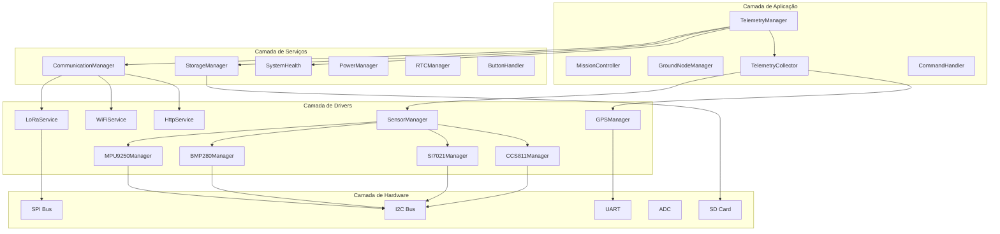
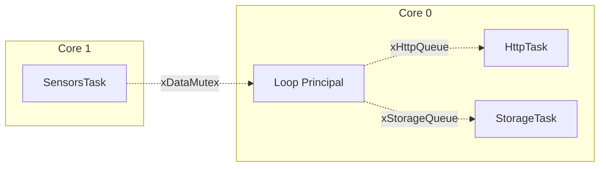
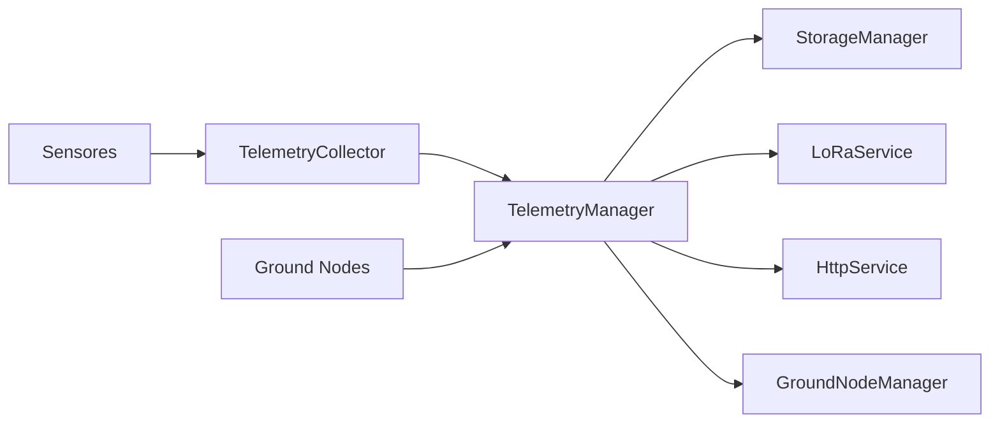

# Documentação Técnica AgroSat-IoT

## Parte 1: Visão Geral e Arquitetura do Sistema

### 1.1 Introdução

O **AgroSat-IoT** é um sistema embarcado desenvolvido para operar em um CubeSat no formato 1U (10x10x10 cm), projetado para monitoramento remoto de cultivos agrícolas em regiões sem cobertura de internet ou telefonia celular.

O sistema atua como um **relay Store-and-Forward**, recebendo dados de sensores terrestres (ground nodes) via rádio LoRa, armazenando-os localmente e retransmitindo quando possível para estações base.

### 1.2 Especificações Técnicas

| Característica | Especificação |
|----------------|---------------|
| Microcontrolador | ESP32 Dual-Core 240MHz |
| Placa | LilyGo T3 V1.6.1 (TTGO LoRa32 V2.1) |
| Rádio | LoRa SX1276 @ 915MHz |
| Memória Flash | 4MB |
| RAM | 320KB (SRAM) |
| Sistema Operacional | FreeRTOS |
| Framework | Arduino (ESP-IDF) |

### 1.3 Arquitetura de Software

O sistema segue uma arquitetura em camadas com separação clara de responsabilidades:



### 1.4 Estrutura de Diretórios

```
AgroSat-IoT/
├── include/                    # Headers de configuração
│   ├── config.h               # Agregador de configurações
│   ├── Globals.h              # Recursos globais (mutexes, filas)
│   ├── config/
│   │   ├── pins.h             # Mapeamento de pinos GPIO
│   │   ├── constants.h        # Constantes do sistema
│   │   ├── modes.h            # Modos de operação
│   │   └── debug.h            # Macros de debug
│   └── types/
│       └── TelemetryTypes.h   # Estruturas de dados
├── src/
│   ├── main.cpp               # Ponto de entrada
│   ├── Globals.cpp            # Implementação de recursos globais
│   ├── app/                   # Lógica de aplicação
│   ├── comm/                  # Comunicação
│   ├── core/                  # Núcleo do sistema
│   ├── sensors/               # Drivers de sensores
│   └── storage/               # Armazenamento
├── lib/                       # Bibliotecas locais
├── docs/                      # Documentação
└── platformio.ini             # Configuração do projeto
```

### 1.5 Modelo de Execução FreeRTOS

O sistema utiliza **FreeRTOS** para gerenciamento de tarefas concorrentes:

| Task | Core | Prioridade | Stack | Frequência | Função |
|------|------|------------|-------|------------|--------|
| **SensorsTask** | 1 | 2 (Alta) | 4KB | 10Hz | Leitura de sensores I2C |
| **HttpTask** | 0 | 1 (Normal) | 8KB | Sob demanda | Envio HTTP assíncrono |
| **StorageTask** | 0 | 1 (Normal) | 8KB | Sob demanda | Gravação em SD Card |
| **Loop (main)** | 0 | 1 (Normal) | - | Contínuo | Comandos, LoRa, lógica |



### 1.6 Sincronização e Recursos Compartilhados

#### Mutexes

| Mutex | Protege | Timeout |
|-------|---------|---------|
| xSerialMutex | Porta Serial (debug) | 100ms |
| xI2CMutex | Barramento I2C | 200ms |
| xDataMutex | Estruturas de telemetria | 100ms |

#### Semáforos

| Semáforo | Tipo | Função |
|----------|------|--------|
| xLoRaRxSemaphore | Binário | Sinaliza recepção LoRa (ISR para Task) |

#### Filas

| Fila | Tamanho | Tipo de Mensagem | Função |
|------|---------|------------------|--------|
| xHttpQueue | 5 itens | HttpQueueMessage | Envio HTTP assíncrono |
| xStorageQueue | 10 itens | uint8_t (sinal) | Gravação SD assíncrona |

### 1.7 Fluxo de Dados Principal



### 1.8 Dependências Externas

| Biblioteca | Versão | Função |
|------------|--------|--------|
| RTClib | ^2.1.4 | Driver RTC DS3231 |
| LoRa | ^0.8.0 | Comunicação LoRa SX1276 |
| ArduinoJson | ^6.21.3 | Serialização JSON |
| TinyGPSPlus | ^1.0.0 | Parsing NMEA GPS |

### 1.9 Uso de Memória

**Compilação atual:**

| Recurso | Uso | Percentual |
|---------|-----|------------|
| RAM | 50.304 bytes | 15.4% |
| Flash | 1.077.957 bytes | 82.2% |

**Distribuição estimada de RAM:**

| Componente | Tamanho Estimado |
|------------|------------------|
| Stack das Tasks | ~24KB |
| Filas FreeRTOS | ~3KB |
| Buffers de telemetria | ~2KB |
| Buffers de comunicação | ~4KB |
| Variáveis globais | ~5KB |
| Heap livre | ~12KB |

---

*Próxima parte: [02 - Hardware e Pinagem](02-hardware-pinagem.md)*