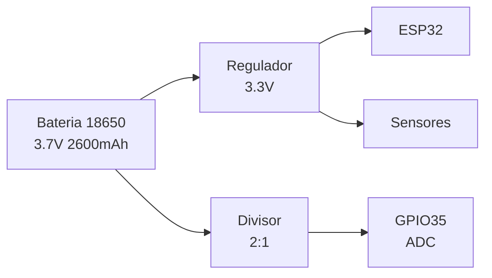

# Documentação Técnica AgroSat-IoT

## Parte 2: Hardware e Pinagem

### 2.1 Placa Principal - LilyGo T3 V1.6.1

A placa principal é a **LilyGo T3 V1.6.1** (também conhecida como TTGO LoRa32 V2.1), que integra:

- **ESP32-PICO-D4**: Microcontrolador dual-core Xtensa LX6 @ 240MHz
- **SX1276**: Transceptor LoRa para banda ISM 915MHz
- **Display OLED**: 0.96" 128x64 (opcional, não utilizado)
- **Conector JST**: Para bateria Li-ion 3.7V
- **USB-C**: Programação e alimentação

### 2.2 Diagrama de Conexões

```mermaid
graph TB
    subgraph "ESP32 - LilyGo T3 V1.6.1"
        ESP[ESP32-PICO-D4]
    end
    
    subgraph "Comunicação LoRa"
        LORA[SX1276]
        ANT[Antena 915MHz]
    end
    
    subgraph "Sensores I2C"
        MPU[MPU9250<br/>IMU 9-DOF]
        BMP[BMP280<br/>Pressão/Temp]
        SI[SI7021<br/>Umidade/Temp]
        CCS[CCS811<br/>CO2/TVOC]
        RTC[DS3231<br/>RTC]
    end
    
    subgraph "GPS"
        GPS[NEO-M8N]
    end
    
    subgraph "Armazenamento"
        SD[MicroSD Card]
    end
    
    subgraph "Energia"
        BAT[Bateria 18650]
        DIV[Divisor Tensão]
    end
    
    ESP <-->|VSPI| LORA
    LORA --- ANT
    ESP <-->|I2C| MPU
    ESP <-->|I2C| BMP
    ESP <-->|I2C| SI
    ESP <-->|I2C| CCS
    ESP <-->|I2C| RTC
    ESP <-->|UART2| GPS
    ESP <-->|HSPI| SD
    BAT --> DIV
    DIV -->|ADC| ESP
```

### 2.3 Mapeamento de Pinos GPIO

#### GPS (UART2)

| Pino ESP32 | GPIO | Função | Descrição |
|------------|------|--------|-----------|
| RX2 | GPIO34 | GPS_RX_PIN | Recebe dados NMEA do GPS |
| TX2 | GPIO12 | GPS_TX_PIN | Envia comandos para GPS |

**Configuração:** 9600 baud, 8N1

#### LoRa SX1276 (VSPI)

| Pino ESP32 | GPIO | Função | Descrição |
|------------|------|--------|-----------|
| VSPI_CLK | GPIO5 | LORA_SCK | Clock SPI (usado internamente) |
| VSPI_MISO | GPIO19 | LORA_MISO | Master In Slave Out |
| VSPI_MOSI | GPIO27 | LORA_MOSI | Master Out Slave In |
| CS | GPIO18 | LORA_CS | Chip Select |
| RST | GPIO23 | LORA_RST | Reset (ativo baixo) |
| DIO0 | GPIO26 | LORA_DIO0 | Interrupção RX/TX Done |

**Nota:** Os pinos SCK, MISO e MOSI são usados pela biblioteca LoRa internamente (VSPI padrão do ESP32).

#### SD Card (HSPI)

| Pino ESP32 | GPIO | Função | Descrição |
|------------|------|--------|-----------|
| HSPI_CLK | GPIO14 | SD_SCLK | Clock SPI |
| HSPI_MISO | GPIO2 | SD_MISO | Master In Slave Out |
| HSPI_MOSI | GPIO15 | SD_MOSI | Master Out Slave In |
| CS | GPIO13 | SD_CS | Chip Select |

**Atenção:** GPIO2 é um strapping pin - não deve estar em HIGH durante o boot.

#### Barramento I2C (Wire)

| Pino ESP32 | GPIO | Função | Descrição |
|------------|------|--------|-----------|
| SDA | GPIO21 | SENSOR_I2C_SDA | Dados I2C |
| SCL | GPIO22 | SENSOR_I2C_SCL | Clock I2C |

**Configuração:** 100kHz (Standard Mode), timeout 3000ms

#### Gerenciamento de Energia

| Pino ESP32 | GPIO | Função | Descrição |
|------------|------|--------|-----------|
| ADC1_CH7 | GPIO35 | BATTERY_PIN | Leitura tensão bateria |

**Circuito:** Divisor de tensão 2:1 (BATTERY_DIVIDER = 2.0)

#### GPIOs Auxiliares

| Pino ESP32 | GPIO | Função | Descrição |
|------------|------|--------|-----------|
| LED | GPIO25 | LED_BUILTIN | LED indicador de status |
| BTN | GPIO4 | BUTTON_PIN | Botão de usuário (INPUT_PULLUP) |

### 2.4 Endereços I2C dos Sensores

| Sensor | Endereço | Alternativo | Descrição |
|--------|----------|-------------|-----------|
| MPU9250 | 0x69 | 0x68 | IMU 9-DOF (AD0=HIGH) |
| BMP280 | 0x76 | 0x77 | Barômetro (SDO=GND) |
| SI7021 | 0x40 | - | Higrômetro (fixo) |
| CCS811 | 0x5A | 0x5B | Sensor CO2 (ADDR=LOW) |
| DS3231 | 0x68 | - | RTC (fixo) |

**Nota:** MPU9250 e DS3231 compartilham o endereço 0x68, por isso o MPU9250 é configurado com AD0=HIGH (0x69).

### 2.5 Sensores - Especificações Detalhadas

#### MPU9250 - IMU 9-DOF

| Parâmetro | Especificação |
|-----------|---------------|
| Acelerômetro | ±2g, ±4g, ±8g, ±16g |
| Giroscópio | ±250, ±500, ±1000, ±2000 °/s |
| Magnetômetro | ±4800 µT (AK8963) |
| Taxa de amostragem | Até 8kHz (accel/gyro), 100Hz (mag) |
| Interface | I2C @ 400kHz |

#### BMP280 - Barômetro

| Parâmetro | Especificação |
|-----------|---------------|
| Pressão | 300 - 1100 hPa |
| Temperatura | -40°C a +85°C |
| Precisão pressão | ±1 hPa |
| Precisão temperatura | ±1°C |
| Interface | I2C @ 3.4MHz |

#### SI7021 - Higrômetro

| Parâmetro | Especificação |
|-----------|---------------|
| Umidade | 0% - 100% RH |
| Temperatura | -40°C a +125°C |
| Precisão umidade | ±3% RH |
| Precisão temperatura | ±0.4°C |
| Interface | I2C @ 400kHz |

#### CCS811 - Sensor de Qualidade do Ar

| Parâmetro | Especificação |
|-----------|---------------|
| eCO2 | 400 - 8192 ppm |
| TVOC | 0 - 1187 ppb |
| Tempo de warmup | 20 minutos |
| Interface | I2C @ 400kHz |

#### NEO-M8N - GPS

| Parâmetro | Especificação |
|-----------|---------------|
| Canais | 72 (GPS, GLONASS, Galileo, BeiDou) |
| Precisão horizontal | 2.5m CEP |
| Sensibilidade | -167 dBm (tracking) |
| Taxa de atualização | 1-10 Hz |
| Interface | UART @ 9600 baud |

#### DS3231 - RTC

| Parâmetro | Especificação |
|-----------|---------------|
| Precisão | ±2 ppm (±1 min/ano) |
| Bateria backup | CR2032 |
| Interface | I2C @ 400kHz |

### 2.6 Rádio LoRa - Configuração

| Parâmetro | Valor | Constante |
|-----------|-------|-----------|
| Frequência | 915 MHz | LORA_FREQUENCY |
| Spreading Factor | 7 | LORA_SPREADING_FACTOR |
| Bandwidth | 125 kHz | LORA_SIGNAL_BANDWIDTH |
| Coding Rate | 4/5 | LORA_CODING_RATE |
| Potência TX | 20 dBm | LORA_TX_POWER |
| Preâmbulo | 8 símbolos | LORA_PREAMBLE_LENGTH |
| Sync Word | 0x12 | LORA_SYNC_WORD |
| CRC | Habilitado | LORA_CRC_ENABLED |

**Duty Cycle:** Máximo 10% por hora (regulamentação ANATEL)

### 2.7 Alimentação



#### Limiares de Bateria

| Estado | Tensão | Ação |
|--------|--------|------|
| Normal | > 3.7V | Operação normal |
| Baixa | 3.3V - 3.7V | Reduz frequência de TX |
| Crítica | < 3.3V | Entra em SAFE MODE |

#### Cálculo de Tensão

```
V_bateria = V_adc × BATTERY_DIVIDER × (BATTERY_VREF / 4095)
V_bateria = V_adc × 2.0 × (3.6 / 4095)
```

### 2.8 Consumo de Energia Estimado

| Componente | Modo Ativo | Modo Sleep |
|------------|------------|------------|
| ESP32 | 80-240 mA | 10 µA |
| LoRa TX | 120 mA | 0.2 µA |
| LoRa RX | 12 mA | 0.2 µA |
| GPS | 25-50 mA | 7 mA |
| Sensores I2C | ~10 mA | ~1 mA |
| SD Card | 50-100 mA | 0.1 mA |
| **Total (típico)** | **~200 mA** | **~20 mA** |

**Autonomia estimada:** ~13 horas (bateria 2600mAh, consumo médio 200mA)

---

*Anterior: [01 - Visão Geral](01-visao-geral.md)*

*Próxima parte: [03 - Modos de Operação](03-modos-operacao.md)*