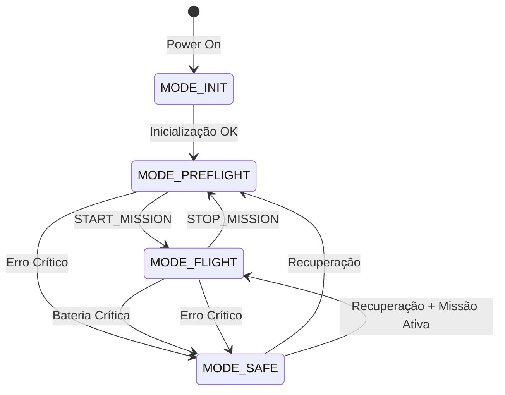
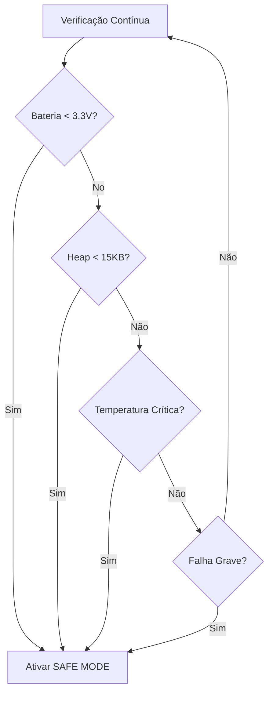
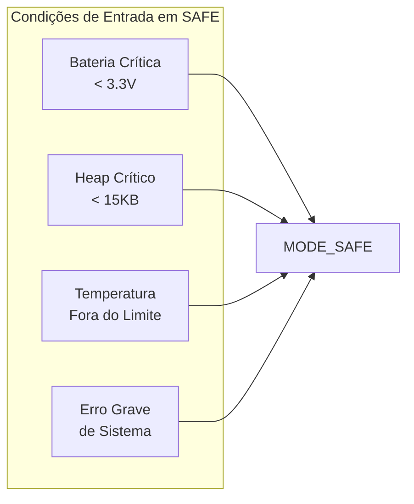
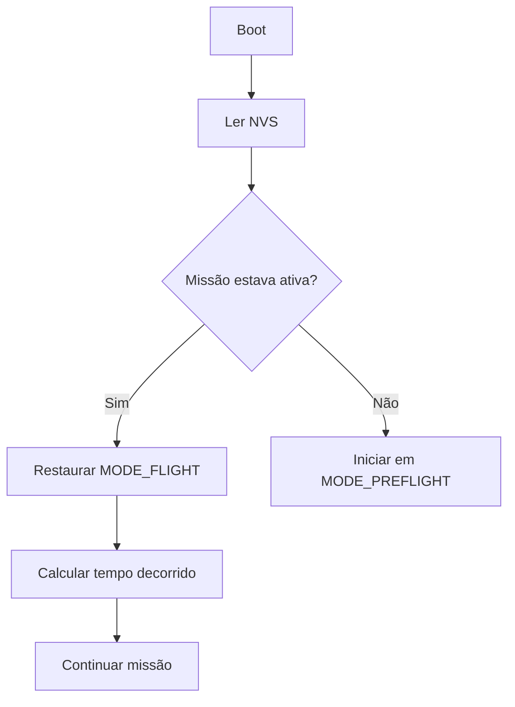

# Documentação Técnica AgroSat-IoT

## Parte 3: Modos de Operação

### 3.1 Visão Geral dos Modos

O sistema opera em três modos principais, cada um otimizado para diferentes fases da missão:



### 3.2 Enumeração de Modos

```cpp
enum OperationMode : uint8_t {
    MODE_INIT = 0,       // Inicialização (transitório)
    MODE_PREFLIGHT = 1,  // Pré-voo: testes e configuração
    MODE_FLIGHT = 2,     // Voo: coleta ativa de dados
    MODE_SAFE = 3        // Seguro: emergência/economia
};
```

### 3.3 Modo PREFLIGHT (Pré-Voo)

**Propósito:** Testes em solo, configuração e verificação do sistema antes do lançamento.

#### Características

| Parâmetro | Valor | Descrição |
|-----------|-------|-----------|
| Serial Logs | ✅ Habilitado | Debug completo via Serial |
| SD Verbose | ✅ Habilitado | Logs detalhados no SD |
| LoRa | ✅ Habilitado | Comunicação rádio ativa |
| HTTP | ✅ Habilitado | Envio para servidor |
| WiFi | ✅ Habilitado | Conexão de rede |
| Intervalo Telemetria | 20 segundos | Frequente para testes |
| Intervalo Storage | 1 segundo | Máxima resolução |
| Beacon | Desabilitado | Não necessário |
| Watchdog Timeout | 60 segundos | Tolerante para debug |

#### Configuração no Código

```cpp
const ModeConfig PREFLIGHT_CONFIG = {
    .serialLogsEnabled = true,
    .sdLogsVerbose = true,
    .loraEnabled = true,
    .httpEnabled = true,
    .telemetrySendInterval = 20000,   // 20s
    .storageSaveInterval = 1000,      // 1s
    .beaconInterval = 0               // Desabilitado
};
```

#### Casos de Uso

- Verificação de sensores antes do lançamento
- Calibração do magnetômetro
- Testes de comunicação LoRa
- Validação de armazenamento SD
- Debug de problemas

### 3.4 Modo FLIGHT (Voo)

**Propósito:** Operação principal durante a missão orbital, otimizado para coleta de dados e economia de energia.

#### Características

| Parâmetro | Valor | Descrição |
|-----------|-------|-----------|
| Serial Logs | ❌ Desabilitado | Economia de processamento |
| SD Verbose | ❌ Desabilitado | Logs essenciais apenas |
| LoRa | ✅ Habilitado | Comunicação principal |
| HTTP | ✅ Habilitado | Quando WiFi disponível |
| WiFi | ✅ Habilitado | Para ground stations |
| Intervalo Telemetria | 60 segundos | Economia de duty cycle |
| Intervalo Storage | 10 segundos | Balanço resolução/espaço |
| Beacon | Desabilitado | Telemetria normal |
| Watchdog Timeout | 90 segundos | Operação autônoma |

#### Configuração no Código

```cpp
const ModeConfig FLIGHT_CONFIG = {
    .serialLogsEnabled = false,
    .sdLogsVerbose = false,
    .loraEnabled = true,
    .httpEnabled = true,
    .telemetrySendInterval = 60000,   // 60s
    .storageSaveInterval = 10000,     // 10s
    .beaconInterval = 0               // Desabilitado
};
```

#### Funcionalidades Ativas

- Coleta contínua de telemetria
- Recepção de dados de ground nodes
- Armazenamento em SD Card
- Transmissão LoRa periódica
- Monitoramento de saúde do sistema
- Controle automático de energia

### 3.5 Modo SAFE (Seguro)

**Propósito:** Modo de emergência para preservar o sistema em condições críticas.

#### Características

| Parâmetro | Valor | Descrição |
|-----------|-------|-----------|
| Serial Logs | ✅ Habilitado | Diagnóstico de problemas |
| SD Verbose | ✅ Habilitado | Registro de eventos |
| LoRa | ✅ Habilitado | Beacon de localização |
| HTTP | ❌ Desabilitado | Economia de energia |
| WiFi | ❌ Desabilitado | Economia de energia |
| Intervalo Telemetria | 120 segundos | Máxima economia |
| Intervalo Storage | 300 segundos | Mínimo uso de SD |
| Beacon | 180 segundos | Localização periódica |
| Watchdog Timeout | 180 segundos | Máxima tolerância |

#### Configuração no Código

```cpp
const ModeConfig SAFE_CONFIG = {
    .serialLogsEnabled = true,
    .sdLogsVerbose = true,
    .loraEnabled = true,
    .httpEnabled = false,
    .telemetrySendInterval = 120000,  // 2min
    .storageSaveInterval = 300000,    // 5min
    .beaconInterval = 180000          // 3min
};
```

#### Condições de Ativação Automática



#### Beacon de Localização

Em modo SAFE, o sistema transmite beacons periódicos contendo:

| Campo | Tamanho | Descrição |
|-------|---------|-----------|
| Magic | 2 bytes | 0xBEAC (identificador) |
| Team ID | 2 bytes | ID da equipe |
| Mode | 1 byte | Modo atual (SAFE=3) |
| Battery | 2 bytes | Tensão × 100 |
| Uptime | 4 bytes | Tempo ligado (segundos) |
| Status | 1 byte | Flags de erro |
| Errors | 2 bytes | Contador de erros |
| Free Heap | 4 bytes | Memória livre |
| Reset Count | 2 bytes | Número de resets |
| Reset Reason | 1 byte | Razão do último reset |
| GPS Fix | 1 byte | 1 se tem fix |

### 3.6 Transições de Modo

#### Comandos Manuais

| Comando | Transição | Descrição |
|---------|-----------|-----------|
| `START_MISSION` | PREFLIGHT → FLIGHT | Inicia missão |
| `STOP_MISSION` | FLIGHT → PREFLIGHT | Encerra missão |
| `SAFE_MODE` | Qualquer → SAFE | Força modo seguro |

#### Via Botão Físico

| Ação | Resultado |
|------|-----------|
| Pressão curta (<2s) | Alterna PREFLIGHT ↔ FLIGHT |
| Pressão longa (>2s) | Ativa SAFE MODE |

#### Transições Automáticas



### 3.7 Persistência de Estado

O estado da missão é persistido na **NVS (Non-Volatile Storage)** do ESP32:

```cpp
// Namespace: "mission"
// Chaves:
//   - "active" (bool): Missão em andamento
//   - "start_utc" (uint32_t): Timestamp UTC de início
```

#### Recuperação após Reset



### 3.8 Indicação Visual (LED)

O LED integrado indica o modo atual:

| Modo | Padrão do LED |
|------|---------------|
| PREFLIGHT | Aceso contínuo |
| FLIGHT | Pisca 1Hz (1s ligado, 1s desligado) |
| SAFE | Pisca rápido 5Hz (200ms ciclo) |

### 3.9 Watchdog por Modo

Cada modo tem um timeout de watchdog diferente:

| Modo | Timeout | Justificativa |
|------|---------|---------------|
| PREFLIGHT | 60s | Permite debug mais longo |
| FLIGHT | 90s | Operação autônoma normal |
| SAFE | 180s | Máxima tolerância em emergência |

### 3.10 Comparativo de Modos

| Característica | PREFLIGHT | FLIGHT | SAFE |
|----------------|-----------|--------|------|
| **Foco** | Debug/Teste | Coleta de Dados | Sobrevivência |
| **Consumo** | Alto | Médio | Baixo |
| **Logs Serial** | ✅ | ❌ | ✅ |
| **WiFi/HTTP** | ✅ | ✅ | ❌ |
| **LoRa** | ✅ | ✅ | ✅ (Beacon) |
| **Intervalo TX** | 20s | 60s | 120s |
| **Intervalo SD** | 1s | 10s | 300s |
| **Watchdog** | 60s | 90s | 180s |

---

*Anterior: [02 - Hardware e Pinagem](02-hardware-pinagem.md)*

*Próxima parte: [04 - Sensores e Coleta de Dados](04-sensores-coleta.md)*