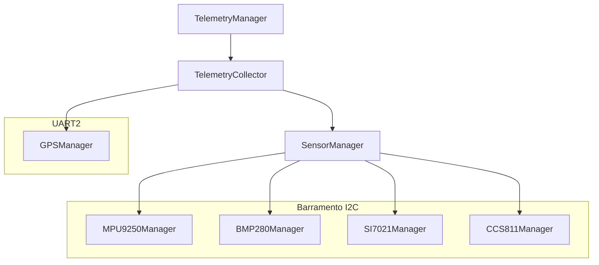
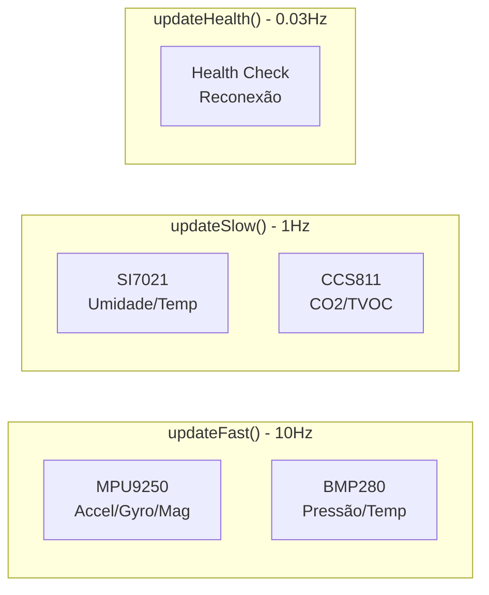
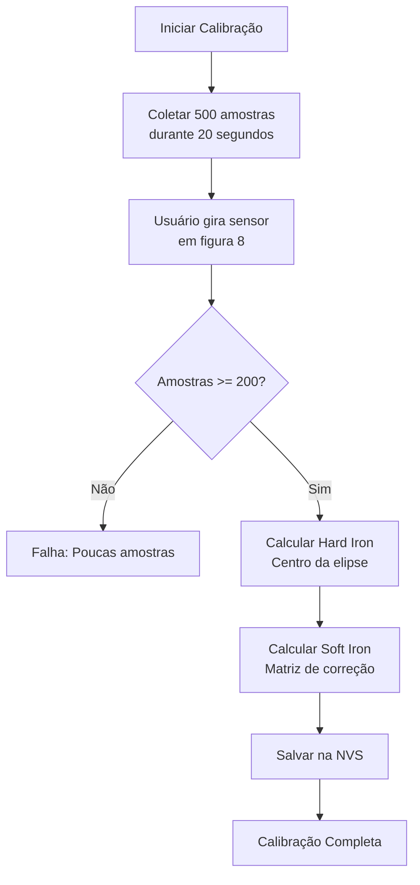
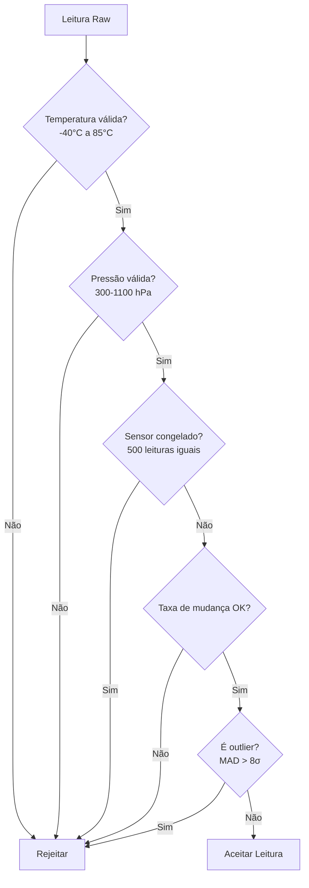
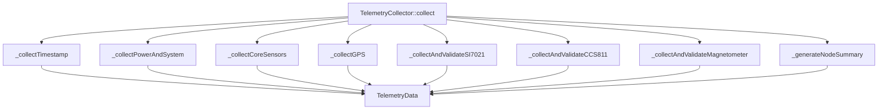
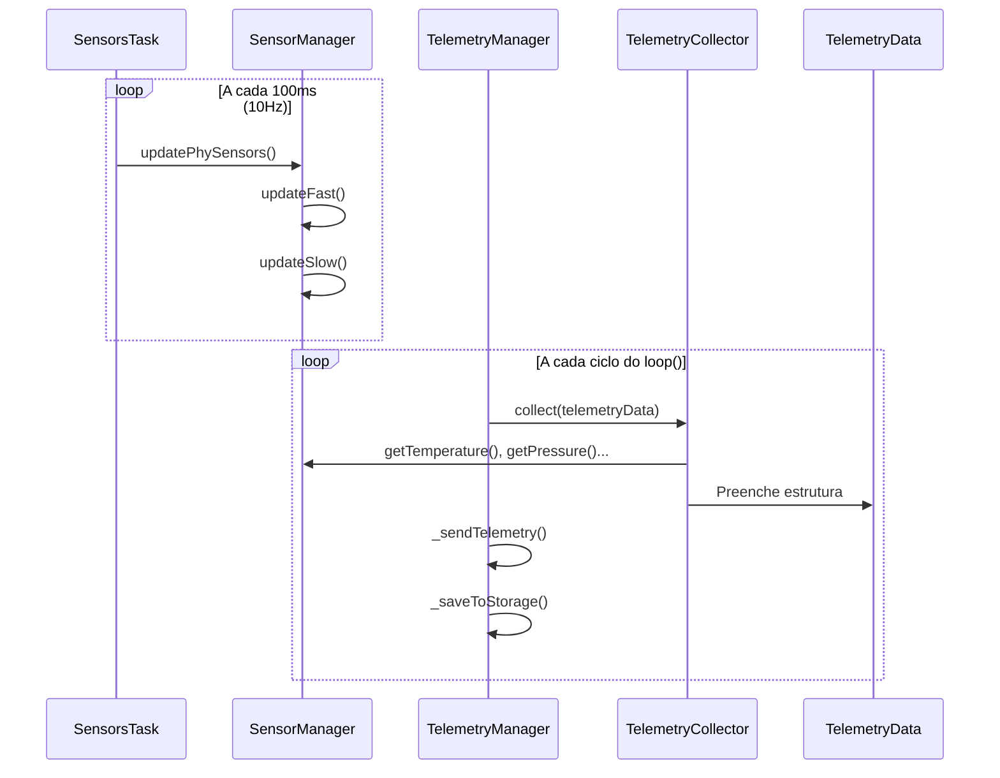

# Documentação Técnica AgroSat-IoT

## Parte 4: Sensores e Coleta de Dados

### 4.1 Arquitetura de Sensores

O sistema utiliza uma arquitetura hierárquica para gerenciamento de sensores:



### 4.2 SensorManager - Orquestrador Central

O `SensorManager` coordena todos os sensores I2C, gerenciando:

- Inicialização sequencial
- Ciclos de atualização diferenciados
- Verificação de saúde
- Recuperação de falhas

#### Ciclos de Atualização



#### Código de Atualização

```cpp
void SensorManager::update() {
    updateFast();   // MPU9250 + BMP280
    updateSlow();   // SI7021 + CCS811
    updateHealth(); // Verificação periódica
}

void SensorManager::updateFast() {
    _mpu9250.update();
    _bmp280.update();
}

void SensorManager::updateSlow() {
    static unsigned long lastSlow = 0;
    if (millis() - lastSlow >= 1000) {
        _si7021.update();
        _ccs811.update();
        _autoApplyEnvironmentalCompensation();
        lastSlow = millis();
    }
}
```

### 4.3 MPU9250Manager - IMU 9-DOF

#### Funcionalidades

- **Acelerômetro**: Medição de aceleração em 3 eixos (g)
- **Giroscópio**: Medição de velocidade angular em 3 eixos (°/s)
- **Magnetômetro**: Medição de campo magnético em 3 eixos (µT)

#### Calibração do Magnetômetro

O magnetômetro requer calibração para compensar:

1. **Hard Iron**: Offset fixo causado por materiais magnéticos próximos
2. **Soft Iron**: Distorção do campo causada por materiais ferromagnéticos



#### Estrutura de Dados

```cpp
// Offsets Hard Iron
float _magOffX, _magOffY, _magOffZ;

// Matriz Soft Iron (3x3)
float _softIronMatrix[3][3];

// Aplicação da correção
void _applySoftIronCorrection(float& mx, float& my, float& mz) {
    float mx_corr = _softIronMatrix[0][0] * mx + 
                    _softIronMatrix[0][1] * my + 
                    _softIronMatrix[0][2] * mz;
    // ... similar para my_corr e mz_corr
}
```

#### Filtro de Média Móvel

O acelerômetro usa filtro de média móvel para suavização:

```cpp
static constexpr uint8_t FILTER_SIZE = 5;
float _bufAX[FILTER_SIZE], _bufAY[FILTER_SIZE], _bufAZ[FILTER_SIZE];

float _applyFilter(float val, float* buf) {
    buf[_filterIdx] = val;
    float sum = 0;
    for (int i = 0; i < FILTER_SIZE; i++) sum += buf[i];
    return sum / FILTER_SIZE;
}
```

### 4.4 BMP280Manager - Barômetro

#### Funcionalidades

- Medição de pressão atmosférica (hPa)
- Medição de temperatura (°C)
- Cálculo de altitude barométrica (m)

#### Validação de Dados

O BMP280Manager implementa validação robusta:



#### Detecção de Anomalias

```cpp
// Detecção de sensor congelado
bool _isFrozen(float currentPressure) {
    if (fabs(currentPressure - _lastPressureRead) < 0.05f) {
        _identicalReadings++;
    } else {
        _identicalReadings = 0;
    }
    return (_identicalReadings >= 500);
}

// Detecção de outliers usando MAD (Median Absolute Deviation)
bool _isOutlier(float value, float* history, uint8_t count) {
    float median = _getMedian(history, count);
    float mad = _getMedian(deviations, count);
    float score = fabs(value - median) / mad;
    return (score > 8.0f);
}
```

#### Histórico para Validação

```cpp
static constexpr uint8_t HISTORY_SIZE = 10;
float _pressureHistory[HISTORY_SIZE];
float _altitudeHistory[HISTORY_SIZE];
float _tempHistory[HISTORY_SIZE];
```

### 4.5 SI7021Manager - Higrômetro

#### Funcionalidades

- Medição de umidade relativa (%)
- Medição de temperatura (°C) - redundância

#### Validação

```cpp
// Limites de validação
static constexpr float TEMP_MIN = -40.0f;
static constexpr float TEMP_MAX = 125.0f;
static constexpr float HUM_MIN = 0.0f;
static constexpr float HUM_MAX = 100.0f;

// Intervalo mínimo entre leituras
static constexpr unsigned long READ_INTERVAL_MS = 2000;
```

#### Recuperação de Falhas

```cpp
void SI7021Manager::update() {
    // ... leitura ...
    
    _failCount++;
    if (_failCount >= 5) {
        DEBUG_PRINTLN("[SI7021Manager] 5 falhas consecutivas. Resetando...");
        reset();
    }
}
```

### 4.6 CCS811Manager - Qualidade do Ar

#### Funcionalidades

- Medição de eCO2 (ppm) - CO2 equivalente
- Medição de TVOC (ppb) - Compostos Orgânicos Voláteis

#### Período de Warmup

O CCS811 requer 20 minutos de warmup para leituras confiáveis:

```cpp
static constexpr unsigned long WARMUP_TIME = 20 * 60 * 1000; // 20 min

bool isWarmupComplete() const {
    return (millis() - _initTime) > WARMUP_TIME;
}

bool isDataValid() const {
    return _online && isWarmupComplete();
}
```

#### Compensação Ambiental

O CCS811 usa dados de temperatura e umidade para compensação:

```cpp
void CCS811Manager::setEnvironmentalData(float hum, float temp) {
    if (_online) {
        _ccs811.setEnvironmentalData(hum, temp);
    }
}

// Chamado automaticamente pelo SensorManager
void SensorManager::_autoApplyEnvironmentalCompensation() {
    float hum = _si7021.getHumidity();
    float temp = _si7021.getTemperature();
    _ccs811.setEnvironmentalData(hum, temp);
}
```

#### Baseline

O baseline do CCS811 pode ser salvo/restaurado para acelerar a estabilização:

```cpp
bool saveBaseline() {
    uint16_t baseline;
    if (_ccs811.getBaseline(baseline)) {
        Preferences prefs;
        prefs.begin("ccs811", false);
        prefs.putUShort("base", baseline);
        prefs.end();
        return true;
    }
    return false;
}

bool restoreBaseline() {
    Preferences prefs;
    prefs.begin("ccs811", true);
    uint16_t baseline = prefs.getUShort("base");
    prefs.end();
    _ccs811.setBaseline(baseline);
    return true;
}
```

### 4.7 GPSManager - Posicionamento

#### Funcionalidades

- Latitude/Longitude (graus decimais)
- Altitude GPS (metros)
- Número de satélites
- Status de fix

#### Parsing NMEA

Utiliza a biblioteca TinyGPS++ para parsing:

```cpp
void GPSManager::update() {
    while (Serial2.available() > 0) {
        char c = Serial2.read();
        if (_gps.encode(c)) {
            _processNewData();
        }
    }
}
```

#### Validação de Coordenadas

```cpp
bool _isValidCoordinate(double lat, double lng) const {
    return (lat >= -90.0 && lat <= 90.0 &&
            lng >= -180.0 && lng <= 180.0 &&
            !(lat == 0.0 && lng == 0.0));
}

bool _isAnomalousJump(double newLat, double newLng, uint32_t dtMs) {
    // Detecta saltos impossíveis (velocidade > 1000 km/h)
    double distance = _haversineDistance(_latitude, _longitude, newLat, newLng);
    double speedKmh = (distance / 1000.0) / (dtMs / 3600000.0);
    return (speedKmh > 1000.0);
}
```

### 4.8 TelemetryCollector - Agregador de Dados

O `TelemetryCollector` agrega dados de todos os sensores em uma estrutura unificada:



#### Estrutura TelemetryData

```cpp
struct TelemetryData {
    // Timestamps
    unsigned long timestamp;      // millis()
    unsigned long missionTime;    // Tempo desde início
    
    // Bateria
    float batteryVoltage;
    float batteryPercentage;
    
    // Temperaturas
    float temperature;            // Fusionada
    float temperatureBMP;         // BMP280
    float temperatureSI;          // SI7021
    
    // Barômetro
    float pressure;               // hPa
    float altitude;               // metros
    
    // GPS
    double latitude, longitude;
    float gpsAltitude;
    uint8_t satellites;
    bool gpsFix;
    
    // IMU
    float gyroX, gyroY, gyroZ;    // °/s
    float accelX, accelY, accelZ; // g
    float magX, magY, magZ;       // µT
    
    // Ambiente
    float humidity;               // %
    float co2;                    // ppm
    float tvoc;                   // ppb
    
    // Status
    uint8_t systemStatus;         // Flags de erro
    uint16_t errorCount;
    
    // Sistema
    uint32_t uptime;
    uint16_t resetCount;
    uint8_t resetReason;
    uint32_t minFreeHeap;
    float cpuTemp;
    
    // Payload customizado
    char payload[64];
};
```

### 4.9 Fusão de Temperatura

O sistema possui duas fontes de temperatura (BMP280 e SI7021). A fusão prioriza:

```cpp
void TelemetryCollector::_collectCoreSensors(TelemetryData& data) {
    // Prioridade: SI7021 > BMP280
    if (_sensors.isSI7021Online()) {
        data.temperature = _sensors.getTemperatureSI7021();
    } else if (_sensors.isBMP280Online()) {
        data.temperature = _sensors.getTemperatureBMP280();
    }
    
    // Sempre coleta ambas para redundância
    data.temperatureBMP = _sensors.getTemperatureBMP280();
    data.temperatureSI = _sensors.getTemperatureSI7021();
}
```

### 4.10 Validação de Dados do Magnetômetro

```cpp
void TelemetryCollector::_collectAndValidateMagnetometer(TelemetryData& data) {
    float mx = _sensors.getMagX();
    float my = _sensors.getMagY();
    float mz = _sensors.getMagZ();
    
    // Validação de range (-4800 a +4800 µT)
    if (mx >= MAG_MIN_VALID && mx <= MAG_MAX_VALID &&
        my >= MAG_MIN_VALID && my <= MAG_MAX_VALID &&
        mz >= MAG_MIN_VALID && mz <= MAG_MAX_VALID) {
        data.magX = mx;
        data.magY = my;
        data.magZ = mz;
    } else {
        data.magX = data.magY = data.magZ = NAN;
    }
}
```

### 4.11 Fluxo de Dados Completo



---

*Anterior: [03 - Modos de Operação](03-modos-operacao.md)*

*Próxima parte: [05 - Comunicação LoRa e WiFi](05-comunicacao.md)*