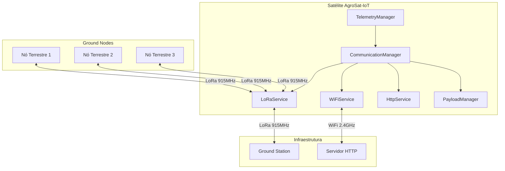
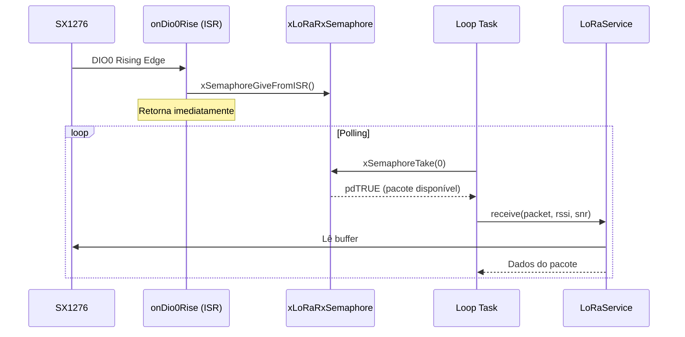
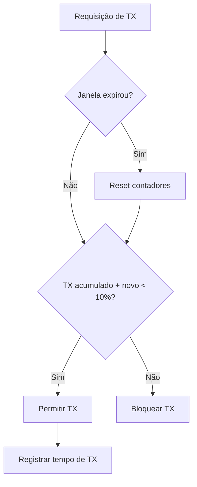
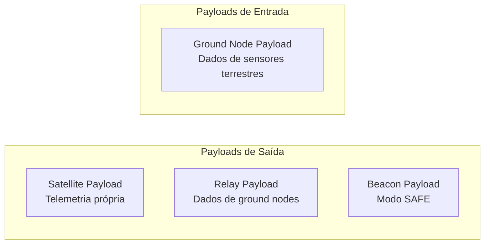
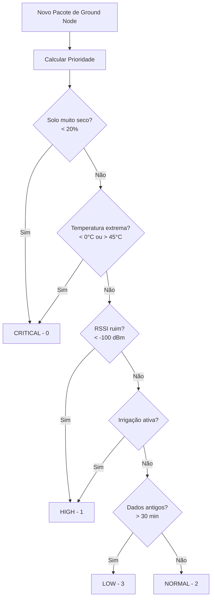
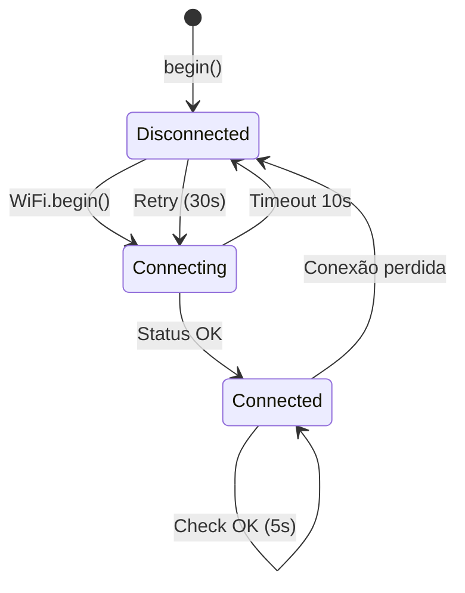
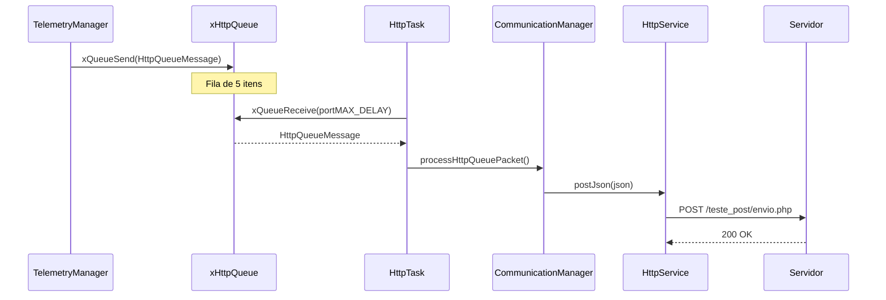

# Documentação Técnica AgroSat-IoT

## Parte 5: Comunicação LoRa e WiFi

### 5.1 Arquitetura de Comunicação

O sistema possui dois canais de comunicação principais:



### 5.2 CommunicationManager - Orquestrador

O `CommunicationManager` coordena todos os serviços de comunicação:

```cpp
class CommunicationManager {
public:
    bool begin();
    void update();
    
    // LoRa
    bool sendLoRa(const uint8_t* data, size_t len);
    bool receiveLoRaPacket(String& packet, int& rssi, float& snr);
    bool processLoRaPacket(const String& packet, MissionData& data);
    
    // WiFi
    void connectWiFi();
    bool isWiFiConnected();
    
    // HTTP
    void sendTelemetry(const TelemetryData& data, GroundNodeBuffer& nodes);
    void processHttpQueuePacket(const HttpQueueMessage& packet);
    
    // Controle
    void enableLoRa(bool enable);
    void enableHTTP(bool enable);
    
    // Duty Cycle
    DutyCycleTracker& getDutyCycleTracker();
};
```

### 5.3 LoRaService - Comunicação Rádio

#### Configuração do Rádio

```cpp
bool LoRaService::begin() {
    LoRa.setPins(LORA_CS, LORA_RST, LORA_DIO0);
    
    if (!LoRa.begin(LORA_FREQUENCY)) {
        return false;
    }
    
    LoRa.setSpreadingFactor(LORA_SPREADING_FACTOR);  // SF7
    LoRa.setSignalBandwidth(LORA_SIGNAL_BANDWIDTH);  // 125kHz
    LoRa.setCodingRate4(LORA_CODING_RATE);           // 4/5
    LoRa.setTxPower(LORA_TX_POWER);                  // 20dBm
    LoRa.setPreambleLength(LORA_PREAMBLE_LENGTH);    // 8
    LoRa.setSyncWord(LORA_SYNC_WORD);                // 0x12
    LoRa.enableCrc();
    
    // Configura interrupção para recepção
    LoRa.onReceive(LoRaService::onDio0Rise);
    LoRa.receive();
    
    return true;
}
```

#### Recepção com Interrupção



#### Código da ISR

```cpp
volatile bool _packetReceived = false;

void IRAM_ATTR LoRaService::onDio0Rise(int packetSize) {
    if (packetSize > 0) {
        _packetReceived = true;
        BaseType_t xHigherPriorityTaskWoken = pdFALSE;
        xSemaphoreGiveFromISR(xLoRaRxSemaphore, &xHigherPriorityTaskWoken);
        if (xHigherPriorityTaskWoken) {
            portYIELD_FROM_ISR();
        }
    }
}
```

#### Transmissão

```cpp
bool LoRaService::send(const uint8_t* data, size_t len, bool isAsync) {
    if (!_initialized || len == 0) return false;
    
    LoRa.beginPacket();
    LoRa.write(data, len);
    LoRa.endPacket(isAsync);
    
    // Registra tempo de transmissão para duty cycle
    uint32_t airTime = _calculateTimeOnAir(len);
    _dutyCycle.recordTransmission(airTime);
    
    // Volta para modo recepção
    LoRa.receive();
    
    return true;
}
```

### 5.4 Controle de Duty Cycle

A regulamentação ANATEL limita o duty cycle a 10% na banda ISM 915MHz.

#### DutyCycleTracker

```cpp
class DutyCycleTracker {
public:
    bool canTransmit(uint32_t transmissionTimeMs);
    void recordTransmission(uint32_t transmissionTimeMs);
    float getDutyCyclePercent() const;
    uint32_t getAccumulatedTxTime() const;
    
private:
    uint32_t _windowStartTime;      // Início da janela
    uint32_t _accumulatedTxTime;    // TX acumulado
    
    static constexpr uint32_t WINDOW_DURATION_MS = 3600000;  // 1 hora
    static constexpr uint8_t DUTY_CYCLE_PERCENT = 10;        // 10%
    static constexpr uint32_t MAX_TX_TIME_MS = 360000;       // 360s/hora
};
```

#### Lógica de Controle



#### Cálculo de Time-on-Air

```cpp
uint32_t _calculateTimeOnAir(size_t payloadSize) {
    // Fórmula simplificada para SF7, BW125kHz
    // ToA ≈ (8 + max(ceil((8*PL - 4*SF + 28) / (4*SF)), 0) * (CR+4)) * Ts
    // Ts = 2^SF / BW
    
    float symbolTime = pow(2, LORA_SPREADING_FACTOR) / LORA_SIGNAL_BANDWIDTH * 1000;
    float preambleTime = (LORA_PREAMBLE_LENGTH + 4.25) * symbolTime;
    
    int payloadSymbols = 8 + max(
        ceil((8.0 * payloadSize - 4 * LORA_SPREADING_FACTOR + 28) / 
             (4 * LORA_SPREADING_FACTOR)) * (LORA_CODING_RATE + 4),
        0.0
    );
    
    return (uint32_t)(preambleTime + payloadSymbols * symbolTime);
}
```

### 5.5 PayloadManager - Formatação de Dados

#### Tipos de Payload



#### Estrutura do Satellite Payload (Binário)

| Offset | Tamanho | Campo | Descrição |
|--------|---------|-------|-----------|
| 0 | 2 | Team ID | Identificador da equipe |
| 2 | 1 | Packet Type | 0x01 = Satellite |
| 3 | 4 | Timestamp | Unix timestamp |
| 7 | 2 | Battery | Tensão × 100 |
| 9 | 2 | Temperature | Temp × 100 |
| 11 | 2 | Pressure | Pressão × 10 |
| 13 | 4 | Latitude | Lat × 1000000 |
| 17 | 4 | Longitude | Lng × 1000000 |
| 21 | 2 | Altitude | Altitude em metros |
| 23 | 1 | Satellites | Número de satélites |
| 24 | 1 | Status | Flags de status |
| 25 | 6 | Accel | X, Y, Z × 100 (2 bytes cada) |
| 31 | 6 | Gyro | X, Y, Z × 10 (2 bytes cada) |
| 37 | 6 | Mag | X, Y, Z × 10 (2 bytes cada) |
| 43 | 2 | Humidity | Umidade × 100 |
| 45 | 2 | CO2 | eCO2 em ppm |
| 47 | 2 | TVOC | TVOC em ppb |

#### Código de Encoding

```cpp
int PayloadManager::createSatellitePayload(const TelemetryData& data, uint8_t* buffer) {
    int offset = 0;
    
    // Header
    buffer[offset++] = (TEAM_ID >> 8) & 0xFF;
    buffer[offset++] = TEAM_ID & 0xFF;
    buffer[offset++] = 0x01;  // Packet type: Satellite
    
    // Timestamp (4 bytes)
    uint32_t ts = data.timestamp / 1000;
    buffer[offset++] = (ts >> 24) & 0xFF;
    buffer[offset++] = (ts >> 16) & 0xFF;
    buffer[offset++] = (ts >> 8) & 0xFF;
    buffer[offset++] = ts & 0xFF;
    
    // Battery (2 bytes, × 100)
    int16_t bat = (int16_t)(data.batteryVoltage * 100);
    buffer[offset++] = (bat >> 8) & 0xFF;
    buffer[offset++] = bat & 0xFF;
    
    // ... continua para outros campos
    
    return offset;
}
```

#### Estrutura do Ground Node Payload

| Offset | Tamanho | Campo | Descrição |
|--------|---------|-------|-----------|
| 0 | 2 | Node ID | Identificador do nó |
| 2 | 2 | Sequence | Número de sequência |
| 4 | 2 | Soil Moisture | Umidade do solo × 100 |
| 6 | 2 | Temperature | Temperatura × 100 |
| 8 | 2 | Humidity | Umidade ar × 100 |
| 10 | 1 | Irrigation | Status irrigação |
| 11 | 4 | Timestamp | Timestamp do nó |

#### Decodificação de Ground Node

```cpp
bool PayloadManager::processLoRaPacket(const String& packet, MissionData& data) {
    // Tenta decodificar como binário
    if (_decodeRawPacket(packet, data)) {
        return true;
    }
    
    // Tenta decodificar como hex string
    if (_decodeHexStringPayload(packet, data)) {
        return true;
    }
    
    return false;
}
```

### 5.6 Priorização de Ground Nodes (QoS)

O sistema prioriza a retransmissão de dados baseado em criticidade:



#### Código de Priorização

```cpp
uint8_t PayloadManager::calculateNodePriority(const MissionData& node) {
    uint8_t priority = static_cast<uint8_t>(PacketPriority::NORMAL);
    
    // Solo muito seco = CRÍTICO
    if (node.soilMoisture < 20.0f) {
        return static_cast<uint8_t>(PacketPriority::CRITICAL);
    }
    
    // Temperatura extrema = CRÍTICO
    if (node.ambientTemp < 0.0f || node.ambientTemp > 45.0f) {
        return static_cast<uint8_t>(PacketPriority::CRITICAL);
    }
    
    // Link ruim = ALTO
    if (node.rssi < -100) {
        return static_cast<uint8_t>(PacketPriority::HIGH_PRIORITY);
    }
    
    // Irrigação ativa = ALTO
    if (node.irrigationStatus == 1) {
        return static_cast<uint8_t>(PacketPriority::HIGH_PRIORITY);
    }
    
    // Dados antigos = BAIXO
    unsigned long age = millis() - node.lastLoraRx;
    if (age > 1800000) {  // 30 minutos
        priority = static_cast<uint8_t>(PacketPriority::LOW_PRIORITY);
    }
    
    return priority;
}
```

### 5.7 WiFiService - Conexão de Rede

#### Gerenciamento de Conexão

```cpp
class WiFiService {
public:
    bool begin();
    void update();
    bool isConnected() const;
    
private:
    static constexpr unsigned long CHECK_INTERVAL = 5000;      // 5s
    static constexpr unsigned long RECONNECT_INTERVAL = 30000; // 30s
};
```

#### Fluxo de Conexão



### 5.8 HttpService - Envio para Servidor

#### Configuração

```cpp
#define HTTP_SERVER "obsat.org.br"
#define HTTP_ENDPOINT "/teste_post/envio.php"
#define HTTP_TIMEOUT_MS 5000
```

#### Formato JSON

```json
{
  "equipe": 666,
  "bateria": 3.85,
  "temperatura": 25.5,
  "pressao": 1013.25,
  "altitude": 150.0,
  "latitude": -16.6869,
  "longitude": -49.2648,
  "giroscopio": {"x": 0.1, "y": -0.2, "z": 0.05},
  "acelerometro": {"x": 0.01, "y": 0.02, "z": 1.0},
  "payload": "dados_customizados"
}
```

#### Envio Assíncrono via Fila



### 5.9 Controle Dinâmico de Potência

O sistema ajusta a potência de transmissão baseado no nível de bateria:

```cpp
void CommunicationManager::_adjustTxPower() {
    float voltage = _power->getVoltage();
    
    if (voltage < BATTERY_LOW) {
        _lora.setTxPower(10);  // Reduz para 10dBm
    } else {
        _lora.setTxPower(LORA_TX_POWER);  // 20dBm normal
    }
}
```

### 5.10 Estatísticas de Comunicação

O sistema mantém estatísticas de link para cada ground node:

```cpp
struct MissionData {
    // ... outros campos ...
    
    // Qualidade do Link
    int16_t rssi;              // RSSI do último pacote (dBm)
    float snr;                 // SNR do último pacote (dB)
    uint16_t packetsReceived;  // Total de pacotes recebidos
    uint16_t packetsLost;      // Pacotes perdidos (gaps no sequence)
    unsigned long lastLoraRx;  // Timestamp da última recepção
};
```

---

*Anterior: [04 - Sensores e Coleta de Dados](04-sensores-coleta.md)*

*Próxima parte: [06 - Armazenamento e Persistência](06-armazenamento.md)*