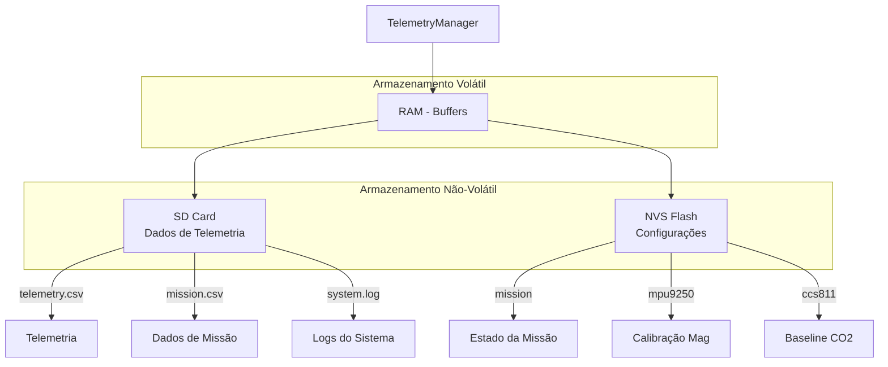
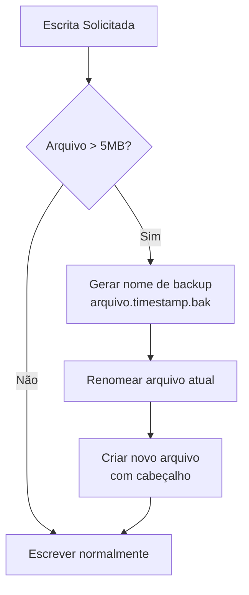
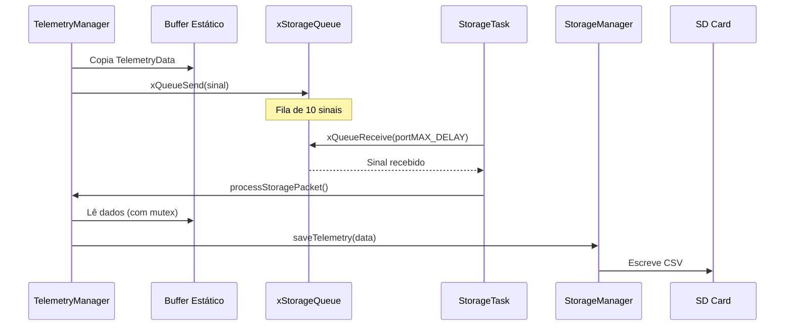
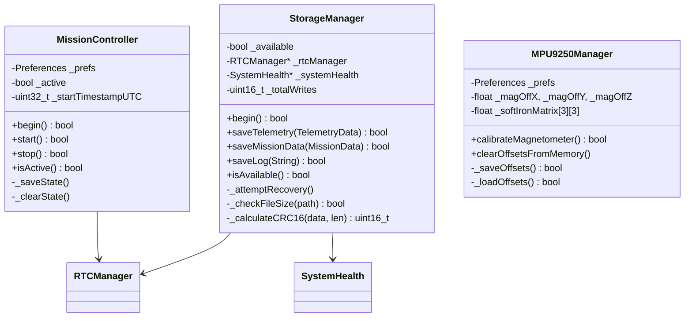

# Documentação Técnica AgroSat-IoT

## Parte 6: Armazenamento e Persistência

### 6.1 Visão Geral do Sistema de Armazenamento

O sistema utiliza dois mecanismos de persistência:



### 6.2 StorageManager - Gerenciador de SD Card

#### Inicialização

```cpp
bool StorageManager::begin() {
    // Configura pinos HSPI
    pinMode(SD_CS, OUTPUT);
    digitalWrite(SD_CS, HIGH);
    
    // Inicializa SPI dedicado para SD
    spiSD.begin(SD_SCLK, SD_MISO, SD_MOSI, SD_CS);
    
    // Monta o sistema de arquivos
    if (!SD.begin(SD_CS, spiSD, 4000000)) {  // 4MHz
        return false;
    }
    
    // Cria arquivos com cabeçalhos
    createTelemetryFile();
    createMissionFile();
    createLogFile();
    
    return true;
}
```

#### Arquivos Gerados

| Arquivo | Conteúdo | Formato | Tamanho Máx |
|---------|----------|---------|-------------|
| `/telemetry.csv` | Dados de sensores | CSV + CRC | 5MB |
| `/mission.csv` | Dados de ground nodes | CSV + CRC | 5MB |
| `/system.log` | Logs do sistema | TXT + CRC | 5MB |

### 6.3 Formato do Arquivo de Telemetria

#### Cabeçalho CSV

```csv
ISO8601,UnixTimestamp,MissionTime,BatVoltage,BatPercent,TempFinal,TempBMP,TempSI,Pressure,Altitude,Lat,Lng,GpsAlt,Sats,Fix,GyroX,GyroY,GyroZ,AccelX,AccelY,AccelZ,MagX,MagY,MagZ,Humidity,CO2,TVOC,Status,Errors,Payload,Uptime,ResetCnt,MinHeap,CpuTemp,CRC16
```

#### Exemplo de Linha

```csv
1705312800,1705312800,3600000,3.85,75.5,25.30,25.10,25.50,1013.25,150.0,-16.686900,-49.264800,850.0,8,1,0.10,-0.05,0.02,0.01,0.02,1.00,25.5,-10.2,45.0,65.0,450,25,0x00,0,-,3600000,2,45000,42.5,A3F2
```

#### Formatação de Dados

```cpp
void StorageManager::_formatTelemetryToCSV(const TelemetryData& data, 
                                            char* buffer, size_t len) {
    // Helper para float seguro (NaN -> 0)
    auto sf = [](float v) -> float { 
        return (isnan(v) || isinf(v)) ? 0.0f : v; 
    };
    
    int pos = 0;
    
    // Timestamps e bateria
    pos += snprintf(buffer + pos, len - pos, "%lu,%lu,%.2f,%.1f,",
        data.timestamp, data.timestamp, data.missionTime,
        sf(data.batteryVoltage), sf(data.batteryPercentage));
    
    // Temperaturas e pressão
    pos += snprintf(buffer + pos, len - pos, "%.2f,%.2f,%.2f,%.1f,",
        sf(data.temperature), sf(data.temperatureBMP), 
        sf(data.temperatureSI), sf(data.pressure));
    
    // GPS
    pos += snprintf(buffer + pos, len - pos, "%.6f,%.6f,%.1f,%d,%d,",
        data.latitude, data.longitude, sf(data.gpsAltitude), 
        data.satellites, data.gpsFix ? 1 : 0);
    
    // IMU (Gyro, Accel, Mag)
    pos += snprintf(buffer + pos, len - pos, 
        "%.2f,%.2f,%.2f,%.2f,%.1f,%.1f,%.1f,",
        sf(data.gyroX), sf(data.gyroY), sf(data.gyroZ),
        sf(data.accelX), sf(data.accelY), sf(data.accelZ),
        sf(data.magX), sf(data.magY), sf(data.magZ));
    
    // Ambiente e status
    pos += snprintf(buffer + pos, len - pos, "%.1f,%.0f,%.0f,0x%02X,%d,-,",
        sf(data.humidity), sf(data.co2), sf(data.tvoc),
        data.systemStatus, data.errorCount);
    
    // Sistema
    snprintf(buffer + pos, len - pos, "%lu,%d,%lu,%.1f",
        data.uptime, data.resetCount, data.minFreeHeap, sf(data.cpuTemp));
}
```

### 6.4 Formato do Arquivo de Missão

#### Cabeçalho CSV

```csv
ISO8601,UnixTimestamp,NodeID,SoilMoisture,AmbTemp,Humidity,Irrigation,RSSI,SNR,PktsRx,PktsLost,LastRx,NodeOriginTS,SatArrivalTS,SatTxTS,CRC16
```

#### Exemplo de Linha

```csv
1705312800,1001,45.5,28.3,72.0,0,-85,7.50,150,3,1705312750,1705312700,1705312800,0,B4C1
```

### 6.5 Integridade de Dados - CRC-16 CCITT

Cada linha de dados inclui um checksum CRC-16 para verificação de integridade:

```cpp
uint16_t StorageManager::_calculateCRC16(const uint8_t* data, size_t length) {
    uint16_t crc = 0xFFFF;
    
    for (size_t i = 0; i < length; i++) {
        crc ^= (uint16_t)data[i] << 8;
        for (uint8_t bit = 0; bit < 8; bit++) {
            if (crc & 0x8000) {
                crc = (crc << 1) ^ 0x1021;  // Polinômio CCITT
            } else {
                crc = crc << 1;
            }
        }
    }
    return crc;
}
```

#### Aplicação do CRC

```cpp
bool StorageManager::saveTelemetry(const TelemetryData& data) {
    char localBuffer[512];
    _formatTelemetryToCSV(data, localBuffer, sizeof(localBuffer));
    
    // Calcula CRC da linha
    uint16_t crc = _calculateCRC16((uint8_t*)localBuffer, strlen(localBuffer));
    
    // Anexa CRC em hexadecimal
    char lineWithCRC[600];
    snprintf(lineWithCRC, sizeof(lineWithCRC), "%s,%04X", localBuffer, crc);
    
    // Escreve no arquivo
    File file = SD.open(SD_LOG_FILE, FILE_APPEND);
    file.println(lineWithCRC);
    file.close();
    
    return true;
}
```

### 6.6 Rotação Automática de Arquivos

Quando um arquivo atinge o tamanho máximo (5MB), é automaticamente rotacionado:



#### Código de Rotação

```cpp
bool StorageManager::_checkFileSize(const char* path) {
    File file = SD.open(path, FILE_READ);
    size_t size = file.size();
    file.close();
    
    if (size > SD_MAX_FILE_SIZE) {  // 5MB
        // Gera nome de backup com timestamp
        String timestamp = _rtcManager->getDateTime();
        timestamp.replace(" ", "_");
        timestamp.replace(":", "-");
        
        String backupPath = String(path) + "." + timestamp + ".bak";
        SD.rename(path, backupPath.c_str());
        
        // Recria arquivo com cabeçalho
        if (strcmp(path, SD_LOG_FILE) == 0) createTelemetryFile();
        else if (strcmp(path, SD_MISSION_FILE) == 0) createMissionFile();
        else if (strcmp(path, SD_SYSTEM_LOG) == 0) createLogFile();
    }
    return true;
}
```

### 6.7 Recuperação de Falhas do SD Card

O sistema detecta e tenta recuperar de falhas do SD Card:

```mermaid
flowchart TD
    A[Operação de Escrita] --> B{SD disponível?}
    B -->|Sim| C[Escrever]
    B -->|Não| D{Última tentativa<br/>> 5 segundos?}
    D -->|Não| E[Retornar falha]
    D -->|Sim| F[Tentar recuperação]
    
    F --> G[SD.end()]
    G --> H[spiSD.end()]
    H --> I[delay 100ms]
    I --> J[begin()]
    
    J --> K{Sucesso?}
    K -->|Sim| L[Log: Recuperado]
    K -->|Não| E
    L --> C
    
    C --> M{Escrita OK?}
    M -->|Sim| N[Retornar sucesso]
    M -->|Não| O[Marcar indisponível]
    O --> E
```

#### Código de Recuperação

```cpp
void StorageManager::_attemptRecovery() {
    unsigned long now = millis();
    if (now - _lastInitAttempt < REINIT_INTERVAL) return;
    _lastInitAttempt = now;
    
    Serial.println("[StorageManager] Tentando recuperar SD Card...");
    
    SD.end();
    spiSD.end();
    delay(100);
    
    if (begin()) {
        Serial.println("[StorageManager] RECUPERADO COM SUCESSO!");
        saveLog("Sistema de arquivos recuperado apos falha.");
    }
}
```

### 6.8 Gravação Assíncrona via Fila

A gravação no SD Card é feita de forma assíncrona para não bloquear o loop principal:



#### Buffer Estático Thread-Safe

```cpp
// Buffer estático para dados de storage
static TelemetryData s_storageData;
static GroundNodeBuffer s_storageNodes;
static SemaphoreHandle_t s_storageMutex = NULL;

void TelemetryManager::_saveToStorage() {
    if (s_storageMutex == NULL) {
        s_storageMutex = xSemaphoreCreateMutex();
    }
    
    // Copia dados para buffer estático (protegido)
    if (xSemaphoreTake(s_storageMutex, pdMS_TO_TICKS(50)) == pdTRUE) {
        memcpy(&s_storageData, &_telemetryData, sizeof(TelemetryData));
        s_storageNodes = _groundNodes.buffer();
        xSemaphoreGive(s_storageMutex);
        
        // Envia sinal para a task processar
        uint8_t signal = 1;
        xQueueSend(xStorageQueue, &signal, 0);
    }
}
```

### 6.9 NVS - Non-Volatile Storage

O ESP32 possui uma partição NVS para armazenamento de configurações:

#### Namespaces Utilizados

| Namespace | Chaves | Descrição |
|-----------|--------|-----------|
| `mission` | `active`, `start_utc` | Estado da missão |
| `mpu9250` | `magic`, `hx`, `hy`, `hz`, `s00`-`s22` | Calibração magnetômetro |
| `ccs811` | `base` | Baseline do sensor CO2 |

#### Persistência de Missão

```cpp
void MissionController::_saveState() {
    _prefs.begin("mission", false);  // Read-write
    _prefs.putBool("active", true);
    _prefs.putUInt("start_utc", _startTimestampUTC);
    _prefs.end();
}

void MissionController::_clearState() {
    _prefs.begin("mission", false);
    _prefs.clear();
    _prefs.end();
}

bool MissionController::begin() {
    _prefs.begin("mission", true);  // Read-only
    bool wasActive = _prefs.getBool("active", false);
    uint32_t savedStartUTC = _prefs.getUInt("start_utc", 0);
    _prefs.end();
    
    if (wasActive && savedStartUTC > 0) {
        // Restaura missão após reset
        _active = true;
        _startTimestampUTC = savedStartUTC;
        return true;
    }
    return false;
}
```

#### Persistência de Calibração

```cpp
bool MPU9250Manager::_saveOffsets() {
    _prefs.begin("mpu9250", false);
    
    _prefs.putUInt("magic", MAGIC_KEY);  // 0xCAFE
    
    // Hard Iron offsets
    _prefs.putFloat("hx", _magOffX);
    _prefs.putFloat("hy", _magOffY);
    _prefs.putFloat("hz", _magOffZ);
    
    // Soft Iron matrix (3x3)
    _prefs.putFloat("s00", _softIronMatrix[0][0]);
    _prefs.putFloat("s01", _softIronMatrix[0][1]);
    // ... demais elementos
    
    _prefs.end();
    return true;
}

bool MPU9250Manager::_loadOffsets() {
    _prefs.begin("mpu9250", true);
    
    if (_prefs.getUInt("magic") != MAGIC_KEY) {
        _prefs.end();
        return false;  // Sem calibração salva
    }
    
    _magOffX = _prefs.getFloat("hx", 0);
    _magOffY = _prefs.getFloat("hy", 0);
    _magOffZ = _prefs.getFloat("hz", 0);
    // ... carrega matriz
    
    _prefs.end();
    return true;
}
```

### 6.10 Estimativa de Uso de Armazenamento

#### Tamanho por Registro

| Tipo | Tamanho Médio | Frequência | Por Hora |
|------|---------------|------------|----------|
| Telemetria | ~300 bytes | 1/min (FLIGHT) | ~18 KB |
| Mission | ~150 bytes | Sob demanda | ~5 KB |
| Log | ~100 bytes | Eventos | ~2 KB |

#### Capacidade Estimada

Para um cartão SD de 4GB:
- **Telemetria**: ~220.000 registros (~150 dias em FLIGHT)
- **Mission**: ~440.000 registros
- **Rotação**: Automática a cada 5MB (~16.000 registros)

### 6.11 Diagrama de Classes



---

*Anterior: [05 - Comunicação LoRa e WiFi](05-comunicacao.md)*

*Próxima parte: [07 - Gerenciamento de Energia e Sistema](07-energia-sistema.md)*