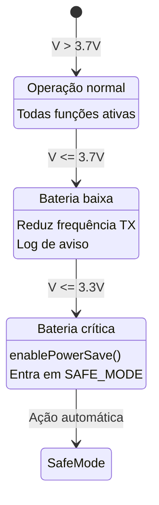

# Documentação Técnica AgroSat-IoT

## Parte 7: Sistema de Energia e Gerenciamento de Bateria

### 7.1 Visão Geral

O sistema de gerenciamento de energia é crítico para a operação do CubeSat, garantindo que o satélite opere de forma eficiente e segura mesmo em condições de bateria baixa.

### 7.2 Hardware de Alimentação

| Componente | Especificação |
|------------|---------------|
| Bateria | Li-ion 18650 |
| Tensão Nominal | 3.7V |
| Tensão Máxima | 4.2V (carga completa) |
| Tensão Mínima | 3.0V (corte) |
| Monitoramento | ADC GPIO35 |
| Divisor de Tensão | 2:1 |

### 7.3 Classe PowerManager

O `PowerManager` é responsável por monitorar a bateria e ajustar o comportamento do sistema.

**Localização:** `src/core/PowerManager/`

#### Constantes de Configuração

```cpp
// include/config/constants.h
#define BATTERY_VREF 3.6        // Tensão de referência ADC (V)
#define BATTERY_DIVIDER 2.0     // Fator do divisor de tensão
#define BATTERY_LOW 3.7         // Limiar bateria baixa (V)
#define BATTERY_CRITICAL 3.3    // Limiar bateria crítica (V)
```

#### Interface Pública

```cpp
class PowerManager {
public:
    bool begin();                    // Inicializa o ADC
    void update();                   // Atualiza leituras
    
    float getVoltage() const;        // Tensão atual (V)
    float getPercentage() const;     // Carga estimada (%)
    bool isCritical() const;         // Bateria crítica?
    bool isLow() const;              // Bateria baixa?
    
    void enablePowerSave();          // Ativa economia de energia
    void adjustCpuFrequency();       // Ajusta frequência da CPU
};
```

### 7.4 Cálculo de Tensão da Bateria

O ESP32 lê a tensão através de um divisor resistivo:


**Fórmula de cálculo:**

```
V_bateria = (ADC_raw / 4095) * BATTERY_VREF * BATTERY_DIVIDER
```

#### Implementação

```cpp
void PowerManager::update() {
    uint32_t raw = analogRead(BATTERY_PIN);
    _voltage = (raw / 4095.0f) * BATTERY_VREF * BATTERY_DIVIDER;
    _updateStatus(_voltage);
}

void PowerManager::_updateStatus(float voltage) {
    // Estimativa de percentual (aproximação linear)
    // 4.2V = 100%, 3.3V = 0%
    _percentage = ((voltage - 3.3f) / (4.2f - 3.3f)) * 100.0f;
    _percentage = constrain(_percentage, 0.0f, 100.0f);
    
    _isCritical = (voltage <= BATTERY_CRITICAL);
    _isLow = (voltage <= BATTERY_LOW);
}
```

### 7.5 Níveis de Bateria e Ações



| Nível | Tensão | Percentual | Ações |
|-------|--------|------------|-------|
| **Normal** | > 3.7V | > 44% | Operação normal |
| **Baixa** | 3.3V - 3.7V | 0-44% | Reduz TX, aviso no log |
| **Crítica** | ≤ 3.3V | 0% | SAFE_MODE, economia máxima |

### 7.6 Modo de Economia de Energia

Quando `enablePowerSave()` é chamado:

```cpp
void PowerManager::enablePowerSave() {
    // 1. Reduz frequência da CPU
    setCpuFrequencyMhz(80);  // 240MHz -> 80MHz
    
    // 2. Desabilita WiFi se não essencial
    WiFi.mode(WIFI_OFF);
    
    // 3. Reduz potência do LoRa
    // (feito via CommunicationManager)
    
    DEBUG_PRINTLN("[PowerManager] Modo economia ativado");
}
```

### 7.7 Ajuste Dinâmico de CPU

O sistema ajusta a frequência da CPU baseado no nível de bateria:

```cpp
void PowerManager::adjustCpuFrequency() {
    if (_isCritical) {
        setCpuFrequencyMhz(80);   // Mínimo
    } else if (_isLow) {
        setCpuFrequencyMhz(160);  // Médio
    } else {
        setCpuFrequencyMhz(240);  // Máximo
    }
}
```

| Nível Bateria | Frequência CPU | Consumo Estimado |
|---------------|----------------|------------------|
| Normal | 240 MHz | ~50mA |
| Baixa | 160 MHz | ~35mA |
| Crítica | 80 MHz | ~25mA |

### 7.8 Integração com TelemetryManager

O `TelemetryManager` verifica condições de energia no loop principal:

```cpp
void TelemetryManager::_checkOperationalConditions() {
    bool batCritical = _power.isCritical();
    bool batLow = (_power.getVoltage() <= BATTERY_LOW);
    
    // Ativa economia se crítico
    if (batCritical) {
        _power.enablePowerSave();
    }
    
    // Atualiza flags de status
    _systemHealth.setSystemError(STATUS_BATTERY_CRIT, batCritical);
    _systemHealth.setSystemError(STATUS_BATTERY_LOW, batLow);
}
```

### 7.9 Telemetria de Energia

Os dados de bateria são incluídos em cada pacote de telemetria:

```cpp
struct TelemetryData {
    // ...
    float batteryVoltage;      // Tensão (V)
    float batteryPercentage;   // Carga (%)
    // ...
};
```

#### Coleta no TelemetryCollector

```cpp
void TelemetryCollector::_collectPowerAndSystem(TelemetryData& data) {
    data.batteryVoltage = _power.getVoltage();
    data.batteryPercentage = _power.getPercentage();
}
```

### 7.10 Beacon de Emergência

Em modo SAFE, o sistema envia beacons periódicos com informações de energia:

```cpp
void TelemetryManager::_sendSafeBeacon() {
    uint8_t beacon[32];
    int offset = 0;
    
    // Header
    beacon[offset++] = 0xBE;  // Beacon marker
    beacon[offset++] = 0xAC;
    
    // Team ID
    beacon[offset++] = (TEAM_ID >> 8) & 0xFF;
    beacon[offset++] = TEAM_ID & 0xFF;
    
    // Modo atual
    beacon[offset++] = (uint8_t)_mode;
    
    // Tensão da bateria (x100 para 2 bytes)
    uint16_t batVoltageInt = (uint16_t)(_power.getVoltage() * 100);
    beacon[offset++] = (batVoltageInt >> 8) & 0xFF;
    beacon[offset++] = batVoltageInt & 0xFF;
    
    // ... mais dados de diagnóstico
    
    _comm.sendLoRa(beacon, offset);
}
```

### 7.11 Proteções de Hardware

O sistema implementa proteções em software:

1. **Watchdog Timer**: Reinicia se sistema travar
2. **Monitoramento de Heap**: Entra em SAFE_MODE se memória crítica
3. **Timeout de Operações**: Evita bloqueios em I2C/SPI

### 7.12 Consumo Estimado por Modo

| Modo | CPU | LoRa TX | WiFi | Consumo Total |
|------|-----|---------|------|---------------|
| PREFLIGHT | 240MHz | 20dBm | ON | ~120mA |
| FLIGHT | 240MHz | 20dBm | OFF | ~80mA |
| SAFE | 80MHz | 10dBm | OFF | ~30mA |

### 7.13 Autonomia Estimada

Com bateria 18650 de 2600mAh:

| Modo | Consumo | Autonomia |
|------|---------|-----------|
| PREFLIGHT | 120mA | ~21 horas |
| FLIGHT | 80mA | ~32 horas |
| SAFE | 30mA | ~86 horas |

---

*Anterior: [06 - Armazenamento](06-armazenamento.md)*

*Próxima parte: [08 - Ground Nodes e Relay](08-ground-nodes-relay.md)*