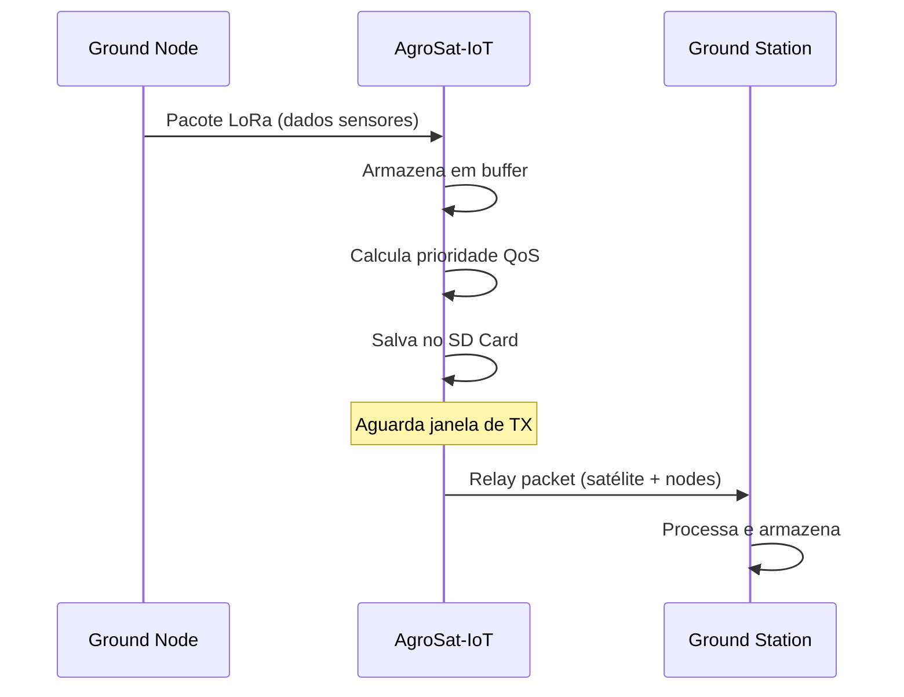
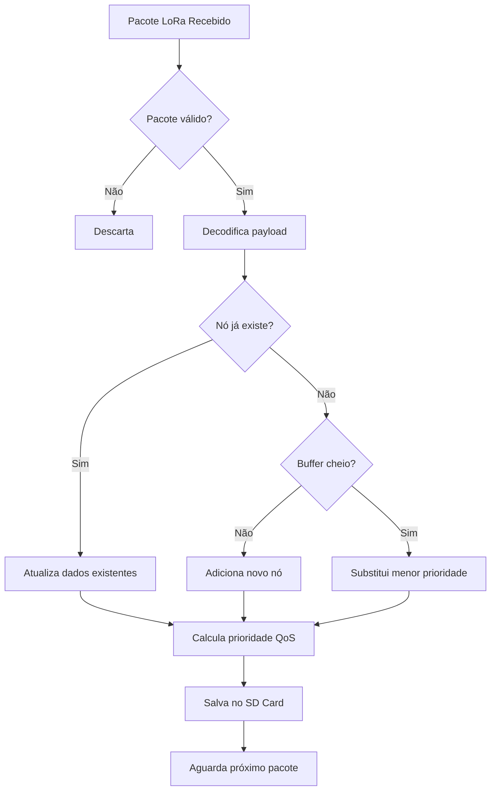
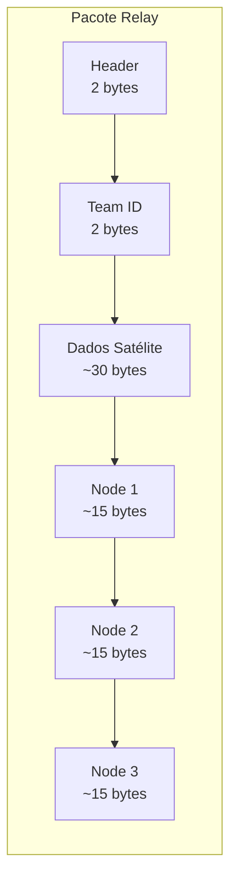
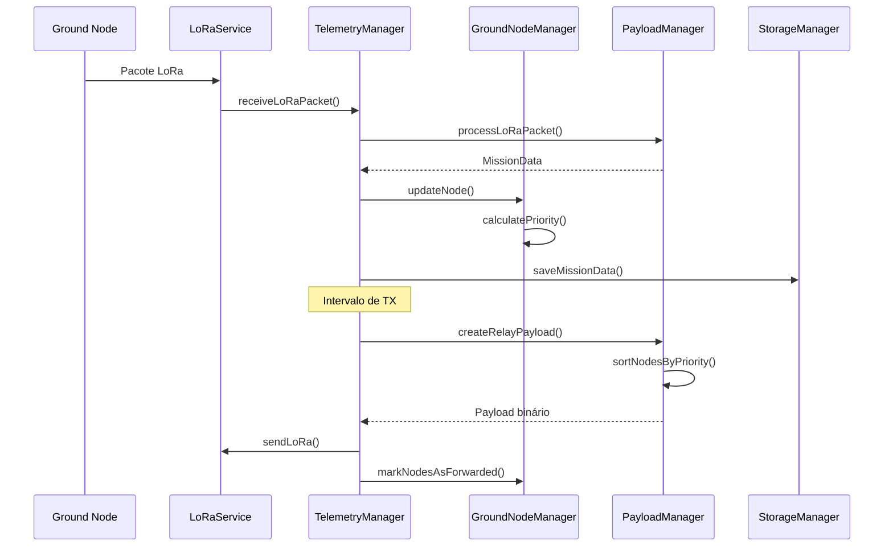

# Documentação Técnica AgroSat-IoT

## Parte 8: Ground Nodes e Sistema de Relay

### 8.1 Visão Geral

O AgroSat-IoT implementa um sistema **Store-and-Forward** para retransmissão de dados de sensores terrestres (ground nodes). O satélite atua como intermediário entre nós remotos sem conectividade e estações base.

### 8.2 Arquitetura do Sistema Relay



### 8.3 Estrutura MissionData

Cada ground node é representado pela estrutura `MissionData`:

```cpp
struct MissionData {
    // Identificação
    uint16_t nodeId;              // ID único do nó (0-65535)
    uint16_t sequenceNumber;      // Número de sequência do pacote
    
    // Dados dos Sensores do Nó
    float soilMoisture;           // Umidade do solo (%)
    float ambientTemp;            // Temperatura ambiente (°C)
    float humidity;               // Umidade do ar (%)
    uint8_t irrigationStatus;     // Status irrigação (0=OFF, 1=ON)
    
    // Qualidade do Link
    int16_t rssi;                 // RSSI do pacote (dBm)
    float snr;                    // SNR do pacote (dB)
    uint16_t packetsReceived;     // Total de pacotes recebidos
    uint16_t packetsLost;         // Pacotes perdidos estimados
    unsigned long lastLoraRx;     // Timestamp última recepção
    
    // Timestamps
    uint32_t nodeTimestamp;       // Timestamp do nó (se disponível)
    unsigned long collectionTime; // Quando foi coletado pelo satélite
    unsigned long retransmissionTime; // Quando foi retransmitido
    
    // Controle de QoS
    uint8_t priority;             // Prioridade calculada (0=crítico, 3=baixo)
    bool forwarded;               // Já foi encaminhado?
    char originalPayloadHex[20];  // Payload original em hex
    uint8_t payloadLength;        // Tamanho do payload
};
```

### 8.4 Buffer de Ground Nodes

O sistema mantém um buffer circular com capacidade limitada:

```cpp
#define MAX_GROUND_NODES 3  // Máximo de nós simultâneos

struct GroundNodeBuffer {
    MissionData nodes[MAX_GROUND_NODES];       // Array de nós
    uint8_t activeNodes;                       // Quantidade ativa
    unsigned long lastUpdate[MAX_GROUND_NODES];// Timestamps por slot
    uint16_t totalPacketsCollected;            // Total coletado
};
```

### 8.5 Classe GroundNodeManager

**Localização:** `src/app/GroundNodeManager/`

#### Interface Pública

```cpp
class GroundNodeManager {
public:
    GroundNodeManager();
    
    // Gerenciamento de nós
    void updateNode(const MissionData& data);
    void cleanup(unsigned long now, unsigned long maxAgeMs);
    uint8_t resetForwardFlags();
    
    // Acesso ao buffer
    const GroundNodeBuffer& buffer() const;
    GroundNodeBuffer& buffer();
    
private:
    GroundNodeBuffer _buffer;
    void _replaceLowestPriorityNode(const MissionData& newData);
};
```

### 8.6 Fluxo de Recepção de Pacotes



#### Implementação da Recepção

```cpp
void TelemetryManager::_handleIncomingRadio() {
    String loraPacket;
    int rssi = 0;
    float snr = 0.0f;

    if (_comm.receiveLoRaPacket(loraPacket, rssi, snr)) {
        MissionData rxData;
        
        if (_comm.processLoRaPacket(loraPacket, rxData)) {
            // Preenche metadados de link
            rxData.rssi = rssi;
            rxData.snr = snr;
            rxData.lastLoraRx = millis();
            rxData.collectionTime = _rtc.isInitialized() ? 
                                    _rtc.getUnixTime() : (millis()/1000);
            
            // Atualiza buffer e salva
            _groundNodes.updateNode(rxData);
            _storage.saveMissionData(rxData);
            
            DEBUG_PRINTF("[TM] Node %u RX: RSSI=%d dBm, SNR=%.1f dB\n", 
                         rxData.nodeId, rssi, snr);
        }
    }
}
```

### 8.7 Sistema de Prioridade (QoS)

O sistema calcula prioridade baseado em múltiplos fatores:

```cpp
enum class PacketPriority : uint8_t {
    CRITICAL = 0,      // Solo seco, temperatura extrema
    HIGH_PRIORITY = 1, // Link ruim, irrigação ativa
    NORMAL = 2,        // Operação padrão
    LOW_PRIORITY = 3   // Dados antigos
};
```

#### Algoritmo de Cálculo

```cpp
uint8_t PayloadManager::calculateNodePriority(const MissionData& node) {
    uint8_t priority = static_cast<uint8_t>(PacketPriority::NORMAL);
    
    // CRÍTICO: Solo muito seco (< 20%)
    if (node.soilMoisture < 20.0f) {
        return static_cast<uint8_t>(PacketPriority::CRITICAL);
    }
    
    // CRÍTICO: Temperatura extrema
    if (node.ambientTemp > 45.0f || node.ambientTemp < 0.0f) {
        return static_cast<uint8_t>(PacketPriority::CRITICAL);
    }
    
    // ALTO: Link ruim (RSSI < -100 dBm)
    if (node.rssi < -100) {
        return static_cast<uint8_t>(PacketPriority::HIGH_PRIORITY);
    }
    
    // ALTO: Irrigação ativa
    if (node.irrigationStatus == 1) {
        return static_cast<uint8_t>(PacketPriority::HIGH_PRIORITY);
    }
    
    // ALTO: Muitos pacotes perdidos (> 10%)
    uint32_t total = node.packetsReceived + node.packetsLost;
    if (total > 0 && (node.packetsLost * 100 / total) > 10) {
        return static_cast<uint8_t>(PacketPriority::HIGH_PRIORITY);
    }
    
    // BAIXO: Dados antigos (> 10 minutos)
    if ((millis() - node.lastLoraRx) > 600000) {
        priority = static_cast<uint8_t>(PacketPriority::LOW_PRIORITY);
    }
    
    return priority;
}
```

### 8.8 Critérios de Prioridade

| Prioridade | Valor | Condição | Ação |
|------------|-------|----------|------|
| **CRITICAL** | 0 | Solo < 20% OU Temp extrema | TX imediato |
| **HIGH** | 1 | RSSI < -100 OU Irrigação ON OU Perda > 10% | TX prioritário |
| **NORMAL** | 2 | Condições normais | TX normal |
| **LOW** | 3 | Dados > 10 min | TX quando possível |

### 8.9 Atualização de Nós

```cpp
void GroundNodeManager::updateNode(const MissionData& data) {
    // 1. Procura nó existente
    for (int i = 0; i < _buffer.activeNodes; i++) {
        if (_buffer.nodes[i].nodeId == data.nodeId) {
            // Atualiza dados existentes
            MissionData& existingNode = _buffer.nodes[i];
            existingNode.soilMoisture = data.soilMoisture;
            existingNode.ambientTemp = data.ambientTemp;
            existingNode.humidity = data.humidity;
            existingNode.irrigationStatus = data.irrigationStatus;
            existingNode.rssi = data.rssi;
            existingNode.snr = data.snr;
            existingNode.packetsReceived++;
            existingNode.lastLoraRx = data.lastLoraRx;
            existingNode.collectionTime = data.collectionTime;
            existingNode.forwarded = false;  // Marca para reenvio
            existingNode.priority = PayloadManager::calculateNodePriority(data);
            
            _buffer.lastUpdate[i] = millis();
            _buffer.totalPacketsCollected++;
            return;
        }
    }
    
    // 2. Nó novo - adiciona se há espaço
    if (_buffer.activeNodes < MAX_GROUND_NODES) {
        int newIndex = _buffer.activeNodes++;
        _buffer.nodes[newIndex] = data;
        _buffer.nodes[newIndex].packetsReceived = 1;
        _buffer.nodes[newIndex].packetsLost = 0;
        _buffer.nodes[newIndex].priority = PayloadManager::calculateNodePriority(data);
        _buffer.lastUpdate[newIndex] = millis();
        _buffer.totalPacketsCollected++;
        return;
    }
    
    // 3. Buffer cheio - substitui menor prioridade
    _replaceLowestPriorityNode(data);
}
```

### 8.10 Substituição por Prioridade

Quando o buffer está cheio, o nó de menor prioridade é substituído:

```cpp
void GroundNodeManager::_replaceLowestPriorityNode(const MissionData& newData) {
    int replaceIndex = 0;
    uint8_t lowestPriority = 0;
    
    // Encontra nó com menor prioridade (maior valor numérico)
    for (int i = 0; i < _buffer.activeNodes; i++) {
        if (_buffer.nodes[i].priority > lowestPriority) {
            lowestPriority = _buffer.nodes[i].priority;
            replaceIndex = i;
        }
    }
    
    // Só substitui se novo nó tem prioridade maior ou igual
    uint8_t newPriority = PayloadManager::calculateNodePriority(newData);
    if (newPriority <= lowestPriority) {
        _buffer.nodes[replaceIndex] = newData;
        _buffer.nodes[replaceIndex].priority = newPriority;
        _buffer.lastUpdate[replaceIndex] = millis();
        _buffer.totalPacketsCollected++;
    }
}
```

### 8.11 Limpeza de Nós Expirados (TTL)

Nós que não recebem atualizações são removidos:

```cpp
#define NODE_TTL_MS 1800000  // 30 minutos

void GroundNodeManager::cleanup(unsigned long now, unsigned long maxAgeMs) {
    for (int i = _buffer.activeNodes - 1; i >= 0; i--) {
        if ((now - _buffer.lastUpdate[i]) > maxAgeMs) {
            // Remove nó expirado (shift array)
            for (int j = i; j < _buffer.activeNodes - 1; j++) {
                _buffer.nodes[j] = _buffer.nodes[j + 1];
                _buffer.lastUpdate[j] = _buffer.lastUpdate[j + 1];
            }
            _buffer.activeNodes--;
            DEBUG_PRINTF("[GNM] Nó removido por TTL (slot %d)\n", i);
        }
    }
}
```

### 8.12 Controle de Retransmissão

O flag `forwarded` controla quais nós já foram retransmitidos:

```cpp
uint8_t GroundNodeManager::resetForwardFlags() {
    uint8_t count = 0;
    for (int i = 0; i < _buffer.activeNodes; i++) {
        if (_buffer.nodes[i].forwarded) {
            _buffer.nodes[i].forwarded = false;
            count++;
        }
    }
    return count;
}
```

### 8.13 Formato do Pacote Relay

O satélite combina seus dados com os dos ground nodes:



#### Estrutura do Payload Relay

| Campo | Tamanho | Descrição |
|-------|---------|-----------|
| Header | 2 bytes | 0xAA 0x55 (marcador) |
| Team ID | 2 bytes | Identificação da equipe |
| Timestamp | 4 bytes | Unix timestamp |
| Lat/Lon | 8 bytes | Posição do satélite |
| Altitude | 2 bytes | Altitude GPS |
| Bateria | 2 bytes | Tensão x100 |
| Status | 1 byte | Flags de status |
| Num Nodes | 1 byte | Quantidade de nós |
| Node Data[] | N x 15 bytes | Dados de cada nó |

### 8.14 Codificação de Nós no Payload

```cpp
void PayloadManager::_encodeNodeData(const MissionData& node, 
                                      uint8_t* buffer, int& offset) {
    // Node ID (2 bytes)
    buffer[offset++] = (node.nodeId >> 8) & 0xFF;
    buffer[offset++] = node.nodeId & 0xFF;
    
    // Soil Moisture (1 byte, 0-100%)
    buffer[offset++] = (uint8_t)constrain(node.soilMoisture, 0, 100);
    
    // Temperature (2 bytes, x10 para 1 casa decimal)
    int16_t tempInt = (int16_t)(node.ambientTemp * 10);
    buffer[offset++] = (tempInt >> 8) & 0xFF;
    buffer[offset++] = tempInt & 0xFF;
    
    // Humidity (1 byte, 0-100%)
    buffer[offset++] = (uint8_t)constrain(node.humidity, 0, 100);
    
    // Irrigation Status (1 byte)
    buffer[offset++] = node.irrigationStatus;
    
    // RSSI (1 byte, offset +150 para caber em uint8)
    buffer[offset++] = (uint8_t)(node.rssi + 150);
    
    // SNR (1 byte, x10)
    buffer[offset++] = (uint8_t)((node.snr + 20) * 2);
    
    // Priority (1 byte)
    buffer[offset++] = node.priority;
    
    // Collection timestamp (4 bytes)
    buffer[offset++] = (node.collectionTime >> 24) & 0xFF;
    buffer[offset++] = (node.collectionTime >> 16) & 0xFF;
    buffer[offset++] = (node.collectionTime >> 8) & 0xFF;
    buffer[offset++] = node.collectionTime & 0xFF;
}
```

### 8.15 Manutenção Periódica

O `TelemetryManager` executa manutenção a cada 60 segundos:

```cpp
void TelemetryManager::_maintainGroundNetwork() {
    static unsigned long lastMaint = 0;
    
    if (millis() - lastMaint > 60000) {
        lastMaint = millis();
        
        // Remove nós expirados
        _groundNodes.cleanup(millis(), NODE_TTL_MS);
        
        // Reseta flags de forwarding para permitir reenvio
        _groundNodes.resetForwardFlags();
    }
}
```

### 8.16 Estatísticas de Link

O `MissionController` calcula estatísticas de qualidade de link:

```cpp
void MissionController::_calculateLinkStats(
    int& avgRSSI, int& bestRSSI, int& worstRSSI,
    float& avgSNR, float& packetLossRate) 
{
    const GroundNodeBuffer& buf = _nodes.buffer();
    long totalRSSI = 0;
    float totalSNR = 0;
    bestRSSI = -200; 
    worstRSSI = 0;
    uint32_t totalLost = 0, totalRx = 0;

    for (int i = 0; i < buf.activeNodes; i++) {
        const MissionData& n = buf.nodes[i];
        totalRSSI += n.rssi;
        totalSNR += n.snr;
        
        if (n.rssi > bestRSSI) bestRSSI = n.rssi;
        if (n.rssi < worstRSSI) worstRSSI = n.rssi;
        
        totalLost += n.packetsLost;
        totalRx += n.packetsReceived;
    }

    if (buf.activeNodes > 0) {
        avgRSSI = totalRSSI / buf.activeNodes;
        avgSNR = totalSNR / buf.activeNodes;
    }
    
    uint32_t totalPkts = totalRx + totalLost;
    packetLossRate = (totalPkts > 0) ? 
                     ((float)totalLost / totalPkts * 100.0f) : 0.0f;
}
```

### 8.17 Resumo do Fluxo Completo



---

*Anterior: [07 - Energia e Bateria](07-energia-bateria.md)*

*Próxima parte: [09 - Controle de Missão](09-controle-missao.md)*