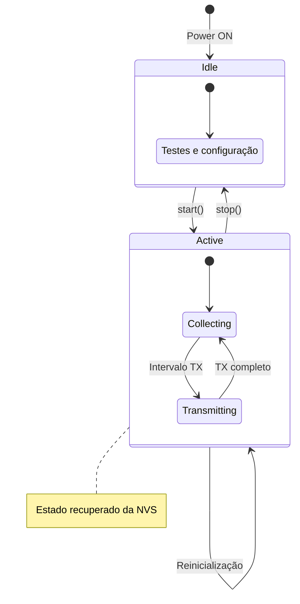
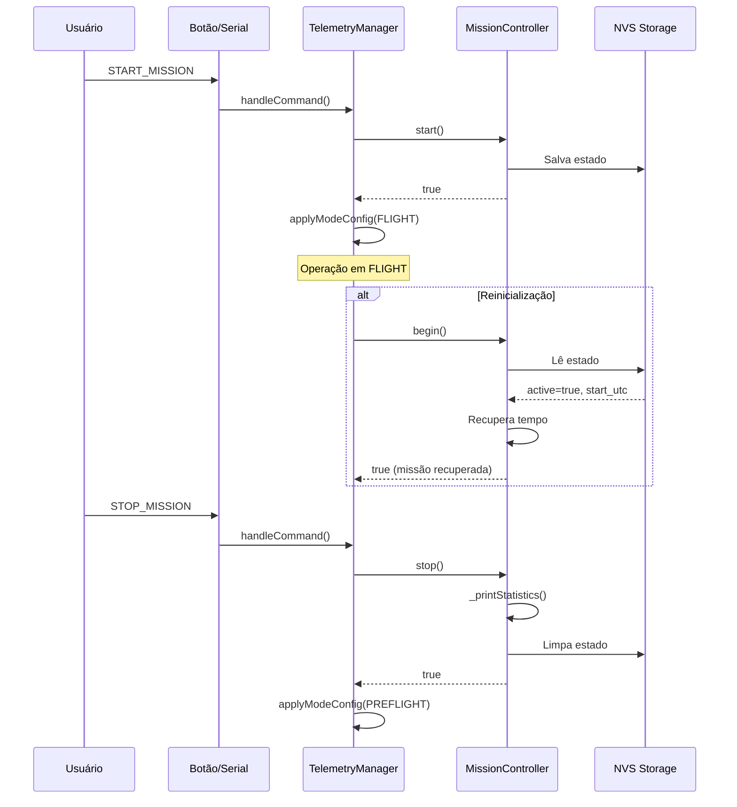

\# Documentação Técnica AgroSat-IoT

## Parte 9: Controle de Missão

### 9.1 Visão Geral

O `MissionController` gerencia o ciclo de vida da missão, incluindo início, término, persistência de estado e estatísticas. O sistema mantém o estado da missão mesmo após reinicializações inesperadas.

### 9.2 Classe MissionController

**Localização:** `src/app/MissionController/`

#### Interface Pública

```cpp
class MissionController {
public:
    MissionController(RTCManager& rtc, GroundNodeManager& nodes);
    
    bool begin();           // Recupera estado da NVS
    bool start();           // Inicia missão
    bool stop();            // Encerra missão
    
    bool isActive() const;  // Missão em andamento?
    uint32_t getDuration() const;  // Duração em ms
    
private:
    RTCManager& _rtc;
    GroundNodeManager& _nodes;
    Preferences _prefs;
    
    bool _active;
    unsigned long _startTime;      // millis() do início
    uint32_t _startTimestampUTC;   // Unix timestamp do início
    
    void _saveState();
    void _clearState();
    void _printStatistics();
    void _calculateLinkStats(...);
};
```

### 9.3 Persistência de Estado (NVS)

O estado da missão é salvo na memória não-volátil (NVS) do ESP32:

```mermaid
flowchart TD
    A[start()] --> B[Salva estado na NVS]
    B --> C[active = true]
    B --> D[start_utc = timestamp]
    
    E[Reinicialização] --> F[begin()]
    F --> G{NVS tem missão ativa?}
    G -->|Sim| H[Recupera estado]
    G -->|Não| I[Inicia em PREFLIGHT]
    H --> J[Calcula tempo decorrido]
    J --> K[Continua missão]
```

#### Estrutura NVS

| Chave | Tipo | Descrição |
|-------|------|-----------|
| `active` | bool | Missão ativa? |
| `start_utc` | uint32_t | Timestamp Unix do início |

### 9.4 Início de Missão

```cpp
bool MissionController::start() {
    if (_active) return false;  // Já está ativa
    
    DEBUG_PRINTLN("[Mission] Iniciando missao...");
    
    // Captura timestamp UTC se RTC disponível
    if (_rtc.isInitialized()) {
        _startTimestampUTC = _rtc.getUnixTime();
    } else {
        _startTimestampUTC = 0;
    }
    
    _startTime = millis();
    _active = true;
    
    _saveState();  // Persiste na NVS
    return true;
}
```

### 9.5 Recuperação Após Reinicialização

```cpp
bool MissionController::begin() {
    // Abre NVS em modo leitura
    _prefs.begin("mission", true);
    bool wasActive = _prefs.getBool("active", false);
    uint32_t savedStartUTC = _prefs.getUInt("start_utc", 0);
    _prefs.end();

    if (wasActive && savedStartUTC > 0) {
        _active = true;
        _startTimestampUTC = savedStartUTC;
        
        // Calcula tempo decorrido usando RTC
        if (_rtc.isInitialized()) {
            uint32_t currentUnix = _rtc.getUnixTime();
            uint32_t elapsedSec = (currentUnix > _startTimestampUTC) ? 
                                  (currentUnix - _startTimestampUTC) : 0;
            _startTime = millis() - (elapsedSec * 1000);
        } else {
            _startTime = millis();  // Fallback
        }

        DEBUG_PRINTLN("[Mission] Missao recuperada apos reinicializacao.");
        return true;
    }
    
    return false;  // Nenhuma missão para recuperar
}
```

### 9.6 Término de Missão

```cpp
bool MissionController::stop() {
    if (!_active) return false;
    
    DEBUG_PRINTLN("[Mission] Encerrando missao...");
    
    // Imprime estatísticas finais
    _printStatistics();
    
    // Limpa estado
    _active = false;
    _startTime = 0;
    _startTimestampUTC = 0;
    
    _clearState();  // Remove da NVS
    return true;
}
```

### 9.7 Salvamento e Limpeza de Estado

```cpp
void MissionController::_saveState() {
    _prefs.begin("mission", false);  // Modo escrita
    _prefs.putBool("active", true);
    _prefs.putUInt("start_utc", _startTimestampUTC);
    _prefs.end();
    DEBUG_PRINTLN("[Mission] Estado salvo na NVS.");
}

void MissionController::_clearState() {
    _prefs.begin("mission", false);
    _prefs.clear();  // Remove todas as chaves
    _prefs.end();
    DEBUG_PRINTLN("[Mission] Estado limpo da NVS.");
}
```

### 9.8 Cálculo de Duração

```cpp
uint32_t MissionController::getDuration() const {
    if (!_active) return 0;
    return millis() - _startTime;
}
```

### 9.9 Estatísticas de Missão

Ao encerrar a missão, estatísticas são impressas:

```cpp
void MissionController::_printStatistics() {
    const GroundNodeBuffer& buf = _nodes.buffer();
    
    DEBUG_PRINTF("[Mission] Nós: %u | Pacotes: %u\n", 
                 buf.activeNodes, buf.totalPacketsCollected);
    
    if (buf.activeNodes > 0) {
        int avgRSSI, best, worst;
        float avgSNR, loss;
        _calculateLinkStats(avgRSSI, best, worst, avgSNR, loss);
        
        DEBUG_PRINTF("[Mission] Link: RSSI %d dBm (Melhor %d), Perda %.1f%%\n", 
                     avgRSSI, best, loss);
    }
}
```

### 9.10 Integração com TelemetryManager

O `TelemetryManager` coordena as transições de modo:

```cpp
void TelemetryManager::startMission() {
    if (_mode == MODE_FLIGHT) return;  // Já em voo
    
    if (_mission.start()) {
        DEBUG_PRINTLN("[TelemetryManager] Transicao para MODE_FLIGHT confirmada.");
        _mode = MODE_FLIGHT;
        applyModeConfig(MODE_FLIGHT);
    }
}

void TelemetryManager::stopMission() {
    if (!_mission.isActive()) return;
    
    if (_mission.stop()) {
        DEBUG_PRINTLN("[TelemetryManager] Missao finalizada. Retornando para PREFLIGHT.");
        _mode = MODE_PREFLIGHT;
        applyModeConfig(MODE_PREFLIGHT);
    }
}
```

### 9.11 Diagrama de Estados da Missão



### 9.12 Comandos de Missão

Via interface Serial:

| Comando | Ação |
|---------|------|
| `START_MISSION` | Inicia missão (PREFLIGHT → FLIGHT) |
| `STOP_MISSION` | Encerra missão (FLIGHT → PREFLIGHT) |
| `SAFE_MODE` | Força modo seguro |

```cpp
bool TelemetryManager::handleCommand(const String& cmd) {
    String cmdUpper = cmd;
    cmdUpper.toUpperCase();
    cmdUpper.trim();

    if (cmdUpper == "START_MISSION") { 
        startMission(); 
        return true; 
    }
    
    if (cmdUpper == "STOP_MISSION") { 
        stopMission(); 
        return true; 
    }
    
    if (cmdUpper == "SAFE_MODE") { 
        applyModeConfig(MODE_SAFE); 
        _mode = MODE_SAFE; 
        return true; 
    }
    
    // ... outros comandos
    return _commandHandler.handle(cmdUpper);
}
```

### 9.13 Interação via Botão

O botão físico também controla a missão:

```cpp
void TelemetryManager::_handleButtonEvents() {
    ButtonEvent evt = _button.update();
    
    if (evt == ButtonEvent::SHORT_PRESS) {
        // Alterna entre PREFLIGHT e FLIGHT
        if (_mode == MODE_FLIGHT) {
            stopMission();
        } else {
            startMission();
        }
    } 
    else if (evt == ButtonEvent::LONG_PRESS) {
        // Força SAFE MODE
        applyModeConfig(MODE_SAFE);
        _mode = MODE_SAFE;
        DEBUG_PRINTLN("[TM] SAFE MODE ATIVADO (Manual)");
    }
}
```

| Ação do Botão | Resultado |
|---------------|-----------|
| Pressão curta (< 2s) | Alterna PREFLIGHT ↔ FLIGHT |
| Pressão longa (≥ 2s) | Ativa SAFE MODE |

### 9.14 Indicador LED

O LED indica o modo atual:

```cpp
void TelemetryManager::_updateLEDIndicator(unsigned long currentTime) {
    bool ledState = LOW;
    
    if (_mode == MODE_PREFLIGHT) {
        ledState = HIGH;  // LED sempre aceso
    }
    else if (_mode == MODE_FLIGHT) {
        ledState = (currentTime / 1000) % 2;  // Pisca 1Hz
    }
    else if (_mode == MODE_SAFE) {
        ledState = (currentTime / 200) % 2;   // Pisca 5Hz (rápido)
    }
    
    digitalWrite(LED_BUILTIN, ledState);
}
```

| Modo | Comportamento LED |
|------|-------------------|
| PREFLIGHT | Aceso contínuo |
| FLIGHT | Pisca lento (1Hz) |
| SAFE | Pisca rápido (5Hz) |

### 9.15 Tempo de Missão na Telemetria

O tempo de missão é incluído em cada pacote:

```cpp
void TelemetryCollector::_collectTimestamp(TelemetryData& data) {
    data.timestamp = millis();
    
    // Tempo desde início da missão
    if (_mission.isActive()) {
        data.missionTime = _mission.getDuration();
    } else {
        data.missionTime = 0;
    }
}
```

### 9.16 Fluxo Completo de Missão



### 9.17 Watchdog e Recuperação

O sistema usa Watchdog Timer para recuperação automática:

| Modo | Timeout WDT |
|------|-------------|
| PREFLIGHT | 60 segundos |
| FLIGHT | 90 segundos |
| SAFE | 180 segundos |

Se o sistema travar, o WDT reinicia o ESP32 e a missão é recuperada da NVS.

---

*Anterior: [08 - Ground Nodes e Relay](08-ground-nodes-relay.md)*

*Próxima parte: [10 - Sistema de Saúde e Diagnóstico](10-sistema-saude.md)*