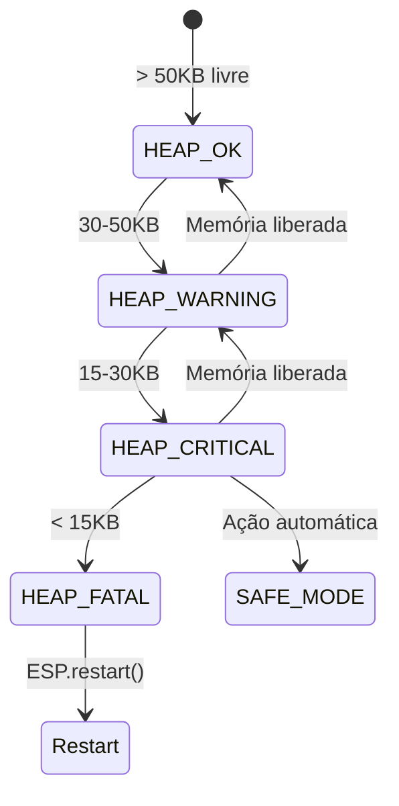

# Documentação Técnica AgroSat-IoT

## Parte 10: Sistema de Saúde e Diagnóstico

### 10.1 Visão Geral

O `SystemHealth` monitora continuamente a saúde do sistema, detectando anomalias, gerenciando o watchdog e mantendo estatísticas de operação para diagnóstico.

### 10.2 Classe SystemHealth

**Localização:** `src/core/SystemHealth/`

#### Interface Pública

```cpp
class SystemHealth {
public:
    enum class HeapStatus { HEAP_OK, HEAP_WARNING, HEAP_CRITICAL, HEAP_FATAL };
    
    bool begin();
    void update();
    void feedWatchdog();
    void setWatchdogTimeout(uint32_t seconds);
    
    // Reportar erros
    void reportError(uint8_t errorCode, const String& description);
    void setSystemError(uint8_t errorFlag, bool active);
    
    // Contadores
    void incrementCRCError();
    void incrementI2CError();
    
    // Setters de estado
    void setSDCardStatus(bool ok);
    void setCurrentMode(uint8_t mode);
    void setBatteryVoltage(float voltage);
    
    // Getters
    uint32_t getFreeHeap();
    uint16_t getErrorCount() const;
    uint8_t getSystemStatus() const;
    HeapStatus getHeapStatus() const;
    unsigned long getUptime();
    HealthTelemetryExtended getHealthTelemetry();
};
```

### 10.3 Flags de Status do Sistema

O status é representado por um bitmask de 8 bits:

```cpp
enum SystemStatusErrors : uint8_t {
    STATUS_OK           = 0,    // 0b00000000 - Sistema OK
    STATUS_WIFI_ERROR   = 1,    // 0b00000001 - Erro WiFi
    STATUS_SD_ERROR     = 2,    // 0b00000010 - Erro SD Card
    STATUS_SENSOR_ERROR = 4,    // 0b00000100 - Erro de sensor
    STATUS_LORA_ERROR   = 8,    // 0b00001000 - Erro LoRa
    STATUS_BATTERY_LOW  = 16,   // 0b00010000 - Bateria baixa
    STATUS_BATTERY_CRIT = 32,   // 0b00100000 - Bateria crítica
    STATUS_TEMP_ALARM   = 64,   // 0b01000000 - Alarme temperatura
    STATUS_WATCHDOG     = 128   // 0b10000000 - Reset por watchdog
};
```

### 10.4 Monitoramento de Heap

O sistema monitora continuamente a memória disponível:



| Status | Heap Livre | Ação |
|--------|------------|------|
| **HEAP_OK** | > 50KB | Operação normal |
| **HEAP_WARNING** | 30-50KB | Log de aviso |
| **HEAP_CRITICAL** | 15-30KB | Entra em SAFE_MODE |
| **HEAP_FATAL** | < 15KB | Reinicialização forçada |

#### Implementação

```cpp
void SystemHealth::update() {
    _currentFreeHeap = ESP.getFreeHeap();
    
    // Atualiza mínimo histórico
    if (_currentFreeHeap < _minFreeHeap) {
        _minFreeHeap = _currentFreeHeap;
    }
    
    // Classifica status do heap
    if (_currentFreeHeap < 15000) {
        _heapStatus = HeapStatus::HEAP_FATAL;
        reportError(STATUS_WATCHDOG, "Heap FATAL (<15kB)");
    }
    else if (_currentFreeHeap < 30000) {
        _heapStatus = HeapStatus::HEAP_CRITICAL;
        if (_lastHeapStatus != HeapStatus::HEAP_CRITICAL) {
            reportError(STATUS_WATCHDOG, "Heap Crítico (<30kB)");
        }
    }
    else if (_currentFreeHeap < 50000) {
        _heapStatus = HeapStatus::HEAP_WARNING;
    }
    else {
        _heapStatus = HeapStatus::HEAP_OK;
    }
    
    _lastHeapStatus = _heapStatus;
}
```

### 10.5 Watchdog Timer

O WDT previne travamentos do sistema:

```cpp
void SystemHealth::feedWatchdog() {
    esp_task_wdt_reset();
}

void SystemHealth::setWatchdogTimeout(uint32_t seconds) {
    esp_task_wdt_init(seconds, true);  // true = panic on timeout
    esp_task_wdt_add(NULL);  // Adiciona task atual
}
```

#### Timeouts por Modo

| Modo | Timeout | Justificativa |
|------|---------|---------------|
| PREFLIGHT | 60s | Operações de teste podem demorar |
| FLIGHT | 90s | Margem para operações normais |
| SAFE | 180s | Economia máxima, menos atividade |

### 10.6 Detecção de Reset por Watchdog

```cpp
bool SystemHealth::begin() {
    // Verifica razão do último reset
    esp_reset_reason_t reason = esp_reset_reason();
    
    if (reason == ESP_RST_TASK_WDT || reason == ESP_RST_WDT) {
        _watchdogResets++;
        _systemStatus |= STATUS_WATCHDOG;
        DEBUG_PRINTF("[SystemHealth] Reset por Watchdog! Total: %d\n", 
                     _watchdogResets);
    }
    
    _resetReason = (uint8_t)reason;
    
    // Carrega contadores da NVS
    _loadPersistentCounters();
    
    return true;
}
```

### 10.7 Monitoramento de Temperatura da CPU

```cpp
void SystemHealth::update() {
    // ... código de heap ...
    
    // Temperatura da CPU (sensor interno)
    _cpuTemp = temperatureRead();
    
    if (_cpuTemp > 80.0f) {
        _systemStatus |= STATUS_TEMP_ALARM;
        reportError(STATUS_TEMP_ALARM, "CPU Superaquecida");
    } else {
        _systemStatus &= ~STATUS_TEMP_ALARM;
    }
}
```

### 10.8 Contadores de Erros

```cpp
void SystemHealth::incrementCRCError() {
    _crcErrors++;
    _errorCount++;
}

void SystemHealth::incrementI2CError() {
    _i2cErrors++;
    _errorCount++;
}

void SystemHealth::reportError(uint8_t errorCode, const String& description) {
    _errorCount++;
    _systemStatus |= errorCode;
    DEBUG_PRINTF("[SystemHealth] ERRO 0x%02X: %s\n", errorCode, description.c_str());
}
```

### 10.9 Estrutura de Telemetria de Saúde

```cpp
struct HealthTelemetryExtended {
    uint32_t uptime;          // Tempo desde boot (ms)
    uint16_t resetCount;      // Total de resets
    uint8_t resetReason;      // Razão do último reset
    uint32_t minFreeHeap;     // Menor heap registrado
    uint32_t currentFreeHeap; // Heap atual
    uint8_t sdCardStatus;     // SD Card OK?
    uint16_t crcErrors;       // Erros de CRC
    uint16_t i2cErrors;       // Erros I2C
    uint16_t watchdogResets;  // Resets por WDT
    uint8_t currentMode;      // Modo atual
};
```

### 10.10 Coleta de Telemetria de Saúde

```cpp
HealthTelemetryExtended SystemHealth::getHealthTelemetry() {
    HealthTelemetryExtended health;
    
    health.uptime = getUptime();
    health.resetCount = _resetCount;
    health.resetReason = _resetReason;
    health.minFreeHeap = _minFreeHeap;
    health.currentFreeHeap = _currentFreeHeap;
    health.sdCardStatus = _sdCardOk ? 1 : 0;
    health.crcErrors = _crcErrors;
    health.i2cErrors = _i2cErrors;
    health.watchdogResets = _watchdogResets;
    health.currentMode = _currentMode;
    
    return health;
}
```

### 10.11 Integração com TelemetryManager

```cpp
void TelemetryManager::loop() {
    // Atualiza saúde do sistema
    _systemHealth.update();
    
    // Verifica status do heap
    SystemHealth::HeapStatus heapStatus = _systemHealth.getHeapStatus();
    
    switch (heapStatus) {
        case SystemHealth::HeapStatus::HEAP_CRITICAL:
            if (_mode != MODE_SAFE) {
                DEBUG_PRINTLN("[TM] MEMORIA CRITICA! Entrando em SAFE MODE.");
                applyModeConfig(MODE_SAFE);
                _mode = MODE_SAFE;
            }
            break;
            
        case SystemHealth::HeapStatus::HEAP_FATAL:
            DEBUG_PRINTLN("[TM] MEMORIA FATAL. Reiniciando...");
            delay(1000);
            ESP.restart();
            break;
            
        default:
            break;
    }
    
    // Atualiza informações de contexto
    _systemHealth.setCurrentMode((uint8_t)_mode);
    _systemHealth.setBatteryVoltage(_power.getVoltage());
    _systemHealth.setSDCardStatus(_storage.isAvailable());
}
```

### 10.12 Verificação de Condições Operacionais

```cpp
void TelemetryManager::_checkOperationalConditions() {
    // Bateria
    bool batCritical = _power.isCritical();
    bool batLow = (_power.getVoltage() <= BATTERY_LOW);
    
    if (batCritical) _power.enablePowerSave();
    
    _systemHealth.setSystemError(STATUS_BATTERY_CRIT, batCritical);
    _systemHealth.setSystemError(STATUS_BATTERY_LOW, batLow);
    
    // Sensores
    bool sensorFail = !_sensors.isMPU9250Online() || !_sensors.isBMP280Online();
    if (sensorFail) {
        static unsigned long lastSensorReset = 0;
        if (millis() - lastSensorReset > 10000) {
            DEBUG_PRINTLN("[TM] Sensores instáveis. Tentando reset...");
            if (xSemaphoreTake(xI2CMutex, pdMS_TO_TICKS(200)) == pdTRUE) {
                _sensors.resetAll();
                xSemaphoreGive(xI2CMutex);
            }
            lastSensorReset = millis();
        }
    }
    _systemHealth.setSystemError(STATUS_SENSOR_ERROR, sensorFail);
    
    // WiFi (se habilitado)
    if (activeModeConfig->httpEnabled) {
        bool wifiDown = !_comm.isWiFiConnected();
        if (wifiDown) {
            static unsigned long lastWifiRetry = 0;
            if (millis() - lastWifiRetry > 30000) {
                _comm.connectWiFi();
                lastWifiRetry = millis();
            }
        }
        _systemHealth.setSystemError(STATUS_WIFI_ERROR, wifiDown);
    }
}
```

### 10.13 Comando de Diagnóstico

O comando `STATUS` exibe informações detalhadas:

```cpp
void SensorManager::printDetailedStatus() const {
    DEBUG_PRINTLN("=== STATUS DOS SENSORES ===");
    DEBUG_PRINTF("MPU9250: %s\n", _mpu9250.isOnline() ? "ONLINE" : "OFFLINE");
    DEBUG_PRINTF("BMP280:  %s (T: %.1f C)\n", 
                 _bmp280.isOnline() ? "ONLINE" : "OFFLINE", 
                 _bmp280.getTemperature());
    DEBUG_PRINTF("SI7021:  %s\n", _si7021.isOnline() ? "ONLINE" : "OFFLINE");
    DEBUG_PRINTF("CCS811:  %s (eCO2: %d ppm)\n", 
                 _ccs811.isOnline() ? "ONLINE" : "OFFLINE",
                 _ccs811.geteCO2());
    DEBUG_PRINTLN("===========================");
}
```

### 10.14 Estatísticas de Mutex

O comando `MUTEX_STATS` mostra timeouts de sincronização:

```cpp
// Contadores globais (em TelemetryManager.cpp)
static uint16_t s_dataMutexTimeouts = 0;
static uint16_t s_i2cMutexTimeouts = 0;

// No handleCommand:
if (cmdUpper == "MUTEX_STATS") {
    DEBUG_PRINTLN("=== MUTEX STATS ===");
    DEBUG_PRINTF("Data Mutex Timeouts: %u\n", s_dataMutexTimeouts);
    DEBUG_PRINTF("I2C Mutex Timeouts: %u\n", s_i2cMutexTimeouts);
    DEBUG_PRINTLN("===================");
    return true;
}
```

### 10.15 Razões de Reset

| Código | Constante | Descrição |
|--------|-----------|-----------|
| 1 | ESP_RST_POWERON | Power-on reset |
| 3 | ESP_RST_SW | Reset por software |
| 4 | ESP_RST_PANIC | Exception/panic |
| 5 | ESP_RST_INT_WDT | Interrupt watchdog |
| 6 | ESP_RST_TASK_WDT | Task watchdog |
| 7 | ESP_RST_WDT | Other watchdog |
| 8 | ESP_RST_DEEPSLEEP | Deep sleep wake |
| 9 | ESP_RST_BROWNOUT | Brownout reset |

### 10.16 Beacon de Diagnóstico (SAFE MODE)

Em modo SAFE, o beacon inclui dados de saúde:

```cpp
void TelemetryManager::_sendSafeBeacon() {
    uint8_t beacon[32];
    int offset = 0;
    
    // Header
    beacon[offset++] = 0xBE;
    beacon[offset++] = 0xAC;
    
    // Team ID
    beacon[offset++] = (TEAM_ID >> 8) & 0xFF;
    beacon[offset++] = TEAM_ID & 0xFF;
    
    // Modo atual
    beacon[offset++] = (uint8_t)_mode;
    
    // Bateria
    uint16_t batVoltageInt = (uint16_t)(_power.getVoltage() * 100);
    beacon[offset++] = (batVoltageInt >> 8) & 0xFF;
    beacon[offset++] = batVoltageInt & 0xFF;
    
    // Uptime (segundos)
    uint32_t uptime = _systemHealth.getUptime() / 1000;
    beacon[offset++] = (uptime >> 24) & 0xFF;
    beacon[offset++] = (uptime >> 16) & 0xFF;
    beacon[offset++] = (uptime >> 8) & 0xFF;
    beacon[offset++] = uptime & 0xFF;
    
    // Status flags
    beacon[offset++] = _systemHealth.getSystemStatus();
    
    // Error count
    uint16_t errors = _systemHealth.getErrorCount();
    beacon[offset++] = (errors >> 8) & 0xFF;
    beacon[offset++] = errors & 0xFF;
    
    // Free heap
    uint32_t freeHeap = _systemHealth.getFreeHeap();
    beacon[offset++] = (freeHeap >> 24) & 0xFF;
    beacon[offset++] = (freeHeap >> 16) & 0xFF;
    beacon[offset++] = (freeHeap >> 8) & 0xFF;
    beacon[offset++] = freeHeap & 0xFF;
    
    // Reset info
    HealthTelemetryExtended health = _systemHealth.getHealthTelemetry();
    beacon[offset++] = (health.resetCount >> 8) & 0xFF;
    beacon[offset++] = health.resetCount & 0xFF;
    beacon[offset++] = health.resetReason;
    
    // GPS fix
    beacon[offset++] = _gps.hasFix() ? 1 : 0;
    
    _comm.sendLoRa(beacon, offset);
}
```

### 10.17 Fluxo de Monitoramento

```mermaid
flowchart TD
    A[SystemHealth.update()] --> B[Verifica Heap]
    B --> C{Heap Status?}
    C -->|OK| D[Continua normal]
    C -->|Warning| E[Log de aviso]
    C -->|Critical| F[Entra SAFE_MODE]
    C -->|Fatal| G[ESP.restart()]
    
    A --> H[Verifica CPU Temp]
    H --> I{Temp > 80°C?}
    I -->|Sim| J[Set TEMP_ALARM]
    I -->|Não| K[Clear TEMP_ALARM]
    
    A --> L[Atualiza contadores]
    L --> M[Salva min heap]
```

### 10.18 Resumo dos Comandos de Diagnóstico

| Comando | Descrição |
|---------|-----------|
| `STATUS` | Status detalhado dos sensores |
| `MUTEX_STATS` | Estatísticas de timeout de mutex |
| `DUTY_CYCLE` | Uso do duty cycle LoRa |
| `HELP` | Lista de comandos |

---

*Anterior: [09 - Controle de Missão](09-controle-missao.md)*

*Próxima parte: [11 - Comandos e Interface Serial](11-comandos-interface.md)*