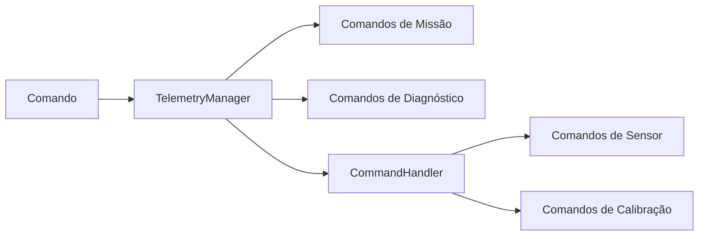
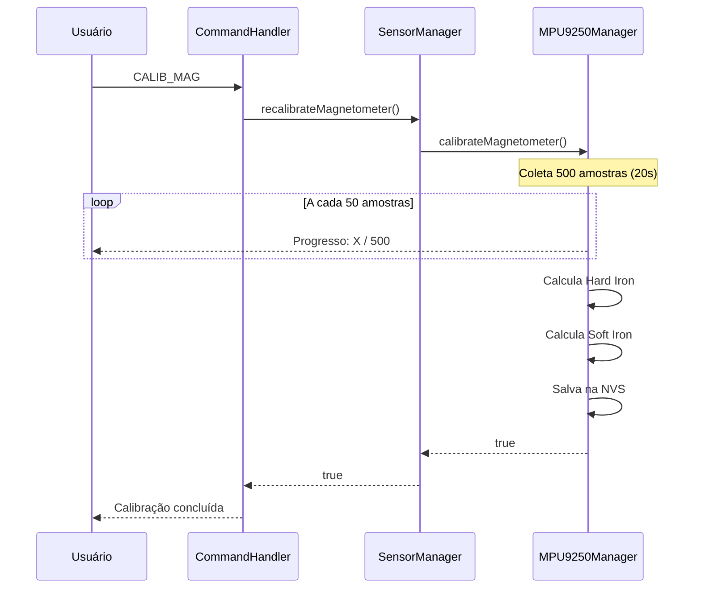
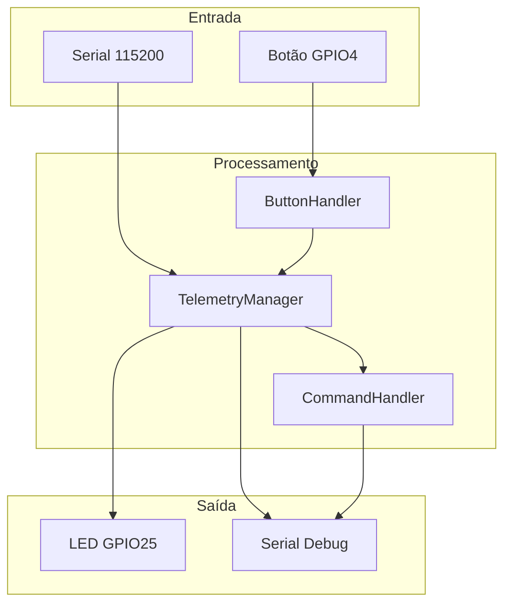

# Documentação Técnica AgroSat-IoT

## Parte 11: Comandos e Interface Serial

### 11.1 Visão Geral

O sistema oferece uma interface de comandos via porta Serial (115200 baud) para controle, diagnóstico e calibração. Os comandos são processados pelo `CommandHandler` e `TelemetryManager`.

### 11.2 Configuração da Serial

```cpp
// include/config/constants.h
#define DEBUG_BAUDRATE 115200

// main.cpp - setup()
Serial.begin(DEBUG_BAUDRATE);
```

### 11.3 Processamento de Comandos

```mermaid
flowchart TD
    A[Serial.available()] --> B{Dados?}
    B -->|Não| A
    B -->|Sim| C[Lê até newline]
    C --> D[trim() + toUpperCase()]
    D --> E[TelemetryManager.handleCommand()]
    E --> F{Comando reconhecido?}
    F -->|Sim| G[Executa ação]
    F -->|Não| H[CommandHandler.handle()]
    H --> I{Reconhecido?}
    I -->|Sim| J[Executa ação]
    I -->|Não| K[Comando desconhecido]
```

#### Implementação

```cpp
// main.cpp
void processSerialCommands() {
    if (!Serial.available()) return;
    
    String cmd = Serial.readStringUntil('\n');
    cmd.trim();
    cmd.toUpperCase();
    
    if (cmd.length() == 0) return;
    
    DEBUG_PRINTF("[Main] Comando recebido: %s\n", cmd.c_str());
    
    if (!telemetry.handleCommand(cmd)) {
        DEBUG_PRINTLN("[Main] Comando nao reconhecido (use HELP)");
    }
}
```

### 11.4 Hierarquia de Comandos



### 11.5 Lista Completa de Comandos

#### Comandos de Missão (TelemetryManager)

| Comando | Descrição | Resposta |
|---------|-----------|----------|
| `START_MISSION` | Inicia missão (PREFLIGHT → FLIGHT) | Confirmação de transição |
| `STOP_MISSION` | Encerra missão (FLIGHT → PREFLIGHT) | Estatísticas da missão |
| `SAFE_MODE` | Força entrada no modo seguro | Confirmação |

#### Comandos de Diagnóstico (TelemetryManager)

| Comando | Descrição | Resposta |
|---------|-----------|----------|
| `DUTY_CYCLE` | Estatísticas de duty cycle LoRa | Tempo usado, percentual |
| `MUTEX_STATS` | Estatísticas de timeout de mutex | Contadores de timeout |

#### Comandos de Sensor (CommandHandler)

| Comando | Descrição | Resposta |
|---------|-----------|----------|
| `STATUS` | Status detalhado dos sensores | Lista de sensores online/offline |
| `HELP` ou `?` | Lista comandos disponíveis | Menu de ajuda |

#### Comandos de Calibração (CommandHandler)

| Comando | Descrição | Resposta |
|---------|-----------|----------|
| `CALIB_MAG` | Inicia calibração do magnetômetro | Instruções + progresso |
| `CLEAR_MAG` | Apaga calibração do magnetômetro | Confirmação |
| `SAVE_BASELINE` | Salva baseline do CCS811 | Confirmação |

### 11.6 Implementação do TelemetryManager

```cpp
bool TelemetryManager::handleCommand(const String& cmd) {
    String cmdUpper = cmd;
    cmdUpper.toUpperCase();
    cmdUpper.trim();

    // Proteção contra buffer overflow
    if (cmdUpper.length() > 32) return false;
    
    // Comandos de missão
    if (cmdUpper == "START_MISSION") { 
        startMission(); 
        return true; 
    }
    
    if (cmdUpper == "STOP_MISSION") { 
        stopMission(); 
        return true; 
    }
    
    if (cmdUpper == "SAFE_MODE") { 
        applyModeConfig(MODE_SAFE); 
        _mode = MODE_SAFE; 
        return true; 
    }
    
    // Comandos de diagnóstico
    if (cmdUpper == "DUTY_CYCLE") {
        auto& dc = _comm.getDutyCycleTracker();
        DEBUG_PRINTLN("=== DUTY CYCLE ===");
        DEBUG_PRINTF("Usado: %lu ms / %lu ms\n", 
                     dc.getAccumulatedTxTime(), 360000UL);
        DEBUG_PRINTF("Percentual: %.1f%%\n", dc.getDutyCyclePercent());
        DEBUG_PRINTLN("==================");
        return true;
    }
    
    if (cmdUpper == "MUTEX_STATS") {
        DEBUG_PRINTLN("=== MUTEX STATS ===");
        DEBUG_PRINTF("Data Mutex Timeouts: %u\n", s_dataMutexTimeouts);
        DEBUG_PRINTF("I2C Mutex Timeouts: %u\n", s_i2cMutexTimeouts);
        DEBUG_PRINTLN("===================");
        return true;
    }
    
    // Delega para CommandHandler
    return _commandHandler.handle(cmdUpper);
}
```

### 11.7 Implementação do CommandHandler

```cpp
bool CommandHandler::handle(String cmd) {
    cmd.trim();
    cmd.toUpperCase();
    
    if (cmd.length() == 0) return false;

    if (cmd == "HELP" || cmd == "?") {
        _printHelp();
        return true;
    }
    
    if (cmd.startsWith("STATUS")) {
        _sensors.printDetailedStatus();
        return true;
    }

    if (cmd == "CALIB_MAG") {
        DEBUG_PRINTLN("[CMD] Iniciando calibracao do magnetometro...");
        if (_sensors.recalibrateMagnetometer()) {
            DEBUG_PRINTLN("[CMD] Calibracao MAG concluida.");
        } else {
            DEBUG_PRINTLN("[CMD] Calibracao MAG falhou.");
        }
        return true;
    }

    if (cmd == "CLEAR_MAG") {
        _sensors.clearMagnetometerCalibration();
        return true;
    }

    if (cmd == "SAVE_BASELINE") {
        if (_sensors.saveCCS811Baseline()) {
            DEBUG_PRINTLN("[CMD] Baseline salvo.");
        } else {
            DEBUG_PRINTLN("[CMD] Erro ao salvar baseline.");
        }
        return true;
    }

    DEBUG_PRINTF("[CMD] Comando desconhecido: %s\n", cmd.c_str());
    return false;
}
```

### 11.8 Menu de Ajuda

```cpp
void CommandHandler::_printHelp() {
    DEBUG_PRINTLN("--- COMANDOS DISPONIVEIS ---");
    DEBUG_PRINTLN("  STATUS          : Status detalhado dos sensores");
    DEBUG_PRINTLN("  CALIB_MAG       : Calibra magnetometro (gire em 8)");
    DEBUG_PRINTLN("  CLEAR_MAG       : Apaga calibracao do magnetometro");
    DEBUG_PRINTLN("  SAVE_BASELINE   : Salva baseline do CCS811");
    DEBUG_PRINTLN("----------------------------");
}

// Em main.cpp
void printAvailableCommands() {
    DEBUG_PRINTLN("=== COMANDOS DISPONIVEIS ===");
    DEBUG_PRINTLN("  STATUS          : Status detalhado");
    DEBUG_PRINTLN("  START_MISSION   : Inicia modo FLIGHT");
    DEBUG_PRINTLN("  STOP_MISSION    : Retorna ao modo PREFLIGHT");
    DEBUG_PRINTLN("  SAFE_MODE       : Forca modo SAFE");
    DEBUG_PRINTLN("  MUTEX_STATS     : Estatisticas de mutex");
    DEBUG_PRINTLN("  HELP            : Este menu");
    DEBUG_PRINTLN("============================");
}
```

### 11.9 Comando STATUS - Detalhes

Saída típica do comando `STATUS`:

```
=== STATUS DOS SENSORES ===
MPU9250: ONLINE
  Accel: X=0.02g Y=-0.01g Z=1.00g
  Gyro:  X=0.5°/s Y=-0.3°/s Z=0.1°/s
  Mag:   X=25.3µT Y=-12.1µT Z=45.2µT (Calibrado)
BMP280:  ONLINE (T: 25.3 C, P: 1013.2 hPa)
SI7021:  ONLINE (T: 24.8 C, RH: 45.2%)
CCS811:  ONLINE (eCO2: 412 ppm, TVOC: 3 ppb)
GPS:     FIX (Sats: 8, Lat: -16.123456, Lon: -49.123456)
===========================
```

### 11.10 Comando CALIB_MAG - Processo



### 11.11 Comando DUTY_CYCLE - Saída

```
=== DUTY CYCLE ===
Usado: 12500 ms / 360000 ms
Percentual: 3.5%
==================
```

### 11.12 Comando MUTEX_STATS - Saída

```
=== MUTEX STATS ===
Data Mutex Timeouts: 0
I2C Mutex Timeouts: 2
===================
```

### 11.13 Sistema de Debug Thread-Safe

O sistema usa macros para debug seguro em ambiente multi-task:

```cpp
// include/config/debug.h

// Printf thread-safe
#define DEBUG_PRINTF(...) \
    do { if(currentSerialLogsEnabled) { safePrintf(__VA_ARGS__); } } while(0)

// Println thread-safe
#define DEBUG_PRINTLN(x) \
    do { if(currentSerialLogsEnabled) { _debugPrintlnSafe(x); } } while(0)
```

#### Implementação do safePrintf

```cpp
// src/Globals.cpp
void safePrintf(const char* format, ...) {
    if (xSerialMutex == NULL) return;
    
    if (xSemaphoreTake(xSerialMutex, pdMS_TO_TICKS(100)) == pdTRUE) {
        va_list args;
        va_start(args, format);
        
        char buffer[256];
        vsnprintf(buffer, sizeof(buffer), format, args);
        Serial.print(buffer);
        
        va_end(args);
        xSemaphoreGive(xSerialMutex);
    }
}
```

### 11.14 Controle de Logs por Modo

Os logs são habilitados/desabilitados conforme o modo:

| Modo | Logs Serial | Logs SD |
|------|-------------|---------|
| PREFLIGHT | ✓ Habilitado | ✓ Verbose |
| FLIGHT | ✗ Desabilitado | ✗ Mínimo |
| SAFE | ✓ Habilitado | ✓ Verbose |

```cpp
// Variável global
extern bool currentSerialLogsEnabled;

// Ao mudar de modo
void TelemetryManager::applyModeConfig(uint8_t modeIndex) {
    // ...
    currentSerialLogsEnabled = activeModeConfig->serialLogsEnabled;
    // ...
}
```

### 11.15 Interação via Botão

Além da Serial, o botão físico oferece controle:

```cpp
void TelemetryManager::_handleButtonEvents() {
    ButtonEvent evt = _button.update();
    
    if (evt == ButtonEvent::SHORT_PRESS) {
        // Alterna PREFLIGHT <-> FLIGHT
        if (_mode == MODE_FLIGHT) {
            stopMission();
        } else {
            startMission();
        }
    } 
    else if (evt == ButtonEvent::LONG_PRESS) {
        // Força SAFE MODE
        applyModeConfig(MODE_SAFE);
        _mode = MODE_SAFE;
        DEBUG_PRINTLN("[TM] SAFE MODE ATIVADO (Manual)");
    }
}
```

### 11.16 Classe ButtonHandler

```cpp
enum class ButtonEvent : uint8_t { 
    NONE,           // Nenhum evento
    SHORT_PRESS,    // Pressão curta (< 2s)
    LONG_PRESS      // Pressão longa (>= 2s)
};

class ButtonHandler {
public:
    void begin();
    ButtonEvent update();
    
private:
    uint8_t _pin;
    bool _lastReading;
    unsigned long _lastDebounceTime;
    unsigned long _pressStartTime;
    bool _longPressHandled;
    
    static constexpr unsigned long DEBOUNCE_MS = 50;
    static constexpr unsigned long LONG_PRESS_MS = 2000;
};
```

### 11.17 Resumo de Interações



### 11.18 Tabela de Referência Rápida

| Entrada | Ação | Resultado |
|---------|------|-----------|
| Serial: `START_MISSION` | Inicia missão | Modo FLIGHT |
| Serial: `STOP_MISSION` | Para missão | Modo PREFLIGHT |
| Serial: `SAFE_MODE` | Força seguro | Modo SAFE |
| Serial: `STATUS` | Diagnóstico | Lista sensores |
| Serial: `CALIB_MAG` | Calibra mag | 20s de coleta |
| Serial: `HELP` | Ajuda | Lista comandos |
| Botão: Curto | Alterna missão | PREFLIGHT ↔ FLIGHT |
| Botão: Longo | Emergência | Modo SAFE |

---

*Anterior: [10 - Sistema de Saúde](10-sistema-saude.md)*

*Próxima parte: [12 - Estruturas de Dados](12-estruturas-dados.md)*