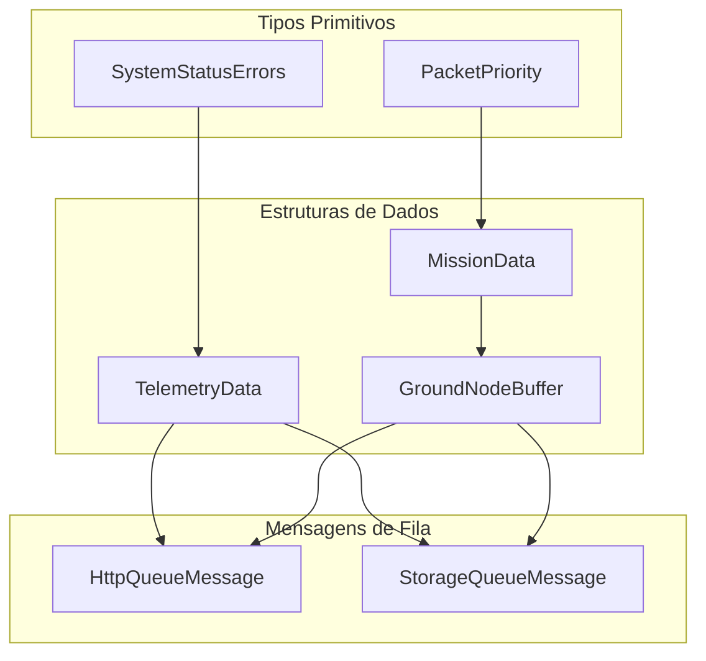

# Documentação Técnica AgroSat-IoT

## Parte 12: Estruturas de Dados e Tipos

### 12.1 Visão Geral

O sistema utiliza estruturas de dados bem definidas para comunicação entre módulos, armazenamento e transmissão. Todas as estruturas estão centralizadas em `include/types/TelemetryTypes.h`.

### 12.2 Hierarquia de Tipos



### 12.3 Flags de Status do Sistema

O sistema usa um bitmask de 8 bits para representar múltiplos estados de erro simultaneamente:

```cpp
enum SystemStatusErrors : uint8_t {
    STATUS_OK           = 0,    // 0b00000000 - Sistema OK
    STATUS_WIFI_ERROR   = 1,    // 0b00000001 - Erro de WiFi
    STATUS_SD_ERROR     = 2,    // 0b00000010 - Erro de SD Card
    STATUS_SENSOR_ERROR = 4,    // 0b00000100 - Erro de sensor
    STATUS_LORA_ERROR   = 8,    // 0b00001000 - Erro de LoRa
    STATUS_BATTERY_LOW  = 16,   // 0b00010000 - Bateria baixa (<3.7V)
    STATUS_BATTERY_CRIT = 32,   // 0b00100000 - Bateria crítica (<3.3V)
    STATUS_TEMP_ALARM   = 64,   // 0b01000000 - Alarme de temperatura
    STATUS_WATCHDOG     = 128   // 0b10000000 - Reset por watchdog
};
```

#### Uso do Bitmask

```cpp
// Definir múltiplos erros
uint8_t status = STATUS_WIFI_ERROR | STATUS_BATTERY_LOW;  // 0b00010001 = 17

// Verificar erro específico
if (status & STATUS_BATTERY_LOW) {
    // Bateria baixa detectada
}

// Adicionar erro
status |= STATUS_SD_ERROR;  // Agora: 0b00010011 = 19

// Remover erro
status &= ~STATUS_WIFI_ERROR;  // Remove bit de WiFi
```

### 12.4 Prioridade de Pacotes (QoS)

```cpp
enum class PacketPriority : uint8_t {
    CRITICAL      = 0,  // Solo seco, temperatura extrema
    HIGH_PRIORITY = 1,  // Link ruim, irrigação ativa
    NORMAL        = 2,  // Operação padrão
    LOW_PRIORITY  = 3   // Dados antigos
};
```

#### Cálculo de Prioridade

```cpp
PacketPriority calculatePriority(const MissionData& data) {
    // Solo muito seco = crítico
    if (data.soilMoisture < 20.0f) return PacketPriority::CRITICAL;
    
    // Temperatura extrema = crítico
    if (data.ambientTemp > 45.0f || data.ambientTemp < 0.0f) 
        return PacketPriority::CRITICAL;
    
    // Link ruim = alta prioridade
    if (data.rssi < -110) return PacketPriority::HIGH_PRIORITY;
    
    // Irrigação ativa = alta prioridade
    if (data.irrigationStatus) return PacketPriority::HIGH_PRIORITY;
    
    // Dados antigos = baixa prioridade
    if (millis() - data.collectionTime > 300000) 
        return PacketPriority::LOW_PRIORITY;
    
    return PacketPriority::NORMAL;
}
```

### 12.5 TelemetryData - Dados Locais

Estrutura principal contendo todos os dados dos sensores embarcados:

```cpp
struct TelemetryData {
    //--- Timestamps (8 bytes) ---
    unsigned long timestamp;      // millis() da coleta
    unsigned long missionTime;    // Tempo desde início da missão
    
    //--- Bateria (8 bytes) ---
    float batteryVoltage;         // Tensão (V)
    float batteryPercentage;      // Carga (%)
    
    //--- Temperaturas (12 bytes) ---
    float temperature;            // Temperatura fusionada (°C)
    float temperatureBMP;         // Temperatura BMP280 (°C)
    float temperatureSI;          // Temperatura SI7021 (°C)
    
    //--- Barômetro (8 bytes) ---
    float pressure;               // Pressão atmosférica (hPa)
    float altitude;               // Altitude barométrica (m)
    
    //--- GPS (26 bytes) ---
    double latitude;              // Latitude (graus decimais)
    double longitude;             // Longitude (graus decimais)
    float gpsAltitude;            // Altitude GPS (m)
    uint8_t satellites;           // Satélites no fix
    bool gpsFix;                  // Fix válido?
    
    //--- IMU: Giroscópio (12 bytes) ---
    float gyroX, gyroY, gyroZ;    // Velocidade angular (°/s)
    
    //--- IMU: Acelerômetro (12 bytes) ---
    float accelX, accelY, accelZ; // Aceleração (g)
    
    //--- IMU: Magnetômetro (12 bytes) ---
    float magX, magY, magZ;       // Campo magnético (µT)
    
    //--- Ambiente (12 bytes) ---
    float humidity;               // Umidade relativa (%)
    float co2;                    // eCO2 (ppm)
    float tvoc;                   // TVOC (ppb)
    
    //--- Status (4 bytes) ---
    uint8_t systemStatus;         // Flags de erro (bitmask)
    uint16_t errorCount;          // Contador de erros
    uint8_t padding;              // Alinhamento
    
    //--- Sistema (16 bytes) ---
    uint32_t uptime;              // Uptime (ms)
    uint16_t resetCount;          // Contagem de resets
    uint8_t resetReason;          // Razão do último reset
    uint8_t padding2;             // Alinhamento
    uint32_t minFreeHeap;         // Menor heap livre (bytes)
    float cpuTemp;                // Temperatura CPU (°C)
    
    //--- Payload (64 bytes) ---
    char payload[64];             // Payload customizado
};
// Total aproximado: ~160 bytes
```

#### Diagrama de Memória

```
TelemetryData (160 bytes)
┌────────────────────────────────────────────────────────┐
│ Timestamps      │ timestamp (4) │ missionTime (4)      │ 8B
├────────────────────────────────────────────────────────┤
│ Bateria         │ voltage (4)   │ percentage (4)       │ 8B
├────────────────────────────────────────────────────────┤
│ Temperaturas    │ temp (4) │ tempBMP (4) │ tempSI (4)  │ 12B
├────────────────────────────────────────────────────────┤
│ Barômetro       │ pressure (4)  │ altitude (4)         │ 8B
├────────────────────────────────────────────────────────┤
│ GPS             │ lat (8) │ lon (8) │ alt (4) │ sat+fix│ 26B
├────────────────────────────────────────────────────────┤
│ Giroscópio      │ gyroX (4) │ gyroY (4) │ gyroZ (4)    │ 12B
├────────────────────────────────────────────────────────┤
│ Acelerômetro    │ accelX (4) │ accelY (4) │ accelZ (4) │ 12B
├────────────────────────────────────────────────────────┤
│ Magnetômetro    │ magX (4) │ magY (4) │ magZ (4)       │ 12B
├────────────────────────────────────────────────────────┤
│ Ambiente        │ humidity (4) │ co2 (4) │ tvoc (4)    │ 12B
├────────────────────────────────────────────────────────┤
│ Status          │ status (1) │ errorCount (2) │ pad    │ 4B
├────────────────────────────────────────────────────────┤
│ Sistema         │ uptime │ resets │ reason │ heap │cpu │ 16B
├────────────────────────────────────────────────────────┤
│ Payload         │ char[64]                             │ 64B
└────────────────────────────────────────────────────────┘
```

### 12.6 MissionData - Dados de Ground Node

Estrutura para dados recebidos de sensores terrestres via LoRa:

```cpp
struct MissionData {
    //--- Identificação (4 bytes) ---
    uint16_t nodeId;              // ID único do nó (0-65535)
    uint16_t sequenceNumber;      // Número de sequência
    
    //--- Sensores do Nó (14 bytes) ---
    float soilMoisture;           // Umidade do solo (%)
    float ambientTemp;            // Temperatura ambiente (°C)
    float humidity;               // Umidade do ar (%)
    uint8_t irrigationStatus;     // Status irrigação (0/1)
    uint8_t padding;              // Alinhamento
    
    //--- Qualidade do Link (16 bytes) ---
    int16_t rssi;                 // RSSI do pacote (dBm)
    float snr;                    // SNR do pacote (dB)
    uint16_t packetsReceived;     // Pacotes recebidos deste nó
    uint16_t packetsLost;         // Pacotes perdidos
    unsigned long lastLoraRx;     // Timestamp última recepção
    
    //--- Timestamps (12 bytes) ---
    uint32_t nodeTimestamp;       // Timestamp do nó
    unsigned long collectionTime; // Quando foi coletado
    unsigned long retransmissionTime; // Quando foi retransmitido
    
    //--- Controle (24 bytes) ---
    uint8_t priority;             // Prioridade QoS calculada
    bool forwarded;               // Já foi encaminhado?
    char originalPayloadHex[20];  // Payload original (hex)
    uint8_t payloadLength;        // Tamanho do payload
    uint8_t padding2;             // Alinhamento
    
    // Construtor com inicialização segura
    MissionData();
};
// Total aproximado: ~80 bytes
```

### 12.7 GroundNodeBuffer - Buffer de Nós

Buffer circular para armazenar múltiplos ground nodes:

```cpp
#define MAX_GROUND_NODES 3  // Máximo de nós simultâneos

struct GroundNodeBuffer {
    MissionData nodes[MAX_GROUND_NODES];        // Array de nós (~240 bytes)
    uint8_t activeNodes;                        // Quantidade ativa (1 byte)
    unsigned long lastUpdate[MAX_GROUND_NODES]; // Timestamps (12 bytes)
    uint16_t totalPacketsCollected;             // Total coletado (2 bytes)
    uint8_t padding[1];                         // Alinhamento
};
// Total aproximado: ~260 bytes
```

#### Operações no Buffer

```cpp
// Adicionar/atualizar nó
bool addOrUpdateNode(uint16_t nodeId, const MissionData& data) {
    // Procura nó existente
    for (int i = 0; i < activeNodes; i++) {
        if (nodes[i].nodeId == nodeId) {
            nodes[i] = data;
            lastUpdate[i] = millis();
            return true;
        }
    }
    
    // Adiciona novo se houver espaço
    if (activeNodes < MAX_GROUND_NODES) {
        nodes[activeNodes] = data;
        lastUpdate[activeNodes] = millis();
        activeNodes++;
        return true;
    }
    
    // Substitui o mais antigo
    int oldest = findOldestNode();
    nodes[oldest] = data;
    lastUpdate[oldest] = millis();
    return true;
}

// Remove nós expirados (TTL)
void pruneExpiredNodes(unsigned long ttlMs) {
    unsigned long now = millis();
    for (int i = activeNodes - 1; i >= 0; i--) {
        if (now - lastUpdate[i] > ttlMs) {
            // Remove nó (shift array)
            for (int j = i; j < activeNodes - 1; j++) {
                nodes[j] = nodes[j + 1];
                lastUpdate[j] = lastUpdate[j + 1];
            }
            activeNodes--;
        }
    }
}
```

### 12.8 Mensagens de Fila

#### HttpQueueMessage

```cpp
struct HttpQueueMessage {
    TelemetryData data;       // ~160 bytes
    GroundNodeBuffer nodes;   // ~260 bytes
};
// Total: ~420 bytes
```

#### StorageQueueMessage

```cpp
struct StorageQueueMessage {
    TelemetryData data;       // ~160 bytes
    GroundNodeBuffer nodes;   // ~260 bytes
};
// Total: ~420 bytes
```

### 12.9 Uso de Memória por Estrutura

| Estrutura | Tamanho | Instâncias | Total RAM |
|-----------|---------|------------|-----------|
| TelemetryData | ~160 bytes | 2-3 | ~480 bytes |
| MissionData | ~80 bytes | 3 (buffer) | ~240 bytes |
| GroundNodeBuffer | ~260 bytes | 1 | ~260 bytes |
| HttpQueueMessage | ~420 bytes | 5 (fila) | ~2100 bytes |
| StorageQueueMessage | ~420 bytes | 10 (fila) | ~4200 bytes |

**Total estimado para estruturas de dados: ~7.3 KB**

### 12.10 Serialização JSON

#### TelemetryData para JSON

```cpp
String telemetryToJson(const TelemetryData& data) {
    StaticJsonDocument<512> doc;
    
    doc["ts"] = data.timestamp;
    doc["mt"] = data.missionTime;
    
    JsonObject bat = doc.createNestedObject("bat");
    bat["v"] = data.batteryVoltage;
    bat["p"] = data.batteryPercentage;
    
    JsonObject temp = doc.createNestedObject("temp");
    temp["avg"] = data.temperature;
    temp["bmp"] = data.temperatureBMP;
    temp["si"] = data.temperatureSI;
    
    JsonObject gps = doc.createNestedObject("gps");
    gps["lat"] = data.latitude;
    gps["lon"] = data.longitude;
    gps["alt"] = data.gpsAltitude;
    gps["sat"] = data.satellites;
    gps["fix"] = data.gpsFix;
    
    // ... demais campos
    
    String output;
    serializeJson(doc, output);
    return output;
}
```

#### MissionData para JSON

```cpp
String missionToJson(const MissionData& data) {
    StaticJsonDocument<256> doc;
    
    doc["id"] = data.nodeId;
    doc["seq"] = data.sequenceNumber;
    doc["soil"] = data.soilMoisture;
    doc["temp"] = data.ambientTemp;
    doc["hum"] = data.humidity;
    doc["irrig"] = data.irrigationStatus;
    doc["rssi"] = data.rssi;
    doc["snr"] = data.snr;
    doc["pri"] = data.priority;
    doc["fwd"] = data.forwarded;
    
    String output;
    serializeJson(doc, output);
    return output;
}
```

### 12.11 Formato CSV para SD Card

#### Telemetria (telemetry.csv)

```csv
timestamp,mission_time,bat_v,bat_pct,temp,temp_bmp,temp_si,pressure,altitude,lat,lon,gps_alt,sats,fix,gyro_x,gyro_y,gyro_z,accel_x,accel_y,accel_z,mag_x,mag_y,mag_z,humidity,co2,tvoc,status,errors,uptime,resets
1705234567890,3600000,3.85,72.5,25.3,25.1,25.5,1013.25,150.2,-16.123456,-49.123456,152.0,8,1,0.5,-0.3,0.1,0.02,-0.01,1.00,25.3,-12.1,45.2,45.2,412,3,0,0,86400000,2
```

#### Missão (mission.csv)

```csv
collection_time,node_id,seq,soil_moisture,ambient_temp,humidity,irrigation,rssi,snr,priority,forwarded
1705234567890,1001,42,35.5,28.3,62.1,0,-95,7.5,2,0
1705234567890,1002,18,22.1,30.1,55.8,1,-102,5.2,1
```

### 12.12 Validação de Dados

```cpp
bool validateTelemetryData(const TelemetryData& data) {
    // Temperatura
    if (data.temperature < TEMP_MIN_VALID || 
        data.temperature > TEMP_MAX_VALID) return false;
    
    // Umidade
    if (data.humidity < HUMIDITY_MIN_VALID || 
        data.humidity > HUMIDITY_MAX_VALID) return false;
    
    // CO2
    if (data.co2 < CO2_MIN_VALID || 
        data.co2 > CO2_MAX_VALID) return false;
    
    // Bateria
    if (data.batteryVoltage < 2.5f || 
        data.batteryVoltage > 4.5f) return false;
    
    // GPS (se tiver fix)
    if (data.gpsFix) {
        if (data.latitude < -90.0 || data.latitude > 90.0) return false;
        if (data.longitude < -180.0 || data.longitude > 180.0) return false;
    }
    
    return true;
}
```

---

*Anterior: [11 - Comandos e Interface](11-comandos-interface.md)*

*Próxima parte: [13 - Configurações e Constantes](13-configuracoes-constantes.md)*