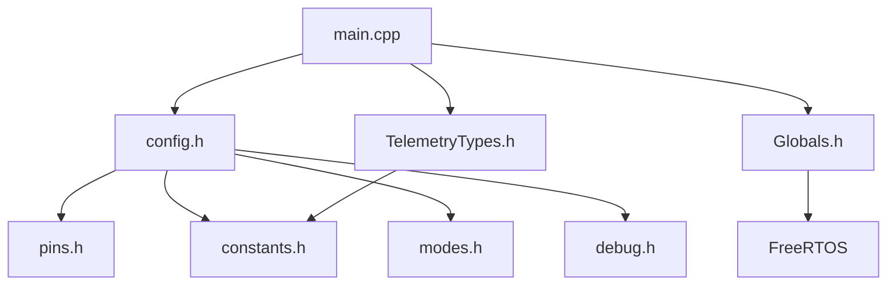

# Documentação Técnica AgroSat-IoT

## Parte 13: Configurações e Constantes

### 13.1 Visão Geral

O sistema utiliza arquivos de configuração centralizados em `include/config/` para facilitar ajustes e manutenção. Esta abordagem permite modificar parâmetros sem alterar o código fonte.

### 13.2 Estrutura de Arquivos de Configuração

```
include/
├── config.h              # Agregador (inclui todos)
├── Globals.h             # Recursos compartilhados
├── config/
│   ├── pins.h            # Mapeamento GPIO
│   ├── constants.h       # Constantes do sistema
│   ├── modes.h           # Modos de operação
│   └── debug.h           # Macros de debug
└── types/
    └── TelemetryTypes.h  # Estruturas de dados
```

### 13.3 Mapeamento de Pinos (pins.h)

#### GPS (UART2)

| Pino | GPIO | Função | Notas |
|------|------|--------|-------|
| GPS_RX_PIN | 34 | Recepção GPS | Somente entrada |
| GPS_TX_PIN | 12 | Transmissão GPS | - |
| GPS_BAUD_RATE | 9600 | Baudrate | Padrão NEO-6M |

```cpp
#define GPS_RX_PIN 34
#define GPS_TX_PIN 12
#define GPS_BAUD_RATE 9600
```

#### LoRa SX1276 (VSPI)

| Pino | GPIO | Função | Notas |
|------|------|--------|-------|
| LORA_CS | 18 | Chip Select | NSS |
| LORA_RST | 23 | Reset | Ativo baixo |
| LORA_DIO0 | 26 | Interrupção | RX/TX Done |

```cpp
#define LORA_CS 18
#define LORA_RST 23
#define LORA_DIO0 26
```

#### SD Card (HSPI)

| Pino | GPIO | Função | Notas |
|------|------|--------|-------|
| SD_CS | 13 | Chip Select | - |
| SD_MOSI | 15 | Data Out | - |
| SD_MISO | 2 | Data In | Strapping pin! |
| SD_SCLK | 14 | Clock | - |

```cpp
#define SD_CS 13
#define SD_MOSI 15
#define SD_MISO 2
#define SD_SCLK 14
```

> ⚠️ **Atenção**: GPIO2 é um strapping pin. Não deve estar em HIGH durante o boot.

#### I2C (Wire)

| Pino | GPIO | Função |
|------|------|--------|
| SENSOR_I2C_SDA | 21 | Data |
| SENSOR_I2C_SCL | 22 | Clock |

```cpp
#define SENSOR_I2C_SDA 21
#define SENSOR_I2C_SCL 22
```

#### Outros

| Pino | GPIO | Função |
|------|------|--------|
| BATTERY_PIN | 35 | ADC bateria |
| LED_BUILTIN | 25 | LED onboard |
| BUTTON_PIN | 4 | Botão usuário |

### 13.4 Endereços I2C

| Sensor | Endereço | Notas |
|--------|----------|-------|
| MPU9250 | 0x69 | AD0=HIGH |
| BMP280 | 0x76 | SDO=GND |
| SI7021 | 0x40 | Fixo |
| CCS811 | 0x5A | ADDR=LOW |
| DS3231 | 0x68 | Fixo |

```cpp
#define MPU9250_ADDRESS 0x69
// Outros definidos nas bibliotecas
```

### 13.5 Constantes do Sistema (constants.h)

#### Identificação

```cpp
#define TEAM_ID 666  // ID da equipe na competição
```

#### I2C

```cpp
#define I2C_FREQUENCY 100000   // 100kHz (standard mode)
#define I2C_TIMEOUT_MS 3000    // Timeout de operações
```

#### Gerenciamento de Energia

```cpp
#define BATTERY_VREF 3.6       // Tensão referência ADC (V)
#define BATTERY_DIVIDER 2.0    // Fator do divisor
#define BATTERY_LOW 3.7        // Limiar bateria baixa (V)
#define BATTERY_CRITICAL 3.3   // Limiar crítico (V)
```

#### Cálculo de Tensão da Bateria

```cpp
float readBatteryVoltage() {
    int raw = analogRead(BATTERY_PIN);
    float voltage = (raw / 4095.0f) * BATTERY_VREF * BATTERY_DIVIDER;
    return voltage;
}
```

#### Timeouts

| Constante | Valor | Descrição |
|-----------|-------|-----------|
| WIFI_TIMEOUT_MS | 10000 | Conexão WiFi |
| HTTP_TIMEOUT_MS | 5000 | Requisição HTTP |
| SYSTEM_HEALTH_INTERVAL | 10000 | Verificação de saúde |

```cpp
#define WIFI_TIMEOUT_MS 10000
#define HTTP_TIMEOUT_MS 5000
#define SYSTEM_HEALTH_INTERVAL 10000
```

#### Watchdog

| Modo | Timeout | Descrição |
|------|---------|-----------|
| PREFLIGHT | 60s | Mais restritivo |
| FLIGHT | 90s | Operação normal |
| SAFE | 180s | Mais tolerante |

```cpp
#define WATCHDOG_TIMEOUT_PREFLIGHT 60
#define WATCHDOG_TIMEOUT_FLIGHT 90
#define WATCHDOG_TIMEOUT_SAFE 180
```

### 13.6 Configuração LoRa

```cpp
#define LORA_FREQUENCY 915E6           // 915 MHz (ISM Brasil)
#define LORA_SPREADING_FACTOR 7        // SF7 (mais rápido)
#define LORA_SIGNAL_BANDWIDTH 125E3    // 125 kHz
#define LORA_CODING_RATE 5             // 4/5
#define LORA_TX_POWER 20               // 20 dBm (máximo legal)
#define LORA_PREAMBLE_LENGTH 8         // Símbolos
#define LORA_SYNC_WORD 0x12            // Rede privada
#define LORA_CRC_ENABLED true          // CRC habilitado
#define LORA_DUTY_CYCLE_PERCENT 10     // 10% máximo
#define LORA_DUTY_CYCLE_WINDOW_MS 3600000  // Janela de 1 hora
```

#### Tabela de Spreading Factor

| SF | Sensibilidade | Data Rate | Alcance |
|----|---------------|-----------|---------|
| 7 | -123 dBm | 5.47 kbps | Curto |
| 8 | -126 dBm | 3.13 kbps | Médio |
| 9 | -129 dBm | 1.76 kbps | Médio-Longo |
| 10 | -132 dBm | 0.98 kbps | Longo |
| 11 | -134.5 dBm | 0.54 kbps | Muito Longo |
| 12 | -137 dBm | 0.29 kbps | Máximo |

#### Cálculo de Time-on-Air

```cpp
// Aproximação para SF7, BW125, CR4/5
// ToA (ms) ≈ (payload_bytes + 13) * 0.5
// Para 64 bytes: ~38.5 ms
```

### 13.7 Configuração WiFi e HTTP

```cpp
#define WIFI_SSID "MATHEUS "
#define WIFI_PASSWORD "12213490"
#define HTTP_SERVER "obsat.org.br"
#define HTTP_ENDPOINT "/teste_post/envio.php"
```

> 🔒 **Segurança**: Em produção, use variáveis de ambiente ou NVS para credenciais.

### 13.8 Buffers e Limites

```cpp
#define PAYLOAD_MAX_SIZE 64      // Tamanho máximo payload
#define MAX_GROUND_NODES 3       // Máximo de ground nodes
#define NODE_TTL_MS 1800000      // TTL de nó (30 min)
```

### 13.9 Arquivos SD Card

```cpp
#define SD_LOG_FILE "/telemetry.csv"   // Dados de telemetria
#define SD_MISSION_FILE "/mission.csv" // Dados de missão
#define SD_SYSTEM_LOG "/system.log"    // Log do sistema
#define SD_MAX_FILE_SIZE 5242880       // 5 MB máximo
```

### 13.10 Limites de Validação de Sensores

#### Temperatura

```cpp
#define TEMP_MIN_VALID -90.0f   // Mínimo físico
#define TEMP_MAX_VALID 100.0f   // Máximo físico
```

#### Umidade

```cpp
#define HUMIDITY_MIN_VALID 0.0f
#define HUMIDITY_MAX_VALID 100.0f
```

#### Qualidade do Ar (CCS811)

```cpp
#define CO2_MIN_VALID 350.0f    // Mínimo atmosférico
#define CO2_MAX_VALID 8192.0f   // Máximo do sensor
#define TVOC_MIN_VALID 0.0f
#define TVOC_MAX_VALID 1200.0f
```

#### Magnetômetro (AK8963)

```cpp
#define MAG_MIN_VALID -4800.0f  // µT
#define MAG_MAX_VALID 4800.0f   // µT
```

### 13.11 Modos de Operação (modes.h)

#### Estrutura ModeConfig

```cpp
struct ModeConfig {
    bool serialLogsEnabled;        // Logs na Serial
    bool sdLogsVerbose;            // Logs detalhados SD
    bool loraEnabled;              // Transmissão LoRa
    bool httpEnabled;              // Envio HTTP
    uint32_t telemetrySendInterval;// Intervalo LoRa (ms)
    uint32_t storageSaveInterval;  // Intervalo SD (ms)
    uint32_t beaconInterval;       // Beacon (ms, 0=off)
};
```

#### Configurações por Modo

| Parâmetro | PREFLIGHT | FLIGHT | SAFE |
|-----------|-----------|--------|------|
| serialLogsEnabled | ✓ | ✗ | ✓ |
| sdLogsVerbose | ✓ | ✗ | ✓ |
| loraEnabled | ✓ | ✓ | ✓ |
| httpEnabled | ✓ | ✓ | ✗ |
| telemetrySendInterval | 20s | 60s | 120s |
| storageSaveInterval | 1s | 10s | 300s |
| beaconInterval | - | 180s |

```cpp
const ModeConfig PREFLIGHT_CONFIG = {
    .serialLogsEnabled = true,
    .sdLogsVerbose = true,
    .loraEnabled = true,
    .httpEnabled = true,
    .telemetrySendInterval = 20000,
    .storageSaveInterval = 1000,
    .beaconInterval = 0
};

const ModeConfig FLIGHT_CONFIG = {
    .serialLogsEnabled = false,
    .sdLogsVerbose = false,
    .loraEnabled = true,
    .httpEnabled = true,
    .telemetrySendInterval = 60000,
    .storageSaveInterval = 10000,
    .beaconInterval = 0
};

const ModeConfig SAFE_CONFIG = {
    .serialLogsEnabled = true,
    .sdLogsVerbose = true,
    .loraEnabled = true,
    .httpEnabled = false,
    .telemetrySendInterval = 120000,
    .storageSaveInterval = 300000,
    .beaconInterval = 180000
};
```

### 13.12 Macros de Debug (debug.h)

```cpp
// Printf thread-safe
#define DEBUG_PRINTF(...) \
    do { if(currentSerialLogsEnabled) { safePrintf(__VA_ARGS__); } } while(0)

// Println thread-safe
#define DEBUG_PRINTLN(x) \
    do { if(currentSerialLogsEnabled) { _debugPrintlnSafe(x); } } while(0)

// Print simples
#define DEBUG_PRINT(x) \
    do { if(currentSerialLogsEnabled) { _debugPrintSafe(x); } } while(0)
```

### 13.13 Recursos Globais (Globals.h)

#### Mutexes

```cpp
extern SemaphoreHandle_t xSerialMutex;   // Protege Serial
extern SemaphoreHandle_t xI2CMutex;      // Protege I2C
extern SemaphoreHandle_t xDataMutex;     // Protege dados
```

#### Semáforos

```cpp
extern SemaphoreHandle_t xLoRaRxSemaphore;  // Sinaliza RX LoRa
```

#### Filas

```cpp
extern QueueHandle_t xHttpQueue;      // Fila HTTP (5 itens)
extern QueueHandle_t xStorageQueue;   // Fila SD (10 itens)
```

### 13.14 Ajustes Recomendados por Cenário

#### Teste em Bancada

```cpp
// constants.h
#define WIFI_TIMEOUT_MS 5000        // Reduzir timeout
#define WATCHDOG_TIMEOUT_PREFLIGHT 120  // Mais tolerante

// modes.h - PREFLIGHT_CONFIG
.telemetrySendInterval = 5000,      // 5s para testes rápidos
.storageSaveInterval = 500,         // 0.5s para debug
```

#### Voo Real

```cpp
// constants.h
#define LORA_SPREADING_FACTOR 10    // Maior alcance
#define LORA_TX_POWER 20            // Máxima potência

// modes.h - FLIGHT_CONFIG
.telemetrySendInterval = 30000,     // 30s se duty cycle permitir
```

#### Economia de Energia

```cpp
// modes.h - SAFE_CONFIG
.telemetrySendInterval = 300000,    // 5 min
.storageSaveInterval = 600000,      // 10 min
.beaconInterval = 600000,           // 10 min
```

### 13.15 Diagrama de Dependências



---

*Anterior: [12 - Estruturas de Dados](12-estruturas-dados.md)*

*Próxima parte: [14 - Guia de Troubleshooting](14-troubleshooting.md)*