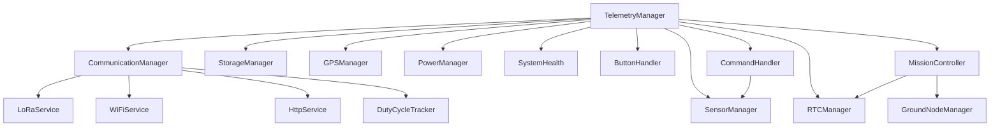

# Documentação Técnica AgroSat-IoT

## Parte 15: Referência de API

### 15.1 Visão Geral

Esta seção documenta as interfaces públicas de todas as classes principais do sistema AgroSat-IoT.

### 15.2 TelemetryManager

**Localização:** `src/app/TelemetryManager/`

Classe principal que orquestra todo o sistema.

```cpp
class TelemetryManager {
public:
    // Construtor
    TelemetryManager(
        CommunicationManager& comm,
        StorageManager& storage,
        SensorManager& sensors,
        GPSManager& gps,
        PowerManager& power,
        RTCManager& rtc,
        SystemHealth& health,
        ButtonHandler& button
    );
    
    // Inicialização
    bool begin();
    
    // Loop principal (chamar em loop())
    void update();
    
    // Controle de missão
    void startMission();
    void stopMission();
    
    // Processamento de comandos
    bool handleCommand(const String& cmd);
    
    // Getters
    uint8_t getMode() const;
    const TelemetryData& getCurrentData() const;
    const GroundNodeBuffer& getGroundNodes() const;
    unsigned long getMissionTime() const;
    bool isMissionActive() const;
};
```

#### Exemplo de Uso

```cpp
// Inicialização
TelemetryManager telemetry(comm, storage, sensors, gps, power, rtc, health, button);

void setup() {
    if (!telemetry.begin()) {
        Serial.println("TelemetryManager init failed!");
        while(1);
    }
}

void loop() {
    telemetry.update();
    
    // Processar comandos serial
    if (Serial.available()) {
        String cmd = Serial.readStringUntil('\n');
        telemetry.handleCommand(cmd);
    }
}
```

---

### 15.3 CommunicationManager

**Localização:** `src/comm/CommunicationManager/`

Gerencia comunicação LoRa, WiFi e HTTP.

```cpp
class CommunicationManager {
public:
    // Construtor
    CommunicationManager(LoRaService& lora, WiFiService& wifi, HttpService& http);
    
    // Inicialização
    bool begin();
    
    // LoRa
    bool sendLoRa(const String& payload);
    bool sendLoRa(const uint8_t* data, size_t len);
    bool receiveLoRa(String& payload, int& rssi, float& snr);
    bool isLoRaAvailable();
    
    // WiFi
    bool connectWiFi();
    bool isWiFiConnected();
    void disconnectWiFi();
    
    // HTTP
    bool sendHTTP(const String& payload);
    bool sendHTTPAsync(const TelemetryData& data, const GroundNodeBuffer& nodes);
    
    // Duty Cycle
    DutyCycleTracker& getDutyCycleTracker();
    bool canTransmit(uint32_t payloadSize);
    float getDutyCyclePercent();
};
```

#### Exemplo de Uso

```cpp
CommunicationManager comm(lora, wifi, http);

// Enviar via LoRa
if (comm.canTransmit(64)) {
    comm.sendLoRa("HELLO,123,456");
}

// Enviar via HTTP (assíncrono)
comm.sendHTTPAsync(telemetryData, groundNodes);

// Verificar duty cycle
Serial.printf("Duty Cycle: %.1f%%\n", comm.getDutyCyclePercent());
```

---

### 15.4 StorageManager

**Localização:** `src/storage/`

Gerencia armazenamento em SD Card.

```cpp
class StorageManager {
public:
    // Inicialização
    bool begin();
    
    // Escrita
    bool saveTelemetry(const TelemetryData& data);
    bool saveMission(const MissionData& data);
    bool saveLog(const String& message);
    
    // Escrita assíncrona
    bool saveAsync(const TelemetryData& data, const GroundNodeBuffer& nodes);
    
    // Leitura
    bool readLastTelemetry(TelemetryData& data);
    size_t getFileSize(const char* path);
    
    // Manutenção
    bool rotateFile(const char* path);
    bool deleteFile(const char* path);
    uint64_t getFreeSpace();
    uint64_t getTotalSpace();
    
    // Status
    bool isAvailable();
    bool isBusy();
};
```

#### Exemplo de Uso

```cpp
StorageManager storage;

if (storage.begin()) {
    // Salvar telemetria
    storage.saveTelemetry(data);
    
    // Verificar espaço
    uint64_t free = storage.getFreeSpace();
    Serial.printf("Free space: %llu MB\n", free / (1024*1024));
    
    // Rotacionar arquivo se muito grande
    if (storage.getFileSize("/telemetry.csv") > 5*1024*1024) {
        storage.rotateFile("/telemetry.csv");
    }
}
```

---

### 15.5 SensorManager

**Localização:** `src/sensors/SensorManager/`

Gerencia todos os sensores I2C.

```cpp
class SensorManager {
public:
    // Inicialização
    bool begin();
    
    // Leitura (thread-safe)
    bool readAll(TelemetryData& data);
    
    // Leitura individual
    bool readIMU(float& ax, float& ay, float& az,
                 float& gx, float& gy, float& gz,
                 float& mx, float& my, float& mz);
    bool readBarometer(float& temp, float& pressure, float& altitude);
    bool readHumidity(float& temp, float& humidity);
    bool readAirQuality(float& co2, float& tvoc);
    
    // Calibração
    bool recalibrateMagnetometer();
    bool clearMagnetometerCalibration();
    bool saveCCS811Baseline();
    bool loadCCS811Baseline();
    
    // Status
    void printDetailedStatus();
    bool isSensorOnline(uint8_t sensorId);
    uint8_t getOnlineSensorCount();
    
    // Constantes de sensor
    static const uint8_t SENSOR_MPU9250 = 0;
    static const uint8_t SENSOR_BMP280 = 1;
    static const uint8_t SENSOR_SI7021 = 2;
    static const uint8_t SENSOR_CCS811 = 3;
};
```

#### Exemplo de Uso

```cpp
SensorManager sensors;

if (sensors.begin()) {
    TelemetryData data;
    
    if (sensors.readAll(data)) {
        Serial.printf("Temp: %.1f°C\n", data.temperature);
        Serial.printf("Pressure: %.1f hPa\n", data.pressure);
    }
    
    // Verificar sensores online
    if (!sensors.isSensorOnline(SensorManager::SENSOR_GPS)) {
        Serial.println("GPS offline!");
    }
}
```

---

### 15.6 GPSManager

**Localização:** `src/sensors/GPSManager/`

Gerencia módulo GPS via UART.

```cpp
class GPSManager {
public:
    // Inicialização
    bool begin();
    
    // Atualização (chamar frequentemente)
    void update();
    
    // Leitura
    bool read(double& lat, double& lon, float& alt, uint8_t& sats, bool& fix);
    
    // Getters individuais
    double getLatitude();
    double getLongitude();
    float getAltitude();
    uint8_t getSatellites();
    bool hasFix();
    float getHDOP();
    float getSpeed();      // km/h
    float getCourse();     // graus
    
    // Tempo GPS
    bool getDateTime(uint16_t& year, uint8_t& month, uint8_t& day,
                     uint8_t& hour, uint8_t& minute, uint8_t& second);
    uint32_t getAge();     // Idade dos dados em ms
    
    // Diagnóstico
    uint32_t getCharsProcessed();
    uint32_t getSentencesWithFix();
    uint32_t getFailedChecksums();
};
```

#### Exemplo de Uso

```cpp
GPSManager gps;

void setup() {
    gps.begin();
}

void loop() {
    gps.update();  // Chamar frequentemente!
    
    if (gps.hasFix()) {
        Serial.printf("Pos: %.6f, %.6f\n", 
                      gps.getLatitude(), 
                      gps.getLongitude());
        Serial.printf("Sats: %d, HDOP: %.1f\n",
                      gps.getSatellites(),
                      gps.getHDOP());
    }
}
```

---

### 15.7 PowerManager

**Localização:** `src/core/PowerManager/`

Gerencia energia e bateria.

```cpp
class PowerManager {
public:
    // Inicialização
    bool begin();
    
    // Leitura
    float readVoltage();
    float readPercentage();
    
    // Status
    bool isBatteryLow();      // < 3.7V
    bool isBatteryCritical(); // < 3.3V
    
    // Economia de energia
    void enableLightSleep();
    void disableLightSleep();
    void enterDeepSleep(uint64_t sleepTimeUs);
    
    // Configuração
    void setLowThreshold(float voltage);
    void setCriticalThreshold(float voltage);
};
```

#### Exemplo de Uso

```cpp
PowerManager power;

void loop() {
    float voltage = power.readVoltage();
    float percent = power.readPercentage();
    
    Serial.printf("Battery: %.2fV (%.0f%%)\n", voltage, percent);
    
    if (power.isBatteryCritical()) {
        Serial.println("CRITICAL: Entering safe mode!");
        // Entrar em modo seguro
    }
}
```

---

### 15.8 RTCManager

**Localização:** `src/core/RTCManager/`

Gerencia RTC DS3231.

```cpp
class RTCManager {
public:
    // Inicialização
    bool begin();
    
    // Tempo
    uint32_t getEpoch();
    void getDateTime(uint16_t& year, uint8_t& month, uint8_t& day,
                     uint8_t& hour, uint8_t& minute, uint8_t& second);
    String getDateTimeString();  // "YYYY-MM-DD HH:MM:SS"
    
    // Configuração
    void setDateTime(uint16_t year, uint8_t month, uint8_t day,
                     uint8_t hour, uint8_t minute, uint8_t second);
    void setFromEpoch(uint32_t epoch);
    void syncFromGPS(GPSManager& gps);
    
    // Temperatura (sensor interno do DS3231)
    float getTemperature();
    
    // Status
    bool isRunning();
    bool lostPower();
};
```

#### Exemplo de Uso

```cpp
RTCManager rtc;

void setup() {
    if (rtc.begin()) {
        if (rtc.lostPower()) {
            Serial.println("RTC lost power, syncing from GPS...");
            rtc.syncFromGPS(gps);
        }
        Serial.println(rtc.getDateTimeString());
    }
}
```

---

### 15.9 SystemHealth

**Localização:** `src/core/SystemHealth/`

Monitora saúde do sistema.

```cpp
class SystemHealth {
public:
    enum class HeapStatus { HEAP_OK, HEAP_WARNING, HEAP_CRITICAL, HEAP_FATAL };
    
    // Inicialização
    bool begin();
    
    // Atualização
    void update();
    
    // Heap
    HeapStatus checkHeap();
    uint32_t getFreeHeap();
    uint32_t getMinFreeHeap();
    uint32_t getMaxAllocHeap();
    float getFragmentation();
    
    // Watchdog
    void feedWatchdog();
    void setWatchdogTimeout(uint32_t seconds);
    
    // Estatísticas
    uint32_t getUptime();
    uint16_t getResetCount();
    uint8_t getLastResetReason();
    String getResetReasonString();
    
    // Temperatura CPU
    float getCpuTemperature();
    
    // Diagnóstico
    void printFullReport();
};
```

#### Exemplo de Uso

```cpp
SystemHealth health;

void loop() {
    health.update();
    health.feedWatchdog();
    
    auto heapStatus = health.checkHeap();
    if (heapStatus == SystemHealth::HeapStatus::HEAP_CRITICAL) {
        Serial.println("CRITICAL: Low memory!");
    }
    
    Serial.printf("Uptime: %lu s, Free Heap: %lu\n",
                  health.getUptime() / 1000,
                  health.getFreeHeap());
}
```

---

### 15.10 LoRaService

**Localização:** `src/comm/LoRaService/`

Interface de baixo nível para LoRa.

```cpp
class LoRaService {
public:
    // Inicialização
    bool begin();
    
    // Transmissão
    bool send(const String& payload);
    bool send(const uint8_t* data, size_t len);
    
    // Recepção
    bool available();
    int receive(uint8_t* buffer, size_t maxLen);
    String receiveString();
    
    // Qualidade do sinal
    int getLastRSSI();
    float getLastSNR();
    
    // Configuração
    void setFrequency(long freq);
    void setSpreadingFactor(int sf);
    void setBandwidth(long bw);
    void setTxPower(int power);
    void setSyncWord(uint8_t sw);
    void enableCRC(bool enable);
    
    // Modo
    void sleep();
    void idle();
    void receive();  // Modo recepção contínua
};
```

---

### 15.11 GroundNodeManager

**Localização:** `src/app/GroundNodeManager/`

Gerencia ground nodes recebidos.

```cpp
class GroundNodeManager {
public:
    // Inicialização
    bool begin();
    
    // Gerenciamento de nós
    bool addOrUpdateNode(const MissionData& data);
    bool removeNode(uint16_t nodeId);
    void pruneExpiredNodes();
    
    // Consulta
    bool getNode(uint16_t nodeId, MissionData& data);
    const GroundNodeBuffer& getBuffer() const;
    uint8_t getActiveNodeCount();
    
    // Priorização
    void sortByPriority();
    MissionData* getHighestPriorityNode();
    
    // Estatísticas
    uint16_t getTotalPacketsCollected();
    uint16_t getTotalPacketsForwarded();
    float getPacketLossRate(uint16_t nodeId);
    
    // Configuração
    void setTTL(unsigned long ttlMs);
    void setMaxNodes(uint8_t max);
};
```

---

### 15.12 MissionController

**Localização:** `src/app/MissionController/`

Controla ciclo de vida da missão.

```cpp
class MissionController {
public:
    // Construtor
    MissionController(RTCManager& rtc, GroundNodeManager& nodes);
    
    // Inicialização
    bool begin();
    
    // Controle
    void startMission();
    void stopMission();
    void pauseMission();
    void resumeMission();
    
    // Estado
    bool isActive();
    bool isPaused();
    unsigned long getElapsedTime();
    uint32_t getStartEpoch();
    
    // Estatísticas
    uint32_t getPacketsSent();
    uint32_t getPacketsReceived();
    uint32_t getErrorCount();
    
    // Persistência
    bool saveState();
    bool loadState();
    void clearState();
};
```

---

### 15.13 ButtonHandler

**Localização:** `src/core/ButtonHandler/`

Gerencia botão físico com debounce.

```cpp
enum class ButtonEvent : uint8_t {
    NONE,
    SHORT_PRESS,
    LONG_PRESS
};

class ButtonHandler {
public:
    // Construtor
    ButtonHandler(uint8_t pin);
    
    // Inicialização
    void begin();
    
    // Atualização (chamar em loop)
    ButtonEvent update();
    
    // Estado
    bool isPressed();
    unsigned long getPressedDuration();
    
    // Configuração
    void setDebounceTime(unsigned long ms);
    void setLongPressTime(unsigned long ms);
    
    // Constantes padrão
    static const unsigned long DEFAULT_DEBOUNCE_MS = 50;
    static const unsigned long DEFAULT_LONG_PRESS_MS = 2000;
};
```

#### Exemplo de Uso

```cpp
ButtonHandler button(BUTTON_PIN);

void setup() {
    button.begin();
}

void loop() {
    ButtonEvent evt = button.update();
    
    switch (evt) {
        case ButtonEvent::SHORT_PRESS:
            Serial.println("Short press!");
            break;
        case ButtonEvent::LONG_PRESS:
            Serial.println("Long press!");
            break;
        default:
            break;
    }
}
```

---

### 15.14 CommandHandler

**Localização:** `src/core/CommandHandler/`

Processa comandos serial.

```cpp
class CommandHandler {
public:
    // Construtor
    CommandHandler(SensorManager& sensors);
    
    // Processamento
    bool handle(String cmd);
    
    // Registro de comandos customizados
    typedef bool (*CommandCallback)(const String& args);
    void registerCommand(const String& name, CommandCallback callback);
    
    // Ajuda
    void printHelp();
};
```

---

### 15.15 DutyCycleTracker

**Localização:** `src/comm/LoRaService/`

Rastreia uso do duty cycle LoRa.

```cpp
class DutyCycleTracker {
public:
    // Construtor
    DutyCycleTracker(float maxPercent = 10.0f, 
                     unsigned long windowMs = 3600000);
    
    // Registro de transmissão
    void recordTransmission(unsigned long durationMs);
    
    // Consulta
    bool canTransmit(unsigned long estimatedDurationMs);
    float getDutyCyclePercent();
    unsigned long getAccumulatedTxTime();
    unsigned long getRemainingTxTime();
    unsigned long getTimeUntilReset();
    
    // Reset
    void reset();
};
```

#### Exemplo de Uso

```cpp
DutyCycleTracker dc(10.0f, 3600000);  // 10% em 1 hora

// Antes de transmitir
unsigned long estimatedToA = 50;  // ms
if (dc.canTransmit(estimatedToA)) {
    // Transmitir
    lora.send(payload);
    dc.recordTransmission(estimatedToA);
} else {
    Serial.printf("Duty cycle exceeded! Wait %lu ms\n", 
                  dc.getTimeUntilReset());
}
```

---

### 15.16 Resumo de Dependências



---

*Anterior: [14 - Guia de Troubleshooting](14-troubleshooting.md)*

*Próxima parte: [16 - Fluxogramas e Diagramas](16-fluxogramas.md)*