# Documentação Técnica AgroSat-IoT

## Parte 16: Fluxogramas e Diagramas

### 16.1 Visão Geral

Esta seção apresenta diagramas visuais do sistema AgroSat-IoT para facilitar a compreensão da arquitetura e fluxos de dados.

### 16.2 Arquitetura Geral do Sistema

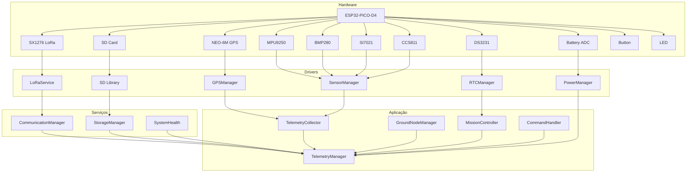

### 16.3 Fluxo de Inicialização (Boot)

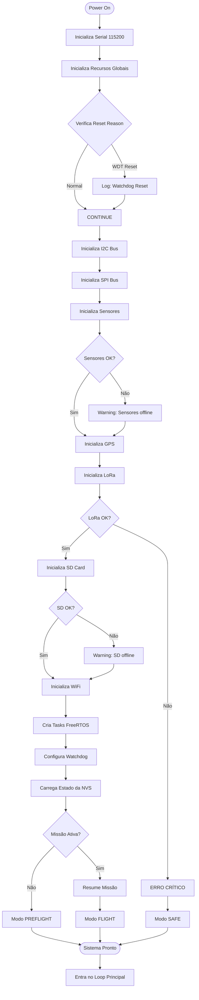

### 16.4 Loop Principal

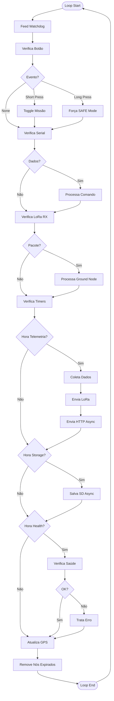

### 16.5 Fluxo de Coleta de Telemetria

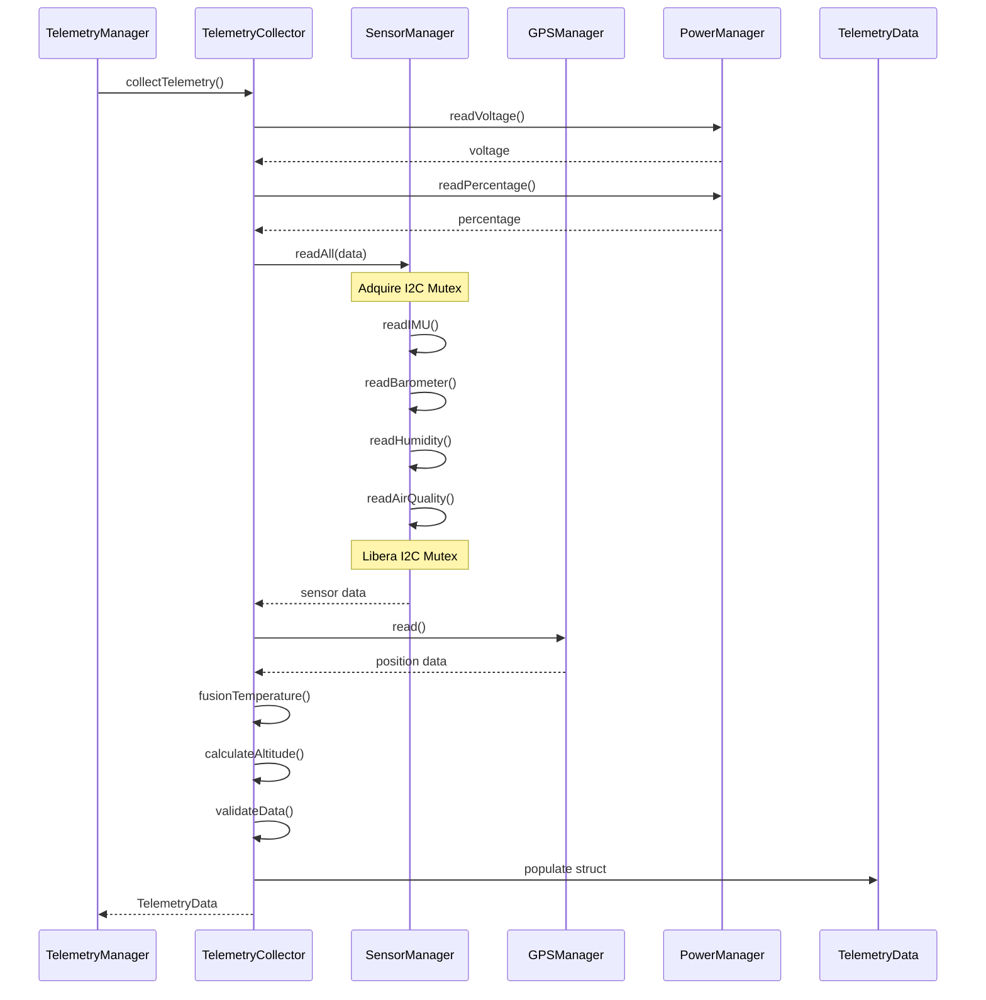

### 16.6 Fluxo de Transmissão LoRa

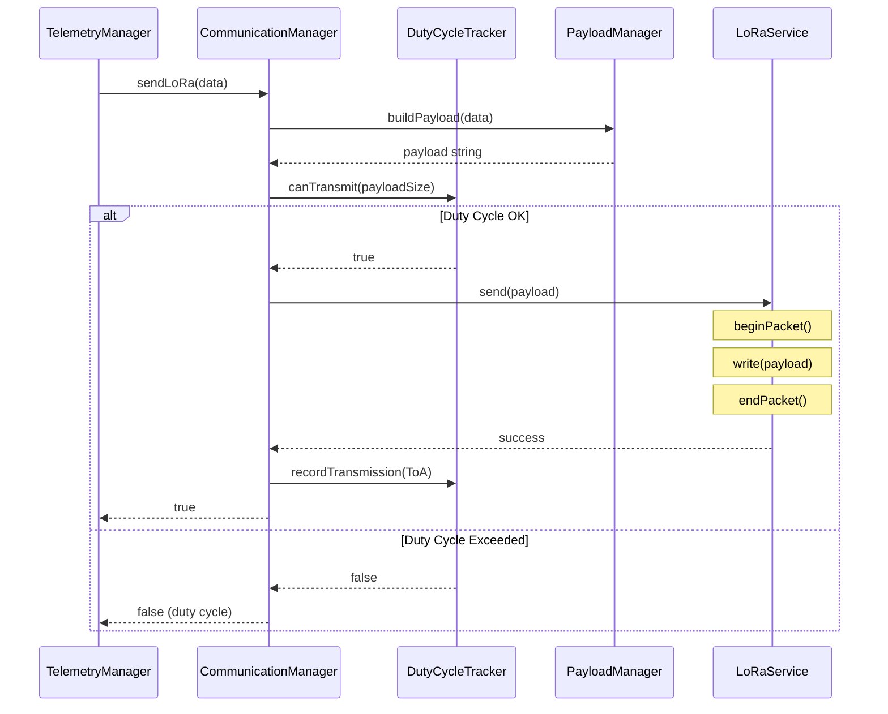

### 16.7 Fluxo de Recepção de Ground Node

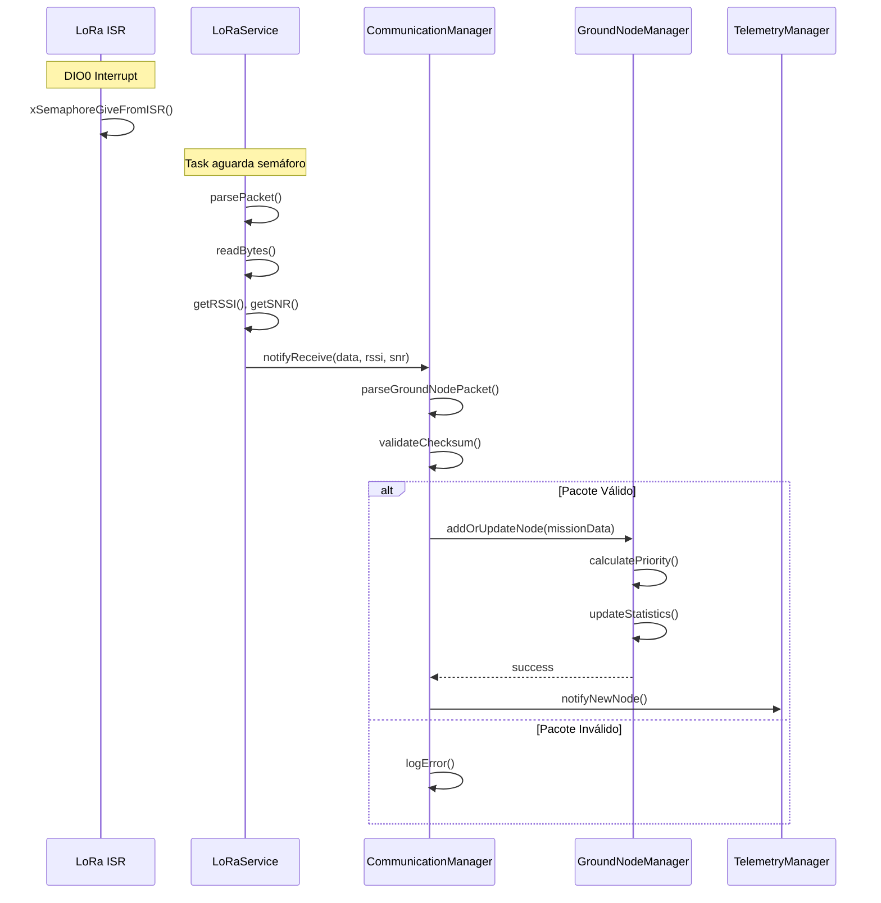

### 16.8 Fluxo de Armazenamento Assíncrono

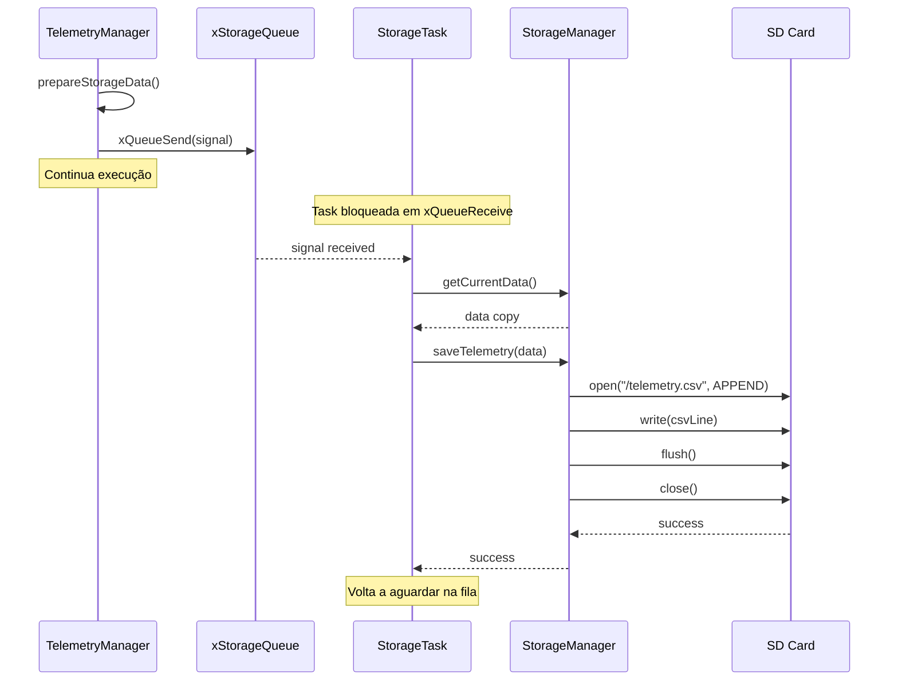

### 16.9 Máquina de Estados - Modos de Operação

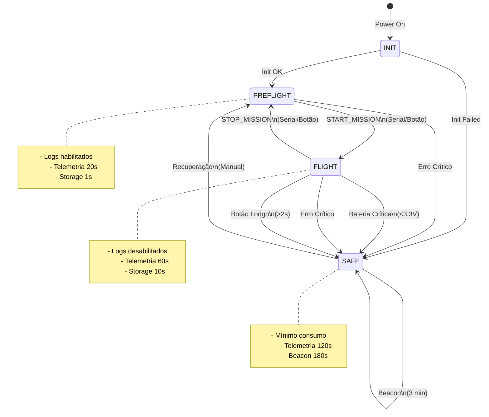

### 16.10 Diagrama de Tasks FreeRTOS

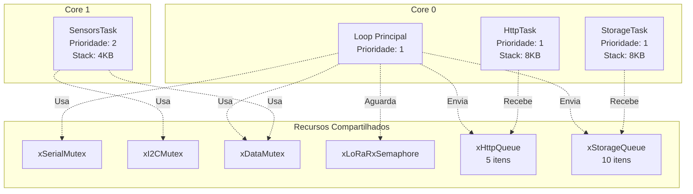

### 16.11 Fluxo de Dados Completo

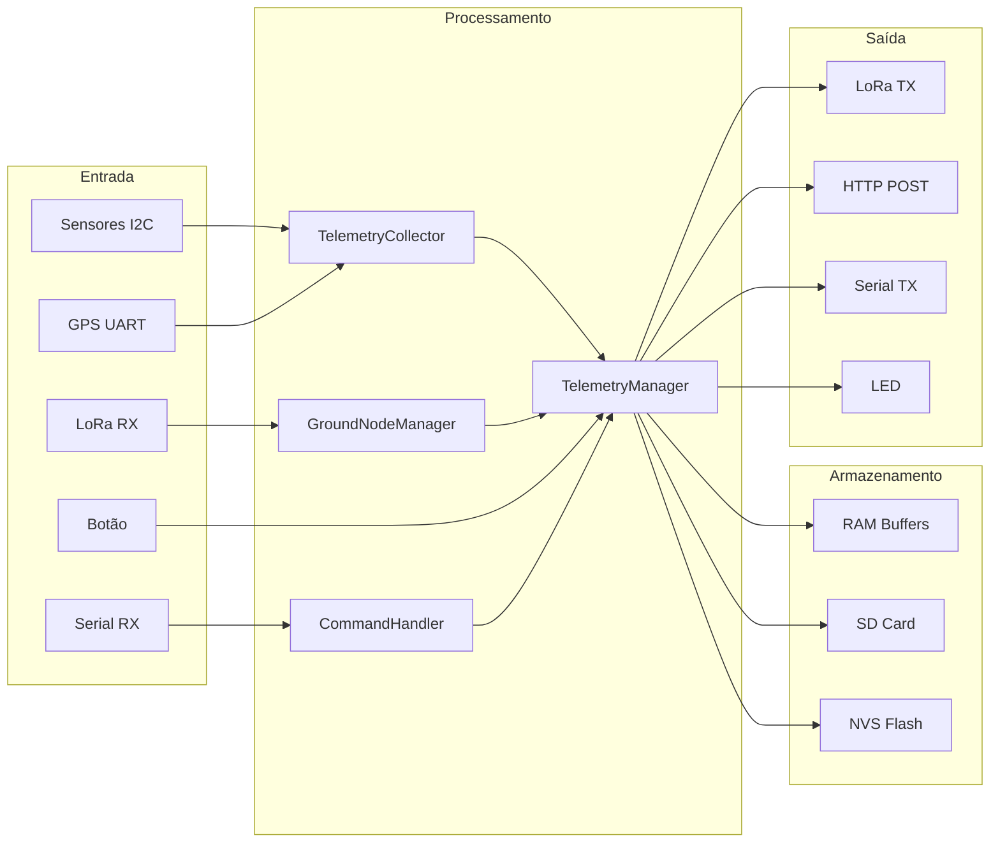

### 16.12 Diagrama de Conexões Físicas

```
┌─────────────────────────────────────────────────────────────────┐
│                    LilyGo T3 V1.6.1 (ESP32)                     │
├─────────────────────────────────────────────────────────────────┤
│                                                                 │
│  ┌─────────┐     ┌─────────┐     ┌─────────┐     ┌─────────┐   │
│  │ MPU9250 │     │ BMP280  │     │ SI7021  │     │ CCS811  │   │
│  │  0x69   │     │  0x76   │     │  0x40   │     │  0x5A   │   │
│  └────┬────┘     └────┬────┘   │
│       │               │               │               │         │
│       └───────────────┴───────────────┴───────────────┘         │
│                           │                                     │
│                      I2C Bus                                    │
│                   SDA=21, SCL=22                                │
│                                                                 │
├─────────────────────────────────────────────────────────────────┤
│                                                                 │
│  ┌─────────┐                              ┌─────────┐           │
│  │ NEO-6M  │                              │ DS3231  │           │
│  │  GPS    │                              │  RTC    │           │
│  └────┬────┘                              └────┬────┘           │
│       │                                        │                │
│   UART2                                    I2C 0x68             │
│   RX=34, TX=12                                                  │
│                                                                 │
├─────────────────────────────────────────────────────────────────┤
│                                                                 │
│  ┌─────────┐                              ┌─────────┐           │
│  │ SX1276  │                              │ SD Card │           │
│  │  LoRa   │                              │         │           │
│  └────┬────┘                              └────┬────┘           │
│       │                                        │                │
│   VSPI                                     HSPI                 │
│   CS=18, RST=23, DIO0=26                   CS=13                │
│                                                                 │
├─────────────────────────────────────────────────────────────────┤
│                                                                 │
│  ┌─────────┐     ┌─────────┐     ┌─────────┐                   │
│  │ Battery │     │  Button │     │   LED   │                   │
│  │  ADC    │     │         │     │         │                   │
│  └────┬────┘     └────┬────┘     └────┬────┘                   │
│       │               │               │                         │
│    GPIO35          GPIO4           GPIO25                       │
│                                                                 │
└─────────────────────────────────┘
```

### 16.13 Formato de Pacote LoRa

```
┌────────────────────────────────────────────────────────────────┐
│                    Pacote LoRa (max 255 bytes)                 │
├────────┬────────┬────────┬─────────────────────┬───────────────┤
│ Header │ TeamID │ SeqNum │      Payload        │   Checksum    │
│ 1 byte │ 2 bytes│ 2 bytes│    N bytes          │    2 bytes    │
├────────┼────────┼────────┼─────────────────────┼───────────────┤
│  0xAA  │  0x029A│  0x0001│  CSV ou Binary      │    CRC16      │
└────────┴────────┴────────┴─────────────────────┴───────────────┘

Header: 0xAA = Telemetria, 0xBB = Ground Node, 0xCC = Beacon
TeamID: 666 (0x029A)
SeqNum: Número sequencial (0-65535)
Payload: Dados em formato CSV ou binário
Checksum: CRC16-CCITT
```

### 16.14 Timeline de Operação Típica

```
Tempo (s)    0    10    20    30    40    50    60    70    80
            │     │     │     │     │     │     │     │     │
PREFLIGHT   ├─────┼─────┼─────┼─────┤
            │  T  │  T  │  T  │     │
            │  S  │  S  │  S  │     │
            │     │     │     │     │
FLIGHT      │     │     │     │     ├─────┼─────┼─────┼─────┤
            │     │     │     │     │     │  T  │     │     │
            │     │     │     │     │  S  │  S  │  S  │
            │     │     │     │     │     │     │     │     │

T = Transmissão LoRa
S = Storage SD

PREFLIGHT: T cada 20s, S cada 1s
FLIGHT: T cada 60s, S cada 10s
```

### 16.15 Diagrama de Prioridade QoS

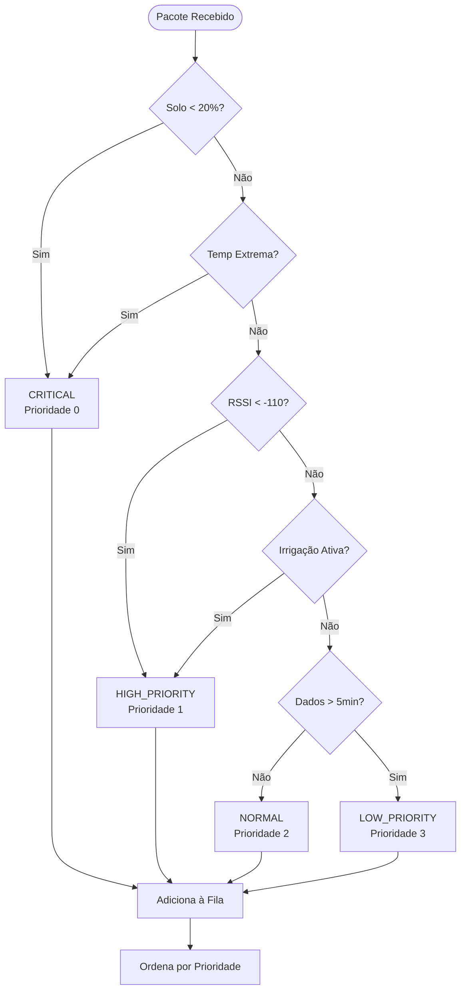

---

*Anterior: [15 - Referência de API](15-referencia-api.md)*

*Próxima parte: [17 - Guia de Desenvolvimento](17-guia-desenvolvimento.md)*